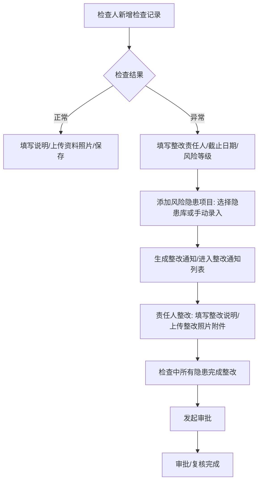
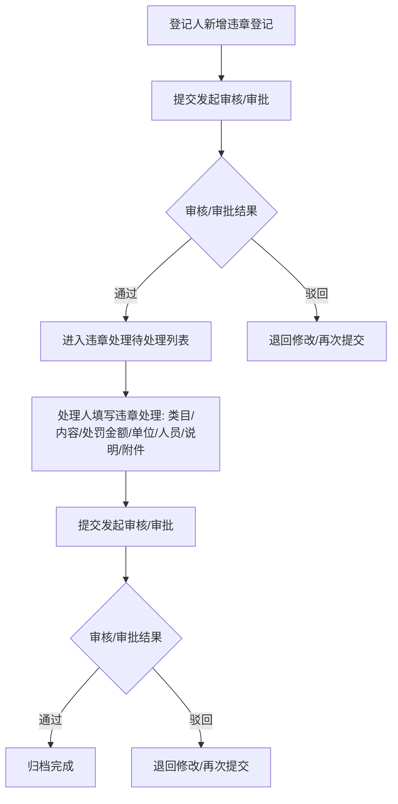
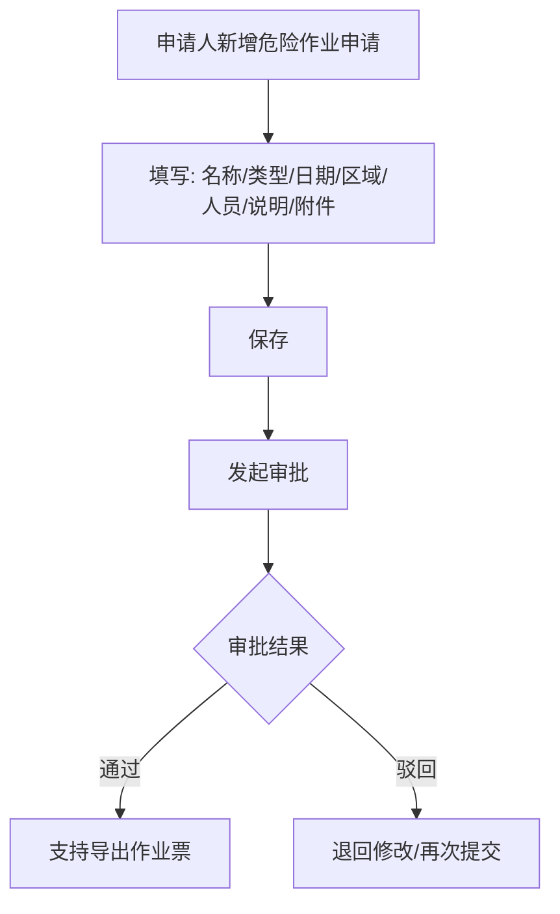
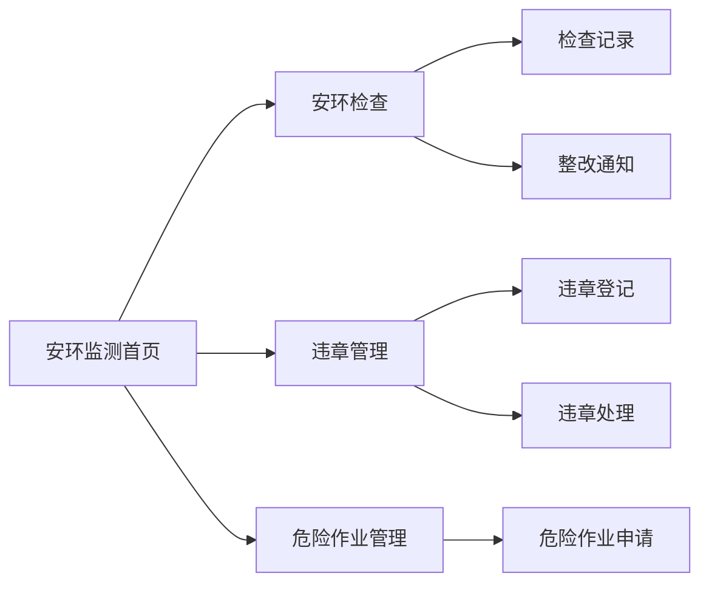
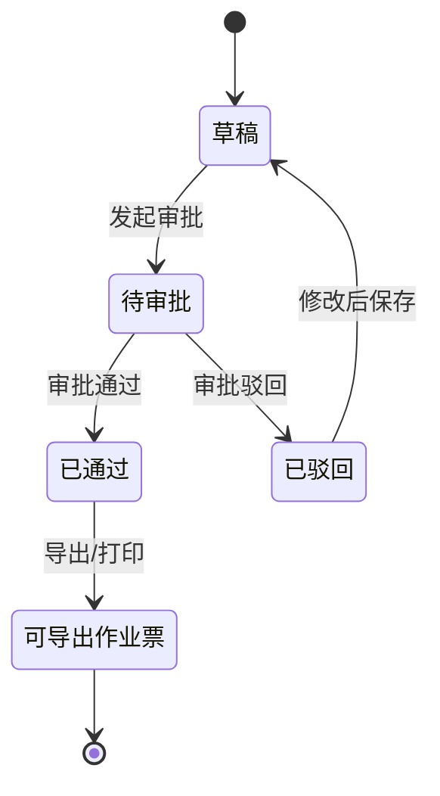
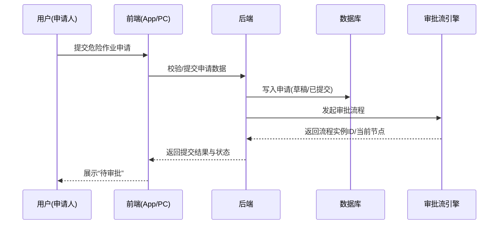

# SES 安环监测原型 PRD（App + PC）

## 1. 产品概述

### 1.1 产品定位
面向企业安全环保管理场景的 **安环监测业务应用**，覆盖 **安环检查、违章管理、危险作业管理** 的记录、整改/处理、审批与作业票导出闭环。

### 1.2 产品目标
- **闭环**：从发现问题 → 记录 → 整改/处理 → 审批/复核 → 留痕归档。
- **标准化**：将检查、违章、作业申请与作业票字段标准化，减少遗漏。
- **效率**：移动端支持一线快速上报；PC 端支持审批、台账检索、打印导出。

### 1.3 用户角色
- **检查人/登记人（移动端）**：创建检查记录、违章登记、危险作业申请；补充附件与照片。
- **责任人（移动端）**：对隐患整改、违章处理进行填写与提交。
- **审批人（移动端/PC）**：对整改发起审批、违章审核/审批、危险作业审批进行处理。
- **安全管理员（PC）**：全量台账、筛选统计、导出/打印作业票、配置处罚标准（假设存在基础配置）。

---

## 2. 业务流程

### 2.1 安环检查（检查记录 → 整改通知 → 整改 → 发起审批 → 复核）

### 2.2 违章管理（违章登记 → 审核/审批 → 待处理 → 违章处理 → 再审核/审批）

### 2.3 危险作业管理（申请 → 审批 → 通过 → 导出/打印作业票）

### 2.4 用户交互流程图（跨模块入口）

### 2.5 状态机（危险作业申请）

### 2.6 数据流转时序图（危险作业申请发起审批）

---

## 3. 功能模块总览（两级）

### 3.1 安环检查
- **一级功能概述**：记录检查结果；对异常隐患发起整改、审批与复核闭环。

#### 3.1.1 检查记录（最小功能模块）
- **功能介绍**：记录安环检查结果，支持正常/异常分支与隐患录入。
- **前置条件**：用户已登录；系统具备检查类型、被检查单位、人员组织数据。
- **数据权限**：普通用户仅查看本部门/本人创建；管理员查看全量（合理假设）。
- **页面跳转**：列表点击“新增”进入新增页；保存成功返回列表；点击“查看/编辑”进入详情/编辑页。
- **关键字段**：
  - 检查类型、检查日期、检查人、责任人、被检查单位、检查结果（正常/异常）
  - 正常：说明、资料/现场照片
  - 异常：整改责任人、整改截止日期、风险等级、隐患项目（可多条）
  - 隐患项目：隐患类型、重大/一般、隐患描述、整改要求、隐患照片/资料；支持从隐患库选择或手动录入

#### 3.1.2 整改通知（最小功能模块）
- **功能介绍**：对未整改隐患形成整改通知，支持整改、提交审批与复核状态流转。
- **前置条件**：存在异常检查记录及其隐患项目。
- **数据权限**：责任人可见与本人相关整改；管理员/审批人可见全量（合理假设）。
- **页面跳转**：列表点击“整改”进入整改页；整改页内对单条隐患点击“整改”进入隐患整改编辑页；完成全部隐患后“发起审批”。
- **状态**：全部/待整改/待复核/已复核。
- **关键操作**：查看、整改、删除（手册明确）。

### 3.2 违章管理
- **一级功能概述**：完成违章登记、审核审批、处罚处理与归档。

#### 3.2.1 违章登记（最小功能模块）
- **功能介绍**：登记违章信息并发起审核/审批。
- **前置条件**：用户已登录；违章类型字典存在。
- **数据权限**：登记人可编辑未进入审批/被驳回记录；审批人可查看待审记录（合理假设）。
- **页面跳转**：列表“新增”进入新增页；提交后回列表并显示状态；详情页可发起审核/审批。
- **关键字段**：违章类型、违章时间、违章地点、违章人员、违章处理责任人、违章记录、违章照片；系统自动填充登记人/登记部门/登记时间。
- **关键操作**：查看、编辑、删除、发起审核、审批。

#### 3.2.2 违章处理（最小功能模块）
- **功能介绍**：对审批通过且待处理的违章事件执行处罚与处理闭环。
- **前置条件**：存在审核/审批通过的违章登记。
- **数据权限**：处理责任人/管理员可处理；其他仅查看（合理假设）。
- **页面跳转**：待处理列表点击“处理”进入处理页；提交后回列表并进入再审核/审批。
- **关键字段**：
  - 自动获取：违章登记信息
  - 处理填写：违章类目、违章内容、考核金额（从处罚标准自动获取）、扣除金额（可编辑）、处罚单位、处罚人员、处理说明、处理文件/处理照片
- **关键操作**：查看、处理、发起审核、审批。

### 3.3 危险作业管理
- **一级功能概述**：高风险特种作业申请审批，支持导出作业票（作业许可证）。

#### 3.3.1 危险作业申请（最小功能模块）
- **功能介绍**：提交危险作业申请并进入审批流，审批通过后导出/打印作业票。
- **前置条件**：用户已登录；作业类型字典存在；作业人员可从组织架构选择。
- **数据权限**：申请人可查看自身；审批人可查看待审批；管理员可查看全量（合理假设）。
- **页面跳转**：列表“新增”进入新增页；保存后回列表；详情页支持“发起审批/审批/导出作业票”。
- **关键字段（来自手册）**：申请名称、作业类型、作业日期、作业区域、作业人员（弹窗勾选添加）、说明、附件。

#### 3.3.2 作业票导出/打印（最小功能模块）
- **功能介绍**：将审批通过的危险作业申请映射为作业许可证模板并导出/打印。
- **前置条件**：危险作业申请审批通过。
- **数据权限**：申请人/管理员可导出；审批人可查看（合理假设）。
- **模板字段（来自《危险作业票》）**：
  - **动火作业许可证**：申请时间/编号、申请人员/所属部门、作业内容/地点、负责人/监护人、施工单位、动火级别、计划/实际动火时间、作业人员及证书编号、风险辨识、安全措施(逐条“涉及/不涉及”)、审批意见与签字、完工验收等。
  - **高处作业许可证**：同类字段 + 高处作业级别、风险辨识、安全措施等。
  - 其他许可证类型按模板继续扩展（合理假设）。

---

## 4. 完整用户交互路径（User Flows）

### 4.1 App 端
- 首页（安环监测）→ 安环检查
  - 检查记录列表 → 新增检查记录（正常/异常分支）→ 保存回列表
  - 整改通知列表（状态筛选）→ 整改 → 隐患整改编辑 → 全部完成 → 发起审批 → 待复核/已复核
- 首页（安环监测）→ 违章管理
  - 违章登记列表 → 新增 → 提交/发起审核审批 → 状态流转
  - 违章处理待处理列表 → 处理 → 提交 → 再审核审批 → 归档
- 首页（安环监测）→ 危险作业管理
  - 危险作业申请列表 → 新增申请 → 选择人员 → 上传附件 → 保存 → 发起审批 → 通过 → 导出作业票预览

### 4.2 PC 端（仅危险作业管理）

> **详细 PRD 见：** [`prd_pc_危险作业管理.md`](./prd_pc_危险作业管理.md)

- 危险作业申请台账（列表筛选/状态）→ 新增/编辑 → 提交审批
- 审批中心（待办）→ 审批通过/驳回
- 申请详情 → 作业票预览 → 打印/导出

---

## 5. 页面清单与跳转关系

### 5.1 App 端页面
- `安环检查_检查记录_list` → `安环检查_检查记录_form` → `安环检查_检查记录_detail`
- `安环检查_整改通知_list` → `安环检查_整改通知_detail` → `安环检查_整改_form`（含隐患整改编辑）
- `违章管理_违章登记_list` → `违章管理_违章登记_form` → `违章管理_违章登记_detail`
- `违章管理_违章处理_list` → `违章管理_违章处理_form`
- `危险作业管理_申请_list` → `危险作业管理_申请_form` → `危险作业管理_申请_detail` → `危险作业管理_作业票_preview`

### 5.2 PC 端页面（危险作业管理）
- `pc_危险作业管理_申请_list` → `pc_危险作业管理_申请_form` → `pc_危险作业管理_申请_detail` → `pc_危险作业管理_作业票_print`

---

## 6. 非功能性需求（合理假设）
- **性能**：列表首屏 ≤ 2s；图片懒加载；移动端表单分步/折叠避免卡顿。
- **安全**：基于角色与组织的数据权限；附件上传做类型/大小限制；审批操作留痕。
- **可用性**：离线弱网提示与草稿保存（合理假设）；关键操作二次确认（如删除）。
- **合规**：作业票打印版式清晰、字段完整，可留存归档。

