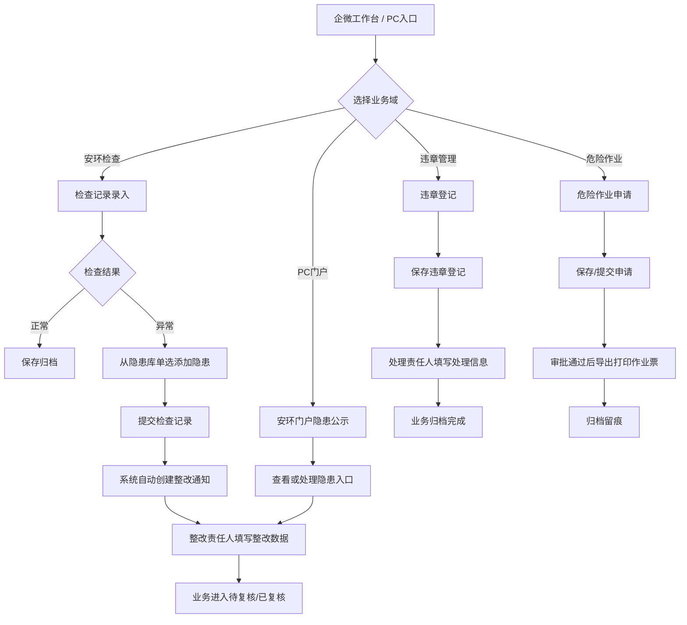
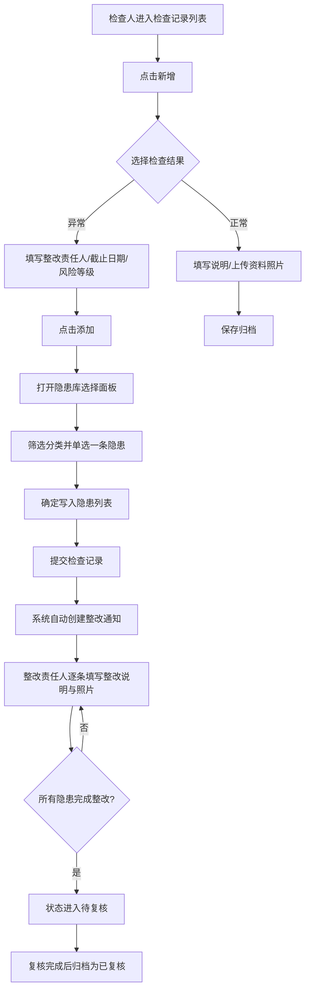
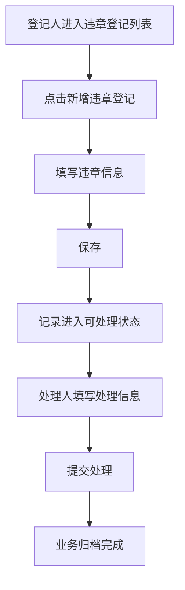
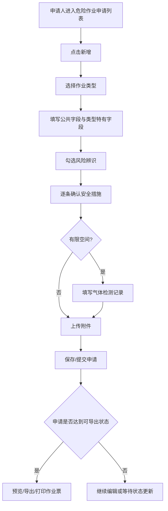
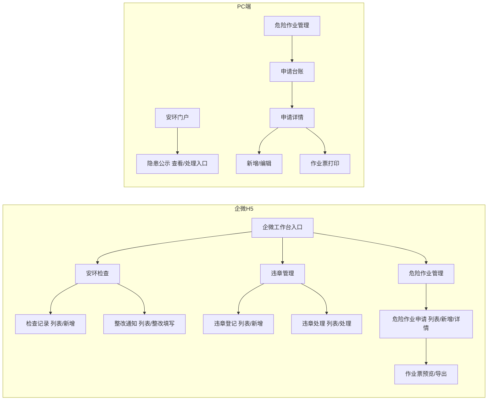
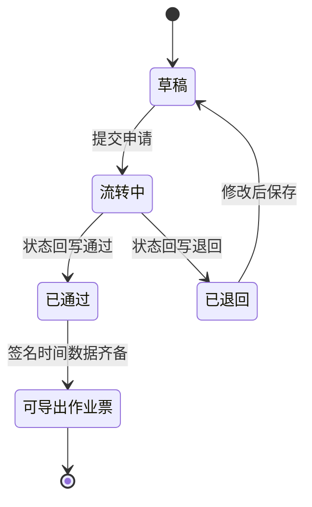
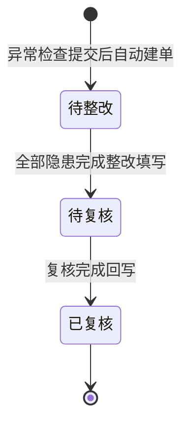
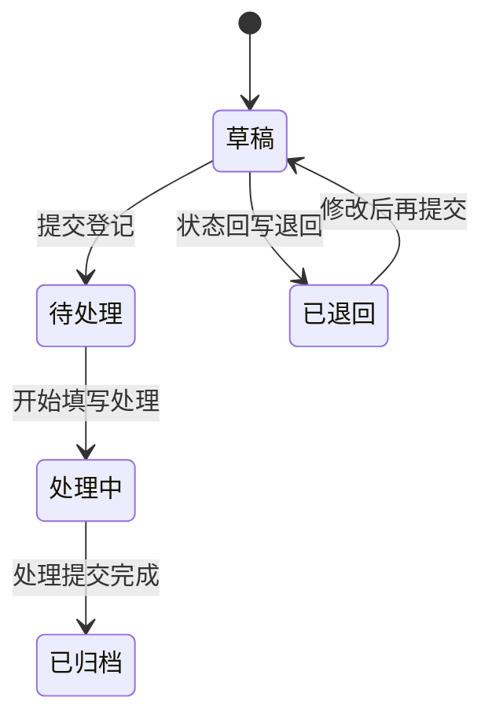
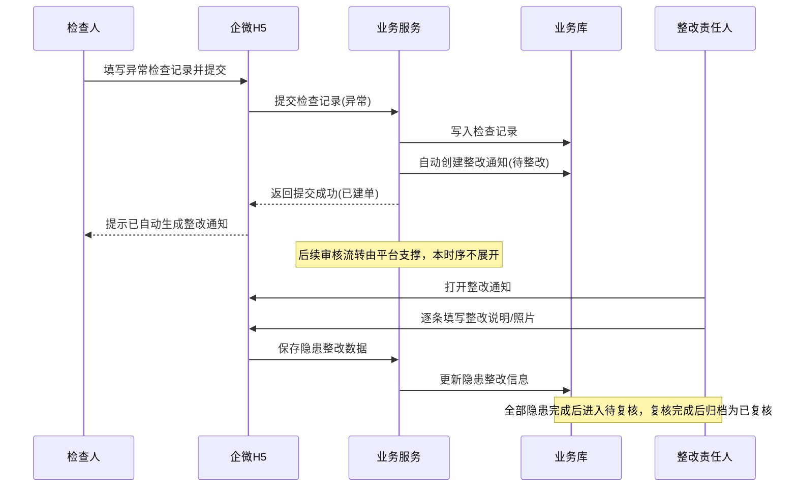
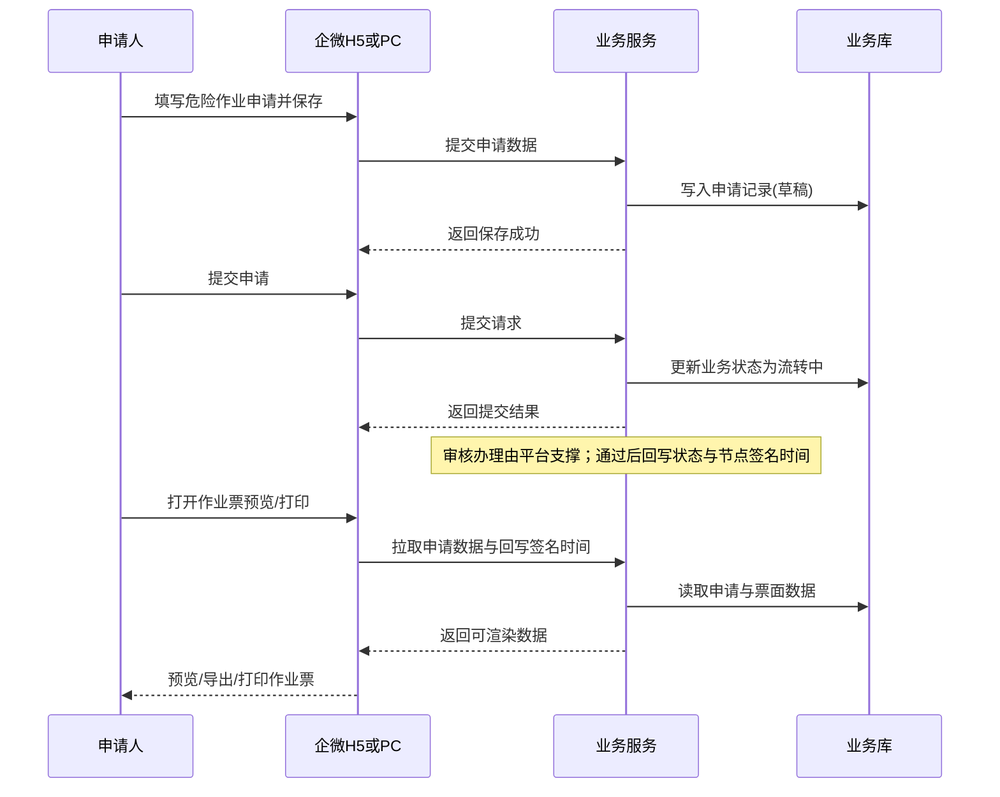

# SES 安环监测原型 PRD（企微 H5 + PC）

---

<a id="sec-version"></a>

## 版本信息

| 项 | 内容 |
|----|------|
| **版本号** | v1.0.0 |
| **更新日期** | 2026-07-15 |
| **迭代说明** | 移动端检查记录支持从隐患库**单选**添加隐患；PC 安环门户隐患公示增加操作入口。本版按 `rulese` 规范重写结构：交付形态调整为**仅企微内嵌 H5 + PC**；流程图/页面/功能模块剥离消息中心、流程审批、角色权限等平台公共能力设计。 |

---

<a id="sec-1"></a>

## 1. 产品概述

#<a id="sec-1-1"></a>

## 1.1 产品定位

面向企业安全环保管理场景的 **安环监测业务应用**，覆盖三大业务域：

| 业务域 | 业务闭环 |
|--------|----------|
| **安环检查** | 检查记录 → 整改通知 → 整改填写 → 复核闭环 |
| **违章管理** | 违章登记 → 违章处理 → 归档 |
| **危险作业管理** | 作业申请 → 作业票导出/打印 |

终端形态为：**企业微信内嵌 H5（一线操作）** + **PC 端（后台台账与门户）**。本版本不交付独立 App。

#<a id="sec-1-2"></a>

## 1.2 产品目标

| 目标 | 说明 | 优先级 |
|------|------|--------|
| **闭环** | 从发现问题 → 记录 → 整改/处理 → 复核/归档，全链路业务留痕 | P0 |
| **标准化** | 检查指标、违章类型、作业票模板标准化，减少遗漏与随意性 | P0 |
| **效率** | 企微 H5 支持一线快速上报、拍照上传；PC 端支持台账检索、筛选、打印 | P0 |
| **合规** | 危险作业许可证（动火/高处/吊装/有限空间/动土/临时用电）模板满足归档要求；作业票展示平台回写的节点签名与时间 | P0 |

#<a id="sec-1-3"></a>

## 1.3 用户角色

| 角色 | 终端 | 职责范围（业务侧） |
|------|------|-------------------|
| **检查人/登记人/申请人** | 企微 H5 | 新增检查记录、登记违章、提交危险作业申请；上传附件与照片 |
| **整改责任人/处理责任人** | 企微 H5 | 填写隐患整改数据；对违章执行处罚处理填写 |
| **安全管理员** | 企微 H5 / PC | 全量台账查看、筛选、导出打印作业票、管理业务闭环状态 |
| **门户浏览人** | PC | 查看安环门户看板；在隐患公示列表进行查看/处理（业务入口） |

> 说明：审核节点办理、待办消息、角色菜单配置由**内部平台统一支撑**，不在本产品角色职责表中展开操作设计。

#<a id="sec-1-4"></a>

## 1.4 终端形态

| 形态 | 本版本是否交付 | 设计要点 |
|------|----------------|----------|
| **企业微信内嵌 H5** | **是（唯一移动端形态）** | 从企微工作台快捷入口进入；无独立 App、无自定义底部业务 Tab；复用企微原生导航；页面轻量化适配企微内置浏览器 |
| **独立 App** | **否** | 本版本不设计、不产出 |
| **PC Web** | **是** | 安环门户 + 危险作业管理台账；B 端清爽后台布局 |

#<a id="sec-1-5"></a>

## 1.5 平台公共能力边界

本项目基于公司统一内部平台开发。以下能力由平台底层统一支撑，**本 PRD 不设计需求页面与交互，原型不产出对应页面/按钮/弹窗**：

| 平台能力 | 边界说明 |
|----------|----------|
| **消息中心** | 站内通知、待办、推送、消息列表 — 本产品不设计 |
| **流程审批** | 审批发起、节点、抄送、驳回、审批记录办理页 — 本产品不设计；业务仅约定状态结果与数据回写（如作业票签名时间） |
| **角色/菜单/按钮/数据权限配置** | 权限配置后台 — 本产品不设计；业务侧仅描述「谁在业务上应看到哪些数据」的数据范围约定 |

业务侧允许保留：业务表单填写、业务状态展示、自动建单等业务自有逻辑；涉及「进入审核」「消息提醒」处统一标注「由平台支撑」。

---

<a id="sec-2"></a>

## 2. 业务流程

#<a id="sec-2-1"></a>

## 2.1 完整业务主流程



**文字解读：**

- **正常流程**：三大业务域各自完成「录入 → 流转 → 闭环」；异常检查提交后由系统自动建整改通知；门户提供隐患查看/处理业务入口，复用整改填写能力。
- **边界情况**：企微入口仅展示已开通业务快捷入口；PC 门户本版本仅新增隐患公示操作，其他看板保持展示不强交互。
- **异常兜底**：自动建单失败时提示「提交成功但建单失败，可重试」；作业票在前置状态未满足时拦截导出。

#<a id="sec-2-2"></a>

## 2.2 子业务流程

#### 2.2.1 安环检查（检查记录 → 自动建单 → 整改填写 → 复核闭环）【P0】



**文字解读：**

- **正常流程**：异常分支「添加」直接进入隐患库，**单选**一条隐患写入列表；提交后系统自动创建整改通知；整改责任人在业务侧填写整改数据，全部完成后进入待复核/已复核。
- **边界情况**：未选隐患点确定 → 提示「请选择一条隐患」；重复添加同一隐患 → 提示已添加；隐患未全部完成前不可进入「待复核」。
- **异常兜底**：隐患库无结果展示「暂无数据」；自动建单失败提示可重试。后续审核流转由平台支撑，业务侧不提供审批操作页。

#### 2.2.2 违章管理（登记 → 处理 → 归档）【P0】



**文字解读：**

- **正常流程**：登记保存后，处理责任人对事件填写处罚/考核等信息并提交，完成业务归档。
- **边界情况**：未填写必填项不可提交；草稿可继续编辑。
- **异常兜底**：附件上传失败可重试；提交失败保留已填内容。状态推进若依赖平台审核，业务仅展示结果状态，不设计审批按钮与审批页。

#### 2.2.3 危险作业管理（申请 → 导出/打印作业票）【P0】



**文字解读：**

- **正常流程**：按类型动态表单填写并保存/提交；达到可导出状态后预览打印作业票，票面带出平台回写的节点签名与审批时间。
- **边界情况**：必填项未完成不可提交；未齐备签名/时间数据时不可导出。
- **异常兜底**：签名图片加载失败提示重新获取或联系管理员；导出缺项拦截并提示补全（数据来源为平台回写）。

**作业票导出与签名数据约定【P0】：**

| 维度 | 说明 |
|------|------|
| **签名数据要求** | 作业票须展示/导出各业务节点对应的**签名**与**审批时间** |
| **导出形态** | 签名与时间**跟随作业票一起导出/打印**，不单独导出审批流文件 |
| **本产品边界** | 不提供审批签名操作页；签名与时间由平台回写后供作业票渲染 |

#<a id="sec-2-3"></a>

## 2.3 用户交互流程



**文字解读：**

- **正常流程**：企微侧按工作台入口进入各业务列表；PC 侧分门户与危险作业台账两条路径。
- **边界情况**：无独立底部 Tab，返回依赖企微/浏览器导航与页面内返回。
- **异常兜底**：入口未开通时不展示对应业务模块。

#<a id="sec-2-4"></a>

## 2.4 流程状态机

#### 2.4.1 危险作业申请状态



#### 2.4.2 整改通知状态

> 状态名称不变：全部 / 待整改 / 待复核 / 已复核。



#### 2.4.3 违章登记/处理状态（业务视角）



> 状态名称用于业务列表展示与筛选；若平台审核节点介入导致中间态差异，以平台回写状态为准，本产品不设计审批办理页。

#<a id="sec-2-5"></a>

## 2.5 系统数据流转时序图

#### 2.5.1 异常检查提交 → 自动建单 → 整改填写



#### 2.5.2 危险作业申请保存 → 可导出作业票



---

<a id="sec-3"></a>

## 3. 功能模块总览

#<a id="sec-3-1"></a>

## 3.1 安环检查

**一级功能概述**：检查人录入检查结果；提交「异常」后系统自动创建整改通知；整改责任人逐条填写整改数据，最终进入待复核/已复核闭环。

#### 3.1.1 检查记录【P0】

| 维度 | 说明 |
|------|------|
| **功能介绍** | 记录安环检查结果，支持「正常/异常」分支；异常时可从隐患库单选添加隐患；异常提交后自动创建整改通知 |
| **前置条件** | 用户已通过企微身份进入应用；检查类型字典、组织人员数据可用 |
| **数据权限** | 检查人查看与本人相关记录；安全管理员可查看全量（具体行权由平台控制，本模块不设计权限配置） |
| **页面跳转** | 检查记录列表 →「新增」→ 检查记录表单；正常/异常提交后回列表；异常成功建单后可进入整改通知列表 |

**字段与交互要点：**

| 分类 | 内容 |
|------|------|
| **基础字段** | 检查类型、检查日期、检查人（自动填充）、责任人、被检查单位 |
| **正常分支** | 说明、上传资料/现场照片 |
| **异常分支** | 整改责任人、整改截止日期、风险等级、风险隐患项目（可多条） |
| **添加隐患（P0）** | 「+ 添加」直接打开隐患库面板；分类筛选、查询/重置；展示顺序：隐患类型 → 是否重大隐患 → 隐患描述 → 整改要求；**仅单选**；未选确定提示选择；已添加禁止重复；确定后写入列表并标注来源「隐患库」 |
| **列表列** | 检查编号、检查类型、检查日期、检查人、被检查单位、检查结果、隐患条数、操作（查看/编辑/删除） |
| **底部操作** | 固定「新增检查记录」/「提交」 |

#### 3.1.2 整改通知【P0】

| 维度 | 说明 |
|------|------|
| **功能介绍** | 异常检查提交后由系统自动创建；整改责任人逐条填写整改说明与照片，推进待整改 → 待复核 → 已复核 |
| **前置条件** | 已存在含隐患的异常检查提交记录，或门户处理入口带入对应隐患 |
| **数据权限** | 整改责任人可见与本人相关通知；检查人/安全管理员可查看相关或全量 |
| **页面跳转** | 整改通知列表 →「查看」→ 详情；「整改」→ 整改页 → 隐患项「整改」→ 隐患整改编辑页 → 保存返回 |

**要点：**

| 项 | 说明 |
|----|------|
| **状态筛选** | 全部 / 待整改 / 待复核 / 已复核（名称不变） |
| **列表列** | 标题、截止日期、责任人、隐患条数、状态 |
| **列表操作** | 查看、整改（已复核不展示）、删除 |
| **详情** | 关联检查信息 + 隐患列表（只读） |
| **整改填写** | 整改说明、整改照片/附件；**不提供「发起审批」按钮**（流转由平台支撑） |

#<a id="sec-3-2"></a>

## 3.2 违章管理

**一级功能概述**：登记违章事件，处理责任人填写处罚处理信息并完成业务归档。

#### 3.2.1 违章登记【P0】

| 维度 | 说明 |
|------|------|
| **功能介绍** | 登记违章信息并保存/提交，进入可处理状态 |
| **前置条件** | 用户已进入企微应用；违章类型字典可用 |
| **数据权限** | 登记人可编辑草稿/退回记录；管理员可查看全量 |
| **页面跳转** | 违章登记列表 →「新增违章登记」→ 新增表单 → 保存回列表 |

**要点：**

| 项 | 说明 |
|----|------|
| **列表列** | 违章标题、时间、地点、人员、状态 |
| **列表操作** | 查看、编辑、提交（业务提交，不提供审批办理页） |
| **表单字段** | 违章类型、时间、地点、人员、处理责任人、记录说明、照片；登记人/部门/时间只读自动填充 |

#### 3.2.2 违章处理【P0】

| 维度 | 说明 |
|------|------|
| **功能介绍** | 对待处理违章执行处罚信息填写并提交，完成业务闭环 |
| **前置条件** | 存在可处理的违章登记记录 |
| **数据权限** | 处理责任人/管理员可处理；其他角色只读 |
| **页面跳转** | 违章处理列表 →「处理」→ 处理表单 → 提交回列表 |

**处理表单字段：** 关联违章只读信息；违章类目、违章内容、考核金额、扣除金额、处罚单位、处罚人员、处理说明、处理照片/附件。

#<a id="sec-3-3"></a>

## 3.3 危险作业管理

**一级功能概述**：6 种高风险特种作业的申请填写与作业许可证导出/打印；按作业类型动态切换字段、风险辨识与安全措施。

#### 3.3.1 危险作业申请（企微 H5）【P0】

| 维度 | 说明 |
|------|------|
| **功能介绍** | 按作业类型动态表单提交申请；达到可导出状态后预览作业票 |
| **前置条件** | 用户已进入企微应用；6 种作业类型配置可用 |
| **数据权限** | 申请人查看自身申请；管理员可查看全量 |
| **页面跳转** | 申请列表 →「新增」→ 申请表单 → 保存回列表；条目 → 详情 → 作业票预览 |

**公共字段：** 申请名称、申请人员、所属部门、作业负责人、作业监护人、施工单位、作业区域、计划作业时间、风险辨识结果、安全措施确认、附件。

**6 种作业类型特有字段：**

| 作业类型 | 特有字段 | 级别 | 风险项示例 | 安全措施条数 |
|----------|----------|------|------------|-------------|
| 动火作业 | 作业内容、地点、动火级别、作业人员及证书编号 | 二级/一级/特级 | 火灾爆炸、灼烫、触电、高处坠落 | 5 |
| 高处作业 | 作业内容、地点、高处级别、人员及证书编号 | 一～四级 | 高处坠落、物体打击、坍塌、起重伤害 | 6 |
| 吊装作业 | 吊装内容、地点、级别、机械、司机、指挥、证书 | 三级/二级/一级 | 起重伤害、物体打击、坍塌 | 6 |
| 有限空间 | 内容、地点 + 气体检测记录表 | 无 | 中毒窒息、淹溺、触电 | 5 |
| 动土作业 | 施工机械、范围/内容/方式、相邻设施管线 | 无 | 坍塌、物体打击、触电、机械伤害 | 4 |
| 临时用电 | 内容、地点、电源接入点及功率、电压、设备、电工证号 | 无 | 触电、坍塌、高处坠落、机械伤害 | 6 |

> 人员多选以业务弹层选择；不提供审批节点办理与签名操作页。

#### 3.3.2 危险作业申请（PC）【P1】

| 维度 | 说明 |
|------|------|
| **功能介绍** | PC 后台申请台账：筛选、新增/编辑、详情、作业票打印 |
| **前置条件** | 用户已登录 PC；作业类型配置可用 |
| **数据权限** | 管理员全量台账；申请人本人范围 |
| **页面跳转** | 申请台账 → 新增/编辑表单；查看 → 详情 → 作业票打印 |

**列表能力：** 状态 Tab、作业类型筛选、分页、查看/编辑/删除/作业票入口。表单字段与企微侧共享配置，按类型动态渲染。

#### 3.3.3 作业票导出/打印【P0】

| 维度 | 说明 |
|------|------|
| **功能介绍** | 将已通过申请映射为标准许可证模板，支持预览与打印/导出；票面同步带出平台回写的签名与审批时间 |
| **前置条件** | 申请已通过且签名/时间数据齐备 |
| **数据权限** | 申请人/管理员可导出查看 |
| **页面跳转** | 企微：详情 → 预览页；PC：详情 → 打印页 |

**票面结构（示意）：** 许可证标题与编号、申请信息、级别与时间、风险辨识、安全措施、气体检测（有限空间）、**签字栏（签名+时间，平台回写）**、现场确认、完工验收、备注。

#<a id="sec-3-4"></a>

## 3.4 安环门户（PC）

**一级功能概述**：PC 安环监测门户首页，汇总运行天数、检查次数、隐患统计，以及隐患公示等看板；本版本在隐患公示增加业务操作入口。

#### 3.4.1 隐患公示操作入口【P0】

| 维度 | 说明 |
|------|------|
| **功能介绍** | 在门户「隐患公示」列表提供「查看」「处理」业务入口；弹窗字段与整改通知查看/隐患整改一致，门户不重复设计第二套表单 |
| **前置条件** | 用户已登录 PC；隐患公示数据存在 |
| **数据权限** | 按钮显隐由平台控制；本 PRD 仅约定**业务状态与操作映射**（不设计权限配置页） |
| **页面跳转** | 安环门户首页 →「查看/处理」→ 打开弹窗（原型可仅保留入口示意） |

**业务状态与操作映射（P0）：**

| 隐患状态 | 可查看 | 可处理 | 操作展示约定 |
|----------|--------|--------|--------------|
| 待整改 | 是 | 是 | 查看、处理 |
| 已整改 | 是 | 否 | 仅查看 |

**弹窗约定（写入 PRD，原型可不渲染完整弹窗 UI）：**

| 操作 | 弹窗内容 |
|------|----------|
| **查看** | 与整改通知「查看」一致：隐患问题信息 + 已填整改内容（如有） |
| **处理** | 与整改通知隐患整改编辑一致：整改说明、照片、附件 |

其他门户模块（隐患分析、违章公告、风险四色图等）：保持展示，本版本不新增交互。【P2】

---

<a id="sec-4"></a>

## 4. 完整用户交互路径（User Flows）

### 4.1 企微 H5 主路径

#### 4.1.1 安环检查

```
企微工作台 → 安环检查入口页（wecom_home.html 业务入口平铺）
├── ▶ 检查记录列表（wecom_安环检查_检查记录_list.html）
│     ├── 「新增」→ 检查记录表单（wecom_安环检查_检查记录_form.html）
│     │     ├── 「正常」→ 说明/照片 → 提交 → 回列表
│     │     └── 「异常」→ 责任人/截止日期/风险等级
│     │           ├── 「添加」→ 隐患库面板（单选）→ 确定写入
│     │           └── 提交 → 自动建整改通知 → 可进整改通知列表
│     └── 查看/编辑/删除
│
└── ▶ 整改通知列表（wecom_安环检查_整改通知_list.html）
      ├── Tab：全部/待整改/待复核/已复核
      ├── 「查看」→ 详情（只读）
      ├── 「整改」→ 整改页 → 隐患编辑页 → 填写说明/照片 → 保存
      └── 「删除」→ 确认删除
```

#### 4.1.2 违章管理

```
企微工作台 → 违章管理
├── ▶ 违章登记列表 → 新增/编辑/提交 → 保存后进入可处理状态
└── ▶ 违章处理列表 → 「处理」→ 填写处罚信息 → 提交归档
```

#### 4.1.3 危险作业管理

```
企微工作台 → 危险作业申请列表
├── 「新增」→ 类型切换动态表单 → 保存/提交 → 回列表
├── 「查看」→ 详情 → 「作业票预览」→ 导出/打印
└── 编辑/删除（按状态可用）
```

### 4.2 PC 端主路径

#### 4.2.1 安环门户 · 隐患公示

```
PC → 安环门户（pc_安环门户_home.html）
└── 隐患公示
      ├── 「查看」→ 只读弹窗（与整改通知查看一致）
      ├── 「处理」（待整改）→ 整改填写弹窗（与隐患整改一致）
      └── 其他看板保持展示
```

#### 4.2.2 危险作业管理

```
PC → 申请台账列表
├── 筛选/分页/新增
├── 编辑表单（类型动态字段）
├── 详情 → 作业票打印
└── 删除确认
```

**异常分支共性：** 必填校验失败就地提示；保存/提交失败 toast 且保留草稿；无数据空状态；删除二次确认。

---

<a id="sec-5"></a>

## 5. 页面清单与跳转关系

### 5.1 企微 H5 页面

| 序号 | 页面文件名 | 页面名称 | 所属模块 | 上游 | 下游 |
|------|-----------|----------|----------|------|------|
| 1 | `wecom_home.html` | 企微业务入口页（平铺入口） | 全局 | 企微工作台 | 各业务列表 |
| 2 | `wecom_安环检查_检查记录_list.html` | 检查记录列表 | 安环检查 | wecom_home | 检查记录 form |
| 3 | `wecom_安环检查_检查记录_form.html` | 新增检查记录 | 安环检查 | 检查记录 list | 回 list；异常可去整改 list |
| 4 | `wecom_安环检查_整改通知_list.html` | 整改通知列表 | 安环检查 | wecom_home | detail / rectify |
| 5 | `wecom_安环检查_整改通知_detail.html` | 整改通知详情 | 安环检查 | list | 回 list |
| 6 | `wecom_安环检查_整改通知_rectify.html` | 整改操作页 | 安环检查 | list | hazard_form |
| 7 | `wecom_安环检查_整改通知_hazard_form.html` | 隐患整改编辑 | 安环检查 | rectify | 回 rectify |
| 8 | `wecom_违章管理_违章登记_list.html` | 违章登记列表 | 违章管理 | wecom_home | 新增/详情示意 |
| 9 | `wecom_违章管理_违章处理_list.html` | 违章处理列表 | 违章管理 | wecom_home | 处理表单示意 |
| 10 | `wecom_危险作业管理_申请_list.html` | 危险作业申请列表 | 危险作业 | wecom_home | form / detail |
| 11 | `wecom_危险作业管理_申请_form.html` | 新增危险作业申请 | 危险作业 | list | 回 list |
| 12 | `wecom_危险作业管理_申请_detail.html` | 申请详情 | 危险作业 | list | 作业票 preview |
| 13 | `wecom_危险作业管理_作业票_preview.html` | 作业票预览 | 危险作业 | detail | 导出/打印 |

> 交互要求：无自定义底部 Tab；顶栏轻量；适配企微内置浏览器（viewport、字号≥12px、柔和阴影等，详见原型规范）。

### 5.2 PC 端页面

| 序号 | 页面文件名 | 页面名称 | 所属模块 | 上游 | 下游 |
|------|-----------|----------|----------|------|------|
| 14 | `pc_安环门户_home.html` | 安环门户首页 | 安环门户 | 全局入口 | 隐患查看/处理入口 |
| 15 | `pc_危险作业管理_申请_list.html` | 申请台账 | 危险作业（PC） | 全局入口 | form / detail |
| 16 | `pc_危险作业管理_申请_form.html` | 新增/编辑申请 | 危险作业（PC） | list | 回 list |
| 17 | `pc_危险作业管理_申请_detail.html` | 申请详情 | 危险作业（PC） | list | 打印 / 编辑 |
| 18 | `pc_危险作业管理_作业票_print.html` | 作业票打印 | 危险作业（PC） | detail | 打印/导出 |

### 5.3 明确不产出的页面（平台能力）

| 类型 | 说明 |
|------|------|
| 消息中心/待办列表 | 不产出 |
| 审批发起/审批办理/审批记录页 | 不产出 |
| 角色权限配置、菜单配置 | 不产出 |

---

<a id="sec-6"></a>

## 6. 非功能性需求

### 6.1 性能

| 场景 | 指标 | 优先级 |
|------|------|--------|
| 列表首屏加载 | ≤ 2s | P0 |
| 表单提交响应 | ≤ 1.5s | P0 |
| 图片懒加载 | 列表图片按需加载，不阻塞首屏 | P1 |
| 长表单 | 企微 H5 分步/折叠，避免一次渲染过重 | P1 |

### 6.2 可用性

| 场景 | 要求 | 优先级 |
|------|------|--------|
| 删除确认 | 删除须二次确认 | P0 |
| 操作反馈 | 关键操作有明确成功/失败提示 | P0 |
| 导航闭环 | 子页提供返回；兼容企微返回手势 | P0 |
| 空状态 | 列表无数据展示空状态 | P0 |
| 弱网 | 提交失败可重试，尽量保留已填内容 | P1 |

### 6.3 安全

| 场景 | 要求 | 优先级 |
|------|------|--------|
| 附件上传 | 限制类型与大小（图片/常用文档） | P0 |
| 数据范围 | 按角色与组织约定可见范围（配置在平台） | P0 |
| 操作留痕 | 创建/修改/删除记录操作人与时间 | P0 |

### 6.4 合规

| 场景 | 要求 | 优先级 |
|------|------|--------|
| 作业票打印 | 版式清晰完整，支持打印样式 | P0 |
| 签名时间随票导出 | 票面须带出平台回写的各节点签名与审批时间，不得缺项导出 | P0 |
| 有效期标注 | 与许可证级别关联（如动火特级 12h、有限空间 24h、临时用电 15 天） | P1 |

### 6.5 兼容性

| 场景 | 要求 | 优先级 |
|------|------|--------|
| 企微 H5 | 企业微信内置浏览器（含 X5 内核常见版本） | P0 |
| PC | Chrome / Edge 主流版本 | P0 |
| 静态发布 | 可 GitHub Pages 静态访问 | P1 |

### 6.6 可拓展性

| 场景 | 要求 | 优先级 |
|------|------|--------|
| 作业类型配置 | 字段/措施/模板可配置扩展，避免写死难以增类型 | P1 |
| 隐患库 | 支持后续扩充条目与分类 | P1 |

---

<a id="sec-7"></a>

## 7. 系统功能清单

| 一级模块 | 二级模块 | 功能概述 | 优先级 | 本版包含 |
|----------|----------|----------|--------|----------|
| 安环检查 | 检查记录 | 新增/查看/编辑/删除；异常从隐患库单选添加；异常提交自动建整改通知 | P0 | 是 |
| 安环检查 | 整改通知 | 自动建单；整改填写；状态待整改/待复核/已复核 | P0 | 是 |
| 安环检查 | 隐患整改编辑 | 单条隐患整改说明与照片/附件 | P0 | 是 |
| 违章管理 | 违章登记 | 登记并提交进入可处理状态 | P0 | 是 |
| 违章管理 | 违章处理 | 填写处罚信息并提交归档 | P0 | 是 |
| 安环门户（PC） | 隐患公示操作 | 查看/处理入口；弹窗与整改通知一致 | P0 | 是 |
| 危险作业管理 | 申请（企微 H5） | 6 类型动态表单 | P0 | 是 |
| 危险作业管理 | 申请（PC） | 台账筛选、新增/编辑 | P1 | 是 |
| 危险作业管理 | 作业票预览/导出 | 6 种模板；签名+时间随票导出 | P0 | 是 |
| 全局 | 企微业务入口 | 平铺安环检查/违章/危险作业入口 | P0 | 是 |
| 全局 | 独立 App | — | — | **否** |
| 平台公共 | 消息/审批办理/权限配置 | — | — | **否（平台支撑）** |

---

<a id="sec-8"></a>

## 8. 范围说明

### 8.1 包含

- 企微 H5：安环检查、违章管理、危险作业申请与作业票预览
- PC：安环门户（含隐患公示操作入口）、危险作业台账与作业票打印
- 隐患库单选添加隐患；整改自动建单与整改填写

### 8.2 不包含

- 独立 App 与自定义底部 Tab
- 消息中心、审批办理页、角色权限配置页及对应按钮/弹窗
- PC 端安环检查、违章管理完整台账（本版不做）
- 门户其他看板新增交互

---

<a id="sec-9"></a>

## 9. 风险项

| 风险 | 说明 | 应对措施 | 优先级 |
|------|------|----------|--------|
| 审核依赖平台 | 建单后的审核、退回、通过由平台支撑 | 业务只展示状态与结果；不产出审批 UI | P0 |
| 消息依赖平台 | 待办与提醒由消息中心处理 | 原型与 PRD 不设计消息页 | P0 |
| 隐患库初期为空 | 单选无数据影响异常录入 | 空状态提示；是否支持手动录入见【待确认】 | P1 |
| 作业票合规 | 6 类模板需满足归档 | 参照标准票样；预留可配置 | P1 |
| 自动建单失败 | 检查提交成功但未建通知 | 明确提示可重试；未建单不出现在待整改 | P0 |
| 企微内核差异 | X5 兼容可能导致样式异常 | 原型阶段按企微兼容清单验收 | P1 |

---

<a id="sec-pending"></a>

## 【待确认】

1. 隐患库初始数据来源——是否需要预置标准隐患条目？异常录入是否保留手动录入兜底？
2. 违章处罚标准金额规则——固定字典还是可配置？
3. PC 端后续是否覆盖安环检查、违章管理台账（当前仅危险作业 + 门户）？
4. 「待复核 / 已复核」的复核动作：完全由平台办理回写，还是业务侧需提供只读复核结果展示细则？
5. 作业票签字栏节点名称与顺序——是否由作业类型配置下发，还是固定模板？

