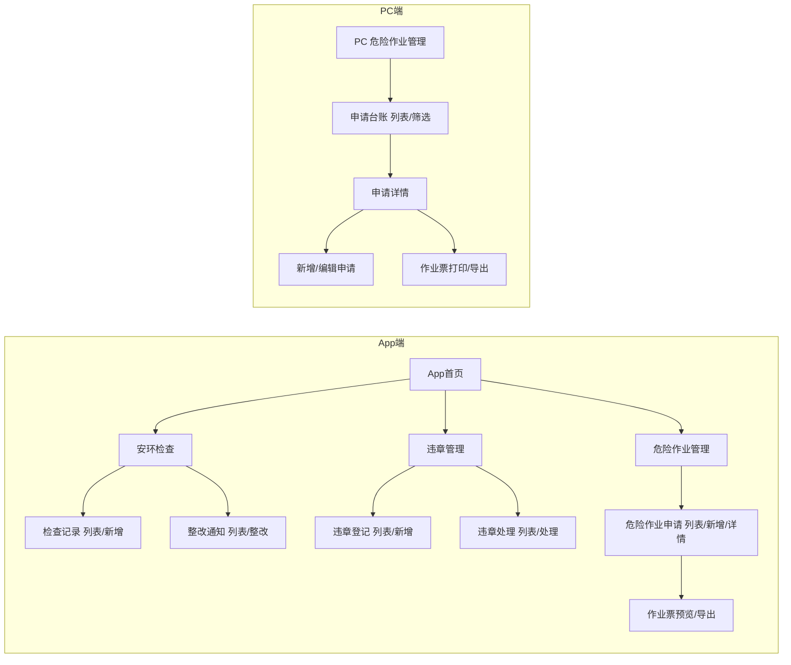
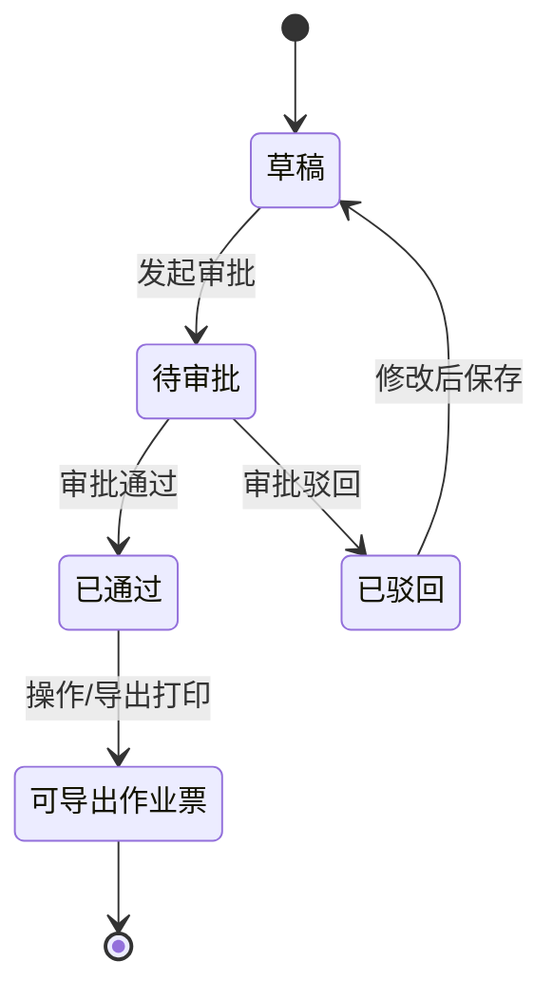
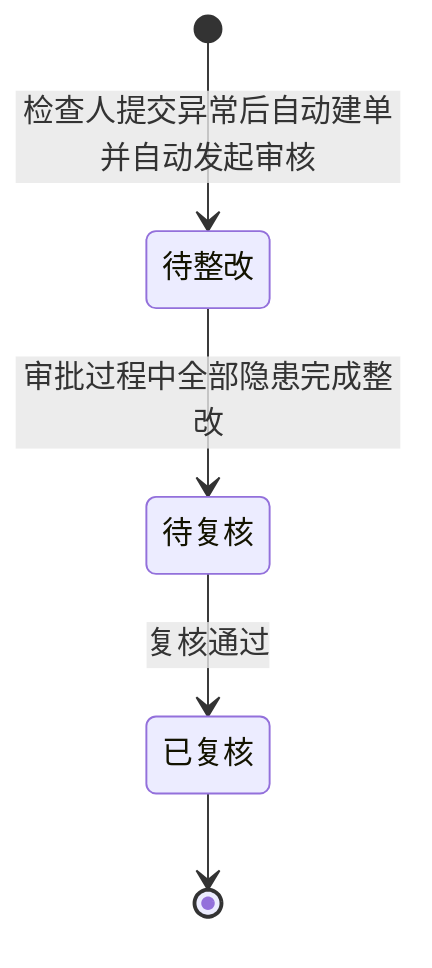
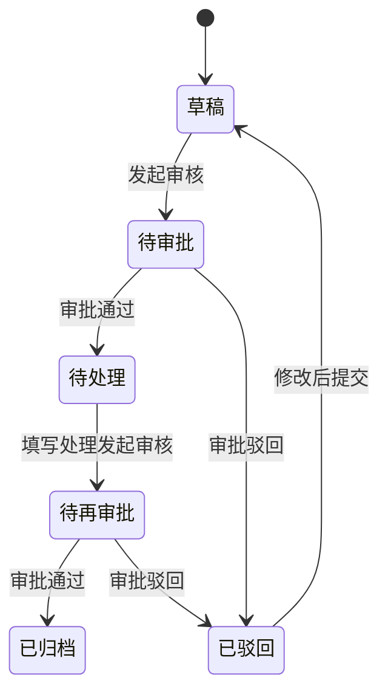
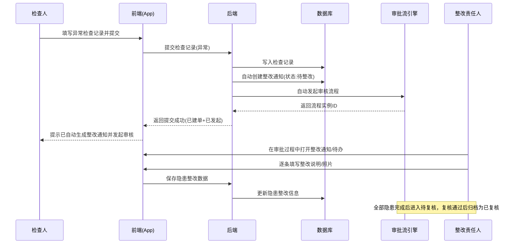
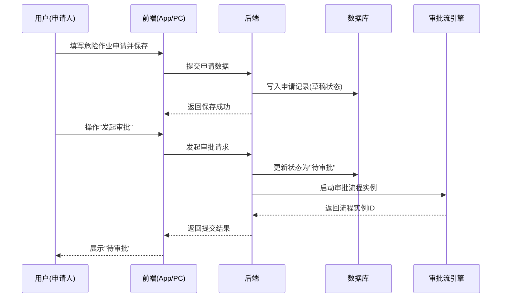

# SES 安环监测原型 PRD（App + PC）

<div id="toc"></div>

> **版本信息**：v1.0.0 | **更新日期**：2026-07-13 | **迭代说明**：App 新增检查记录「添加」直接进入隐患库单选；PC 安环门户隐患公示增加按权限查看/处理入口

---

<!-- TOC 占位，GitHub Pages 可自动解析 -->

---

## 1. 产品概述

### 1.1 产品定位

面向企业安全环保管理场景的 **安环监测业务应用**，覆盖 **安环检查（检查记录 → 整改通知 → 整改闭环）**、**违章管理（违章登记 → 审核/审批 → 违章处理 → 再审核归档）**、**危险作业管理（申请 → 审批 → 导出/打印作业票）** 三大业务域的记录、整改/处理、审批与作业票导出闭环。

系统包含 **App 端**（移动版一线操作）和 **PC 端**（后台台账管理，当前覆盖危险作业管理模块）。

### 1.2 产品目标

| 目标 | 说明 |
|------|------|
| **闭环** | 从发现问题 → 记录 → 整改/处理 → 复核/归档，全链路闭环留痕 |
| **标准化** | 检查指标、违章类型、作业票模板标准化，减少遗漏与随意性 |
| **效率** | App 端支持一线快速上报、拍照上传；PC 端支持台账检索、筛选、打印 |
| **合规** | 危险作业许可证（动火/高处/吊装/有限空间/动土/临时用电）模板满足法规归档要求 |

### 1.3 用户角色

| 角色 | 终端 | 职责范围 |
|------|------|----------|
| **检查人/登记人** | App | 新增检查记录、登记违章、提交危险作业申请；上传附件与照片 |
| **整改责任人/处理责任人** | App | 在审批过程中填写隐患整改数据；对违章执行处罚处理 |
| **安全管理员** | App / PC | 全量台账查看、筛选统计、导出打印作业票、管理闭环 |
| **审批人** | App / PC | 参与整改通知审批流转、违章审核/审批、危险作业审批（审批能力由平台支撑） |

---

## 2. 业务流程

### 2.1 安环检查全流程（检查记录 → 自动建单并发起审核 → 审批中整改 → 复核闭环）

```mermaid
flowchart TD
  A[检查人进入检查记录列表] --> B[点击"新增"按钮]
  B --> C{选择检查结果}
  C -->|正常| D[填写说明/上传资料照片]
  C -->|异常| E[填写整改责任人/截止日期/风险等级]
  E --> F[点击添加风险隐患项目]
  F --> G[打开隐患库选择面板]
  G --> H[筛选分类并单选一条隐患]
  H --> I[确定写入隐患列表]
  I --> J[检查人提交检查记录]
  D --> K[保存归档]
  J --> L[系统自动创建整改通知]
  L --> M[系统自动发起审核]
  M --> N[整改责任人在审批过程中填写整改数据]
  N --> O{所有隐患完成整改?}
  O -->|否| N
  O -->|是| P[状态进入待复核]
  P --> Q[复核通过后归档为已复核]
```

**文字解读：**
- **正常流程**：异常分支点击「添加」直接进入隐患库，**单选**一条隐患后写入列表；提交后系统自动创建整改通知并自动发起审核；整改责任人在审批过程中填写整改数据。
- **边界情况**：未选择隐患点确定 → 提示「请选择一条隐患」；重复选择同一隐患 → 提示已添加；隐患项未全部填写完成时，审批节点不可完结至「待复核」。
- **异常兜底**：隐患库查询无结果展示「暂无数据」；自动建单或自动发起审核失败时，提示检查人「提交成功但发起失败，可重试」。

### 2.2 违章管理全流程（违章登记 → 审核审批 → 违章处理 → 再审核归档）

```mermaid
flowchart TD
  A[登记人进入违章登记列表] --> B[点击"新增违章登记"]
  B --> C[填写违章信息: 类型/时间/地点/人员/记录/照片]
  C --> D[保存]
  D --> E[列表页操作"发起审核"]
  E --> F{审核/审批结果}
  F -->|通过| G[进入违章处理待处理列表]
  F -->|驳回| H[退回修改/再次提交]
  G --> I[处理人点击"处理"]
  I --> J[填写处理信息: 考核金额/扣除金额/处罚单位/人员/说明/附件]
  J --> K[提交发起审核/审批]
  K --> L{审核/审批结果}
  L -->|通过| M[归档完成]
  L -->|驳回| N[退回修改/再次提交]
```

### 2.3 危险作业管理全流程（申请 → 审批 → 导出/打印作业票）

```mermaid
flowchart TD
  A[申请人进入危险作业申请列表] --> B[点击"新增"]
  B --> C[选择作业类型: 动火/高处/吊装/有限空间/动土/临时用电]
  C --> D{动态表单切换}
  D --> E[填写基本字段: 名称/日期/区域/人员]
  E --> F[填写类型特有字段: 级别/机械/证书等]
  F --> G[勾选风险辨识结果]
  G --> H[逐条确认安全措施: 涉及/不涉及]
  H --> I[有限空间?]
  I -->|是| J[填写气体检测记录]
  I -->|否| K[上传附件]
  J --> K
  K --> L[保存]
  L --> M[列表页操作"发起审批"]
  M --> N{审批结果}
  N -->|通过| O[详情页可导出/打印作业票]
  N -->|驳回| P[退回修改/再次提交]
  O --> Q[打印/导出作业许可证]
```

- **正常流程**：每一审批节点审批人须**手写/电子签名**后方可完结该节点；审批全部通过后导出/打印作业票时，将各节点**签名 + 审批时间**随作业票一并导出。
- **边界情况**：某一节点未签名 → 该节点不可提交/完结；未全部节点签名完成 → 不允许导出/打印作业票。
- **异常兜底**：签名图片加载失败时提示「签名加载失败，请重新签名或联系管理员」；导出时缺失任一节点签名/时间 → 拦截导出并提示补全。

#### 2.3.1 作业票审批说明（签名与导出）【P0】

| 维度 | 说明 |
|------|------|
| **签名要求** | **每一个审批节点均须签字**，缺签不可完结该节点 |
| **审批流导出字段** | 仅导出各节点的**签名**与**审批时间**（不含审批意见等其他字段） |
| **导出形态** | 签名与时间**跟随作业票一起导出/打印**，不单独导出审批流文件 |
| **优先级** | P0（合规刚需） |

### 2.4 用户交互流程（跨模块入口）



### 2.5 状态机

#### 2.5.1 危险作业申请状态



#### 2.5.2 整改通知状态

> 状态名称不变：全部 / 待整改 / 待复核 / 已复核。



#### 2.5.3 违章登记状态



### 2.6 数据流转时序图（异常检查提交 → 自动建单并发起审核）



### 2.7 数据流转时序图（危险作业申请发起审批）



---

## 3. 功能模块总览（两级结构）

### 3.1 安环检查

**一级功能概述**：检查人录入检查结果；提交「异常」后系统自动创建整改通知并自动发起审核；整改责任人在审批过程中填写整改数据，最终复核归档。

#### 3.1.1 检查记录（最小功能模块）

| 维度 | 说明 |
|------|------|
| **功能介绍** | 记录安环检查结果，支持「正常/异常」分支切换；异常提交时自动创建整改通知并发起审核 |
| **前置条件** | 用户已登录；检查类型字典、被检查单位/人员组织数据已存在 |
| **数据权限** | 检查人可查看与本人相关记录；安全管理员可查看全量 |
| **页面跳转** | 检查记录列表（`安环检查_检查记录_list.html`）→ 点击底部「新增」 → 新增页（`安环检查_检查记录_form.html`）；正常提交后返回列表；异常提交后系统自动建单并发起审核，可跳转整改通知列表 |


- **基础字段**：
  - 检查类型（下拉：综合检查 / 专项检查 / 日常巡检）
  - 检查日期（日期选择器）
  - 检查人（自动填充）
  - 责任人（输入）
  - 被检查单位（输入）
- **正常分支**：
  - 说明（多行文本）
  - 上传资料/现场照片（附件选择）
- **异常分支**：
  - 整改责任人（输入）
  - 整改截止日期（日期选择器）
  - 风险等级（下拉：低 / 中 / 高）
  - 风险隐患项目（可添加多条）：
    - 隐患名称
    - 隐患类型
    - 重大/一般标识
    - 隐患描述
    - 整改要求
    - 隐患照片/资料（附件上传）
    - 来源：隐患库（本版本添加入口）
- **添加隐患交互（P0，对齐 PC 隐患库弹窗）**：
  - 入口：风险隐患项目旁「+ 添加」→ **直接打开隐患库选择面板**（不经手动录入分支）
  - 面板能力：隐患分类筛选、查询/重置、列表展示；字段展示顺序为：**隐患类型 → 是否重大隐患 → 隐患描述 → 整改要求**（短字段置前，长文本置后并限制展示行数，便于移动端浏览）
  - 选择规则：**仅支持单选**；未选择点「确定」提示请选择；已添加过的隐患禁止重复添加
  - 确定后写入当前隐患列表，来源标注「隐患库」
  - 取消/关闭：关闭面板，不变更已选列表
- **列表展示列**：检查编号、检查类型、检查日期、检查人、被检查单位、检查结果（正常/异常）、隐患条数、操作（查看/编辑/删除）
- **底部操作**：固定底部「新增检查记录」/「提交并自动发起审核」按钮

#### 3.1.2 整改通知（最小功能模块）

| 维度 | 说明 |
|------|------|
| **功能介绍** | 由异常检查记录提交后**系统自动创建**；同时**自动发起审核**；整改责任人在审批过程中逐条填写整改数据 |
| **前置条件** | 检查人已提交含隐患项目的异常检查记录 |
| **数据权限** | 整改责任人可见与本人相关的整改通知；安全管理员/检查人可查看全量 |
| **页面跳转** | 整改通知列表（`安环检查_整改通知_list.html`）→ 点击「查看」 → 详情页（`安环检查_整改通知_detail.html`）；点击「整改」 → 整改页（`安环检查_整改通知_rectify.html`）→ 点击隐患项「整改」 → 隐患整改编辑页（`安环检查_整改通知_hazard_form.html`）。整改填写亦可在审批待办中完成（平台能力，原型侧在整改通知模块演示） |


- **状态筛选**：全部 / 待整改 / 待复核 / 已复核（顶部 Tab 切换，**状态名称不变**）
- **列表展示列**：整改通知标题、整改截止日期、责任人、隐患条数、状态（待整改/待复核/已复核）
- **列表操作**：查看、整改（已复核状态不显示）、删除
- **详情页展示**：
  - 关联的检查记录信息（检查类型、检查日期、检查人）
  - 隐患项目列表（只读）：隐患名称、类型、风险等级、整改要求、照片
- **整改页操作（审批过程中填写）**：
  - 逐条隐患进行整改：点击隐患项进入编辑页
  - 隐患编辑页字段：整改说明（多行文本）、上传整改照片/附件
  - **无需手动「发起审批」**（已在检查记录提交时自动发起）
- **底部操作**：无（功能入口来自列表页的卡片按钮）

### 3.2 违章管理

**一级功能概述**：登记违章事件，经过审核/审批流转，处理责任人执行处罚处理并再审核归档。

#### 3.2.1 违章登记（最小功能模块）

| 维度 | 说明 |
|------|------|
| **功能介绍** | 登记违章信息并发起审核/审批，进入处理流程 |
| **前置条件** | 用户已登录；违章类型字典已存在 |
| **数据权限** | 登记人可编辑未提交/被驳回记录；审批人可查看待审核记录；管理员可查看全量 |
| **页面跳转** | 违章登记列表（`违章管理_违章登记_list.html`）→ 点击底部"新增违章登记" → 新增页（原型内 toast 示意）；列表条目操作"发起审核" → 提交审批流 |


- **列表展示列**：违章标题、违章时间、违章地点、违章人员、状态（待审批/已通过/已驳回）
- **列表操作**：查看、编辑、发起审核
- **关键字段（新增表单）**：
  - 违章类型（字典下拉）
  - 违章时间（日期时间选择器）
  - 违章地点（输入）
  - 违章人员（输入）
  - 违章处理责任人（输入）
  - 违章记录/说明（多行文本）
  - 违章照片（附件上传）
  - 登记人/登记部门/登记时间（系统自动填充，只读）
- **底部操作**：固定底部"新增违章登记"按钮

#### 3.2.2 违章处理（最小功能模块）

| 维度 | 说明 |
|------|------|
| **功能介绍** | 对审批通过且状态为"待处理"的违章事件执行处罚处理，完成后再次提交审核审批 |
| **前置条件** | 存在审核/审批通过的违章登记记录 |
| **数据权限** | 处理责任人/管理员可查看处理列表并执行处理操作；其他角色仅可查看 |
| **页面跳转** | 违章处理列表（`违章管理_违章处理_list.html`）→ 点击"处理" → 处理表单页（原型内 toast 示意）；提交后返回列表 |


- **列表展示列**：违章标题、违章人员、处理责任人、违章地点、违章时间、状态（待处理）
- **列表操作**：查看、处理
- **处理表单字段**：
  - 自动获取：关联的违章登记信息（类型、时间、地点、人员、记录）
  - 处理填写：
    - 违章类目（字典下拉）
    - 违章内容（多行文本）
    - 考核金额（从处罚标准自动获取）
    - 扣除金额（可编辑）
    - 处罚单位（输入）
    - 处罚人员（输入）
    - 处理说明（多行文本）
    - 处理文件/处理照片（附件上传）
  - 提交后发起审核/审批
- **底部操作**：无（功能入口来自列表页卡片按钮）

### 3.3 危险作业管理

**一级功能概述**：6 种高风险特种作业的申请、审批与作业许可证（作业票）导出/打印，**按作业类型动态切换表单字段、安全措施、审批节点**。

#### 3.3.1 危险作业申请（App 端，最小功能模块）

| 维度 | 说明 |
|------|------|
| **功能介绍** | 提交危险作业申请，根据作业类型动态展示不同字段、风险辨识、安全措施；审批通过后导出作业票 |
| **前置条件** | 用户已登录；6 种作业类型配置存在；作业人员数据可从组织架构选择 |
| **数据权限** | 申请人可查看自身申请；审批人可查看待审批记录；管理员可查看全量 |
| **页面跳转** | 申请列表（`危险作业管理_申请_list.html`）→ 点击底部"新增" → 新增页（`危险作业管理_申请_form.html`）；保存后返回列表；点击条目 → 详情页（`危险作业管理_申请_detail.html`）；详情页右上方 → 作业票预览（`危险作业管理_作业票_preview.html`） |


- **列表展示列**：申请编号、申请名称、作业类型、作业日期、作业区域、状态（草稿/待审批/已通过/已驳回）
- **列表操作**：查看、编辑、发起审批、删除
- **底部操作**：固定底部"新增危险作业申请"按钮
- **公共字段（所有作业类型共有）**：
  - 申请名称（自动根据类型生成，如"动火作业申请"）
  - 申请人员（自动填充，只读）
  - 所属部门（自动填充，只读）
  - 作业负责人（多选人员弹窗）
  - 作业监护人（多选人员弹窗）
  - 施工单位（输入）
  - 作业区域（输入）
  - 计划作业时间（开始/结束，datetime-local）
  - 风险辨识结果（复选框组，按类型预置）
  - 安全措施确认（逐条"涉及/不涉及"单选）
  - 上传附件（现场照片/简图）
- **6 种作业类型特有字段**：

| 作业类型 | 特有字段 | 级别 | 风险项 | 安全措施条数 | 审批节点数 |
|----------|----------|------|--------|-------------|-----------|
| 动火作业 | 作业内容、作业地点、动火级别、动火作业人员及证书编号 | 二级/一级/特级 | 火灾(爆炸)、灼烫、触电、高处坠落 | 5 条 | 3 级 |
| 高处作业 | 作业内容、作业地点、高处作业级别、高处作业人员及证书编号 | 一级/二级/三级/四级 | 高处坠落、物体打击、坍塌、起重伤害 | 6 条 | 3 级 |
| 吊装作业 | 吊装内容、吊装地点、作业级别、吊装机械、吊装司机、指挥人员、证书编号 | 三级/二级/一级 | 起重伤害、物体打击、坍塌 | 6 条 | 3 级 |
| 有限空间作业 | 作业内容、作业地点 + 有毒有害气体检测记录表 | 无分级 | 中毒窒息、淹溺、触电 | 5 条 | 3 级 |
| 动土作业 | 施工机械、作业范围/内容/方式（含简图）、相邻建筑设施和管线设施 | 无分级 | 坍塌、物体打击、触电、机械伤害 | 4 条 | 2 级 |
| 临时用电作业 | 作业内容、作业地点、电源接入点及许可用电功率、工作电压、用电设备、电工证号、负责人电工证号 | 无分级 | 触电、坍塌、高处坠落、机械伤害 | 6 条 | 3 级 |

- **多选人员弹窗**：底部 Sheet 弹窗，支持全量人员（王强、钱师傅、赵工、李明、孙伟、周杰）多选勾选，已选显示标签
- **审批说明（签名）**【P0】：
  - 发起审批后，流程按作业类型配置的审批节点逐级流转（见上表「审批节点数」）
  - **每一审批节点均须签名**，审批人签名后方可完结本节点
  - 节点落库字段：签名图、审批时间（本版本审批流对外导出仅取这两项）

#### 3.3.2 危险作业申请（PC 端，最小功能模块）

| 维度 | 说明 |
|------|------|
| **功能介绍** | PC 端后台危险作业申请管理台账，支持列表筛选、新增/编辑申请、查看详情、作业票打印 |
| **前置条件** | 用户已登录 PC 端；作业类型配置存在 |
| **数据权限** | 管理员可在 PC 端查看全量申请台账；审批人可查看待审批记录 |
| **页面跳转** | 申请台账列表（`pc_危险作业管理_申请_list.html`）→ 点击"新增" → 申请表单（`pc_危险作业管理_申请_form.html`）；点击"查看" → 详情页（`pc_危险作业管理_申请_detail.html`）；详情页操作"作业票打印" → 打印页（`pc_危险作业管理_作业票_print.html`） |


- **PC 端布局框架**：顶部通栏导航（含 logo、15 个功能模块 tab、用户信息）、左侧菜单栏（含搜索、菜单组折叠）、内容页签栏、操作工具栏
- **列表功能**：
  - 状态筛选 Tab：全部 / 待审批 / 已通过 / 已驳回 / 草稿
  - 作业类型筛选下拉：全部作业类型 / 动火 / 高处 / 吊装 / 有限空间 / 动土 / 临时用电
  - 列表列：序号、申请编号、申请名称、作业类型、作业日期、作业区域、申请人、状态、操作（查看/编辑/删除/作业票）
  - 分页组件：每页条数切换（10/20/50）、页码跳转
- **新增/编辑表单**：与 App 端共享 `PERMIT_TYPES` 配置，按作业类型动态渲染字段、级别、安全措施、气体检测表
- **详情页**：
  - 基本信息展示（字段同 App 端详情）
  - 风险辨识结果
  - 安全措施确认状态
  - 作业人员信息及证书编号
  - 气体检测记录表（有限空间专用）
  - 附件资料列表
- **工具栏操作**：返回列表、编辑、作业票打印
- **底部操作**：顶部工具栏右侧"新增"按钮

#### 3.3.3 作业票导出/打印（最小功能模块）

| 维度 | 说明 |
|------|------|
| **功能介绍** | 将审批通过的危险作业申请映射为标准化作业许可证模板，支持预览与打印/导出；**审批流签名与时间直接从作业票中一并导出** |
| **前置条件** | 危险作业申请已审批通过，且各审批节点均已完成签名 |
| **数据权限** | 申请人/管理员可查看导出；审批人可查看 |
| **页面跳转** | 移动端从详情页右上角进入预览页（`危险作业管理_作业票_preview.html`）；PC 端从详情页操作"作业票打印"进入打印页（`pc_危险作业管理_作业票_print.html`） |


- **模板结构（以动火作业为例）**：
  - **头部**：许可证标题 + 申请编号 + 申请时间
  - **申请信息**：申请人员、所属部门、作业内容/地点、负责人/监护人、施工单位
  - **级别与时间**：动火级别、计划/实际动火时间
  - **风险辨识**：风险项列表（选中项标记）
  - **安全措施**：逐条展示，标注"涉及/不涉及"
  - **气体检测记录**（有限空间专有）：检测项目、允许范围、检测值、结果
  - **审批签字栏**【P0】：按审批节点顺序展示每一节点的**签名**与**审批时间**（数据直接取自审批流，**跟随作业票一起导出/打印**；本版本不导出审批意见等其他审批信息）
  - **现场确认**：确认人签字栏
  - **完工验收**：完工签字栏
  - **备注**：有效期/注意事项等
- **6 种类型**：动火作业许可证、高处作业许可证、吊装作业许可证、有限空间作业许可证、动土作业许可证、临时用电作业许可证，各有独立模板字段

### 3.4 安环门户（PC）

**一级功能概述**：PC 端安环监测门户首页，汇总运行天数、检查次数、隐患统计，以及隐患公示、隐患分析、违章公告、风险四色图等看板模块。

#### 3.4.1 隐患公示（最小功能模块）

| 维度 | 说明 |
|------|------|
| **功能介绍** | 在门户首页「隐患公示」列表中，按权限对隐患数据提供「查看」「处理」操作入口 |
| **前置条件** | 用户已登录 PC 端；隐患公示数据已存在 |
| **数据权限** | 由平台角色/按钮权限控制：具备查看权限显示「查看」；具备处理权限且状态为「待整改」时显示「处理」；无权限不显示操作按钮。已整改状态仅展示「查看」 |
| **页面跳转** | 安环门户首页（`pc_安环门户_home.html`）→ 点击「查看/处理」→ **打开弹窗**（原型仅保留入口，不渲染弹窗 UI） |


- **操作规则（P0）**：

| 状态 | 有查看权限 | 有处理权限 | 操作展示 |
|------|------------|------------|----------|
| 待整改 | 是 | 是 | 查看、处理 |
| 待整改 | 是 | 否 | 仅查看 |
| 已整改 | 是 | 任意 | 仅查看 |
| 任意 | 否 | 否 | 无操作入口 |

- **弹窗说明（写入 PRD，原型不展示弹窗）**：
  - 点击「查看」：打开与 **整改通知「查看」弹窗**一致的只读弹窗，展示隐患问题信息及已填写的整改内容（如有）。
  - 点击「处理」：打开与 **整改通知隐患整改弹窗（`安环检查_整改通知_hazard_form`）一致** 的处理弹窗，供整改责任人在审批过程中填写整改说明、整改照片、附件。
  - 弹窗字段、校验、提交逻辑与整改通知模块保持一致，门户侧仅增加操作入口，不重复设计第二套表单。

- **列表字段**：隐患等级、来源/名称、日期、责任部门、状态、操作
- **其他门户模块**（隐患分析、违章公告、风险四色图等）：保持现有展示，本版本不新增交互

---

## 4. 完整用户交互路径（User Flows）

### 4.1 App 端用户交互路径

#### 4.1.1 安环检查主路径

```
App 首页（app_home.html）
├── ▶ 安环检查 → 检查记录列表（安环检查_检查记录_list.html）
│     ├── 点击「新增」 → 检查记录新增页（安环检查_检查记录_form.html）
│     │     ├── 切换「正常」 → 填写说明 → 上传照片 → 提交 → 回列表
│     │     └── 切换「异常」 → 填写整改责任人/截止日期/风险等级 → 添加隐患项目
│     │           ├── 点击「添加」→ 打开隐患库选择面板（单选）
│     │           ├── 筛选分类 → 查询/重置 → 点选一条 → 确定写入列表
│     │           └── 提交 → 系统自动创建整改通知 + 自动发起审核 → 可跳转整改通知列表
│     └── 列表条目 → 查看/编辑；异常记录可「去整改通知」
│
├── ▶ 安环检查 → 整改通知列表（安环检查_整改通知_list.html）
│     ├── Tab 切换：全部/待整改/待复核/已复核（状态名称不变）
│     ├── 点击「查看」 → 整改通知详情（安环检查_整改通知_detail.html）
│     │     └── 只读展示检查信息 + 隐患项目列表
│     ├── 点击「整改」 → 整改页（安环检查_整改通知_rectify.html）
│     │     ├── 说明：审核已自动发起，本页供整改责任人在审批过程中填写整改数据
│     │     ├── 逐条隐患点击「整改」 → 隐患编辑页（安环检查_整改通知_hazard_form.html）
│     │     │     └── 填写整改说明 → 上传照片/附件 → 保存返回
│     │     └── 全部隐患完成 → 进入待复核（无需手动发起审批）
│     └── 点击「删除」 → 确认删除
```

#### 4.1.2 违章管理主路径

```
App 首页（app_home.html）
├── ▶ 违章管理 → 违章登记列表（违章管理_违章登记_list.html）
│     ├── 点击底部"新增违章登记" → 新增页 → 填写提交
│     ├── 列表条目操作：
│     │     ├── "查看" → 详情页
│     │     ├── "编辑" → 修改后保存
│     │     ├── "发起审核" → 提交审批流 → 状态变更为"待审批"
│     │     └── （待审批通过后 → 进入违章处理）
│     └── 状态：草稿/待审批/已通过/已驳回
│
└── ▶ 违章管理 → 违章处理列表（违章管理_违章处理_list.html）
      ├── 展示待处理的违章记录（审批通过的违章登记）
      ├── 点击"查看" → 处理详情
      └── 点击"处理" → 处理表单
            ├── 填写：违章类目/内容/考核金额/扣除金额/处罚单位/人员/说明/附件
            └── 提交 → 发起审核审批 → 归档或驳回
```

#### 4.1.3 危险作业管理主路径

```
App 首页（app_home.html）
└── ▶ 危险作业管理 → 危险作业申请列表（危险作业管理_申请_list.html）
      ├── 点击底部"新增危险作业申请" → 新增页（危险作业管理_申请_form.html）
      │     ├── 选择作业类型 → 表单字段动态切换
      │     ├── 填写基本字段 + 类型特有字段
      │     ├── 勾选风险辨识项
      │     ├── 逐条确认安全措施
      │     ├── 上传附件
      │     └── 保存 → 回列表
      ├── 列表条目操作：
      │     ├── "查看" → 详情页（危险作业管理_申请_detail.html）
      │     │     ├── 查看基本信息/风险/措施/人员/审批记录
      │     │     └── 右上角 → 作业票预览
      │     ├── "编辑" → 修改
      │     ├── "发起审批" → 提交审批流
      │     └── "删除" → 确认删除
      └── 作业票预览（危险作业管理_作业票_preview.html）
            ├── 左右滑动切换 6 种作业票模板
            └── 顶部操作：导出/打印
```

### 4.2 PC 端用户交互路径

#### 4.2.1 安环门户 · 隐患公示

```
PC 端 → 安环门户（pc_安环门户_home.html）
└── 隐患公示列表
      ├── 权限控制操作列：
      │     ├── 有查看权限 → 显示「查看」→ 打开与整改通知查看弹窗一致的弹窗（原型仅 toast 入口）
      │     ├── 有处理权限 + 待整改 → 显示「处理」→ 打开与整改通知隐患整改弹窗一致的弹窗（原型仅 toast 入口）
      │     ├── 已整改 → 仅「查看」
      │     └── 无权限 → 不显示操作按钮
      └── 其他看板模块保持展示，本版本不新增交互
```

#### 4.2.2 危险作业管理

```
PC 端总入口 → 危险作业管理申请台账（pc_危险作业管理_申请_list.html）
├── 顶部导航：品牌 logo + 15 个功能模块 tab（安环监测高亮）
├── 左侧菜单：危险作业管理 > 危险作业申请（选中态）
├── 内容区：
│     ├── Tab 切换：全部/待审批/已通过/已驳回/草稿
│     ├── 工具栏：作业类型筛选下拉 + 搜索框 + "新增"按钮
│     ├── 数据表格：序号/编号/名称/类型/日期/区域/申请人/状态/操作
│     ├── 分页：条数切换 + 页码跳转
│     └── 操作链接："查看" → 详情页 | "编辑" → 表单页 | "作业票" → 打印页 | "删除"
│
├── 新增/编辑页（pc_危险作业管理_申请_form.html）
│     └── 类型切换 → 动态表单（同 App 端字段结构，PC 大屏布局）
│
├── 详情页（pc_危险作业管理_申请_detail.html）
│     ├── 基本信息卡片（2 列/3 列网格）
│     ├── 风险辨识结果
│     ├── 安全措施确认状态
│     ├── 气体检测记录（有限空间专用）
│     ├── 附件列表
│     └── 操作栏：返回列表 / 编辑 / 作业票打印
│
└── 作业票打印页（pc_危险作业管理_作业票_print.html）
      └── 6 种许可证模板（媒体查询 @media print 优化打印版式）
```

---

## 5. 页面清单与跳转关系

### 5.1 App 端页面（共 13 页）

| 序号 | 页面文件名 | 页面名称 | 所属模块 | 上游页面 | 下游页面 |
|------|-----------|----------|----------|----------|----------|
| 1 | `app_home.html` | App 首页（功能入口） | 全局 | - | 安环检查/违章管理/危险作业管理各列表页 |
| 2 | `安环检查_检查记录_list.html` | 检查记录列表 | 安环检查 | app_home | 检查记录 form |
| 3 | `安环检查_检查记录_form.html` | 新增检查记录 | 安环检查 | 检查记录 list | 检查记录 list（保存后返回） |
| 4 | `安环检查_整改通知_list.html` | 整改通知列表（Tab 筛选） | 安环检查 | app_home | 整改通知 detail / rectify |
| 5 | `安环检查_整改通知_detail.html` | 整改通知详情（只读） | 安环检查 | 整改通知 list | 整改通知 list（返回） |
| 6 | `安环检查_整改通知_rectify.html` | 整改通知 - 整改操作 | 安环检查 | 整改通知 list | 隐患项编辑页 hazard_form |
| 7 | `安环检查_整改通知_hazard_form.html` | 隐患整改编辑 | 安环检查 | 整改通知 rectify | 整改通知 rectify（保存返回） |
| 8 | `违章管理_违章登记_list.html` | 违章登记列表 | 违章管理 | app_home | 新增/详情（原型内 toast） |
| 9 | `违章管理_违章处理_list.html` | 违章处理列表 | 违章管理 | app_home | 处理表单（原型内 toast） |
| 10 | `危险作业管理_申请_list.html` | 危险作业申请列表 | 危险作业管理 | app_home | 申请 form / 详情 |
| 11 | `危险作业管理_申请_form.html` | 新增危险作业申请 | 危险作业管理 | 申请 list | 申请 list（保存后返回） |
| 12 | `危险作业管理_申请_detail.html` | 危险作业申请详情 | 危险作业管理 | 申请 list | 作业票 preview |
| 13 | `危险作业管理_作业票_preview.html` | 作业票预览 | 危险作业管理 | 申请 detail | 导出/打印 |

### 5.2 PC 端页面（共 5 页）

| 序号 | 页面文件名 | 页面名称 | 所属模块 | 上游页面 | 下游页面 |
|------|-----------|----------|----------|----------|----------|
| 14 | `pc_安环门户_home.html` | 安环门户首页 | 安环门户（PC） | 全局总入口 | 隐患「查看/处理」弹窗入口（与整改通知弹窗一致，原型不渲染弹窗） |
| 15 | `pc_危险作业管理_申请_list.html` | 危险作业申请台账 | 危险作业管理（PC） | 全局总入口 | 申请 form / 详情 |
| 16 | `pc_危险作业管理_申请_form.html` | 新增/编辑申请（PC） | 危险作业管理（PC） | 申请 list | 申请 list（保存返回） |
| 17 | `pc_危险作业管理_申请_detail.html` | 申请详情（PC） | 危险作业管理（PC） | 申请 list | 作业票打印 / 编辑 |
| 18 | `pc_危险作业管理_作业票_print.html` | 作业票打印（PC） | 危险作业管理（PC） | 申请 detail | 打印/导出 |

---

## 6. 非功能性需求

### 6.1 性能

| 场景 | 指标 |
|------|------|
| 列表首屏加载 | ≤ 2s |
| 表单提交响应 | ≤ 1.5s |
| 图片懒加载 | 列表页图片按需加载，不阻塞首屏渲染 |
| 移动端表单 | 长表单分步/折叠展示，避免一次性渲染过多字段导致卡顿 |

### 6.2 可用性

| 场景 | 要求 |
|------|------|
| 关键操作二次确认 | 删除操作需要确认弹窗 |
| 操作反馈 | 按钮点击必需有缩放反馈（active:scale-95） |
| 顶部遮挡处理 | 固定顶栏高度变化时，内容区自动计算 padding-top，防止内容被遮挡 |
| 导航闭环 | 每个子页面提供返回按钮，核心页面支持 history.back() 与 fallback 双保险 |
| 空状态 | 列表无数据时展示空状态提示 |
| 离线/弱网 | 草稿本地暂存假设（原型使用 toast 模拟） |

### 6.3 安全

| 场景 | 要求 |
|------|------|
| 附件上传 | 限制文件类型（图片 jpg/png、文档 pdf/docx）与大小 |
| 数据权限 | 基于角色与组织的数据权限隔离，用户仅可查看/操作权限范围内的数据 |
| 操作留痕 | 所有创建、修改、删除操作记录操作人与操作时间 |

### 6.4 合规

| 场景 | 要求 |
|------|------|
| 作业票打印 | 版式清晰、字段完整，支持 @media print 打印样式，满足法规归档要求 |
| 审批节点签名【P0】 | 每一审批节点均须签名；作业票导出/打印须同步带出各节点签名与审批时间，不得缺项 |
| 有效期标注 | 作业票有效期与许可证级别关联标注（如动火特级 12h、有限空间 24h、临时用电 15 天） |

### 6.5 兼容性

| 场景 | 要求 |
|------|------|
| 移动端 | iOS Safari / Android Chrome 主流版本 |
| PC 端 | Chrome / Edge / Firefox 最新版本 |
| GitHub Pages | 全部页面可静态部署访问，无后端依赖 |

---

## 7. 系统功能清单

| 一级功能模块 | 二级功能模块 | 功能概述 | P0/P1/P2 |
|-------------|-------------|----------|----------|
| 安环检查 | 检查记录 | 新增/查看/编辑/删除检查记录；异常提交时自动创建整改通知并发起审核 | P0 |
| 安环检查 | 整改通知 | 系统自动建单；整改责任人在审批过程中逐条填写整改数据；状态：待整改/待复核/已复核 | P0 |
| 安环检查 | 隐患整改编辑 | 对单条隐患填写整改说明、上传整改照片/附件（审批过程中填写） | P0 |
| 违章管理 | 违章登记 | 登记违章信息并提交审核/审批 | P0 |
| 违章管理 | 违章处理 | 对审批通过的违章执行处罚处理并再次提交审核 | P0 |
| 安环门户（PC） | 隐患公示操作 | 按权限展示查看/处理入口；弹窗与整改通知一致（原型仅入口） | P0 |
| 危险作业管理 | 危险作业申请（App） | 6 种作业类型动态表单提交申请 | P0 |
| 危险作业管理 | 危险作业申请（PC） | PC 端申请台账、筛选、新增/编辑 | P1 |
| 危险作业管理 | 作业票预览/导出 | 6 种许可证模板预览与导出/打印；审批流各节点签名+时间随票导出 | P0 |
| 危险作业管理 | 审批节点签名 | 每一审批节点强制签名；缺签不可完结节点、不可导出作业票 | P0 |
| 全局 | APP 功能首页 | 平铺入口：安环检查、违章管理、危险作业管理 | P0 |

---

## 8. 风险项

| 风险 | 说明 | 应对措施 |
|------|------|----------|
| 审批流程依赖平台 | 整改通知在检查提交时自动发起审核；审批记录由统一审批平台支撑 | PRD 标注「平台能力」；业务侧仅保留整改填写入口，不产出审批操作 UI |
| 消息通知依赖平台 | 整改通知推送、待办提醒由消息中心统一处理 | 原型中不实现消息提示页面 |
| 隐患库数据缺失 | 隐患项目支持从隐患库选择，但初期隐患库可能为空 | 支持手动录入作为兜底方案 |
| 作业票模板合规性 | 6 种许可证需满足各地监管要求 | 模板参照《危险作业票》标准文档设计，预留可配置空间 |
| 自动发起失败 | 检查提交成功但建单/发起审核失败 | 提示可重试；整改通知未创建时不进入待整改列表 |

---

**【待确认】**
1. 隐患库的初始数据来源——是否需要预置一批标准隐患条目？
2. 违章处罚标准的具体金额规则——是固定值字典还是可自定义配置？
3. PC 端是否需要覆盖安环检查和违章管理模块的台账功能（当前仅覆盖危险作业管理）？
4. 企业微信 H5 内嵌形态是否需要同步输出原型？
