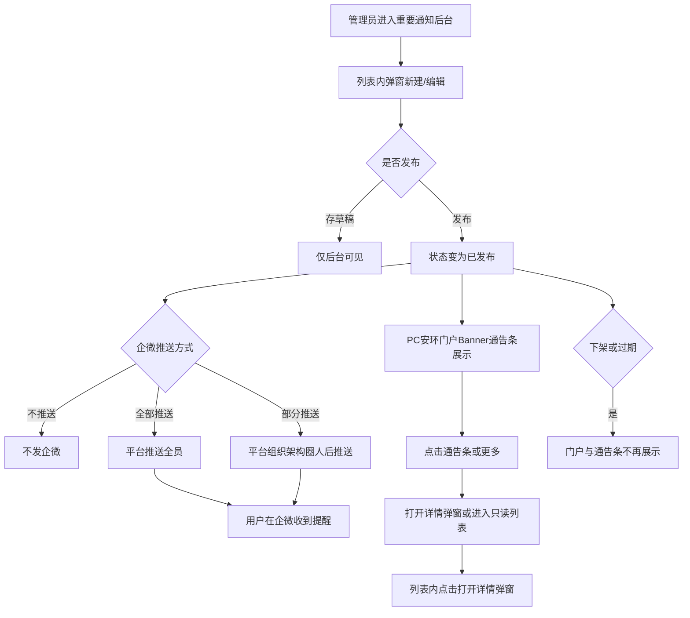
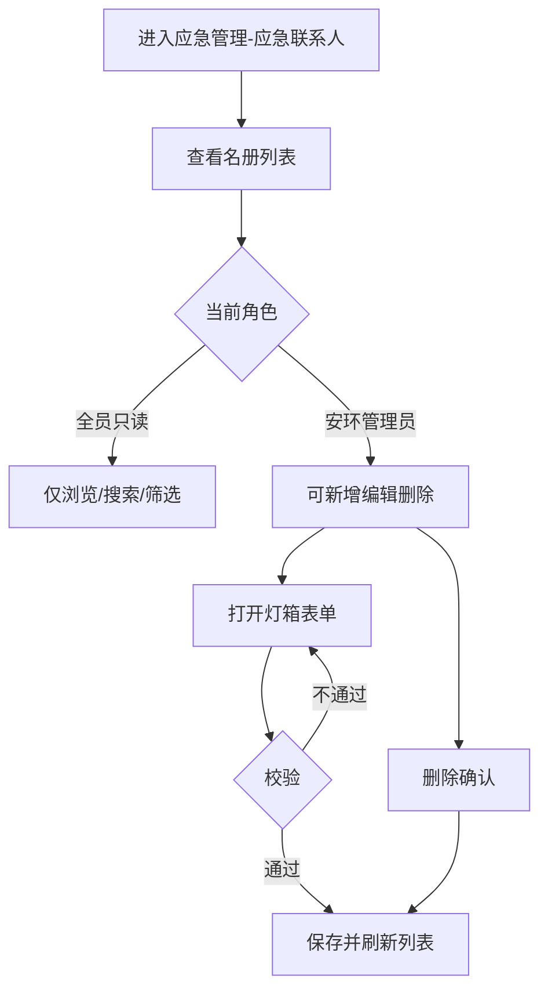
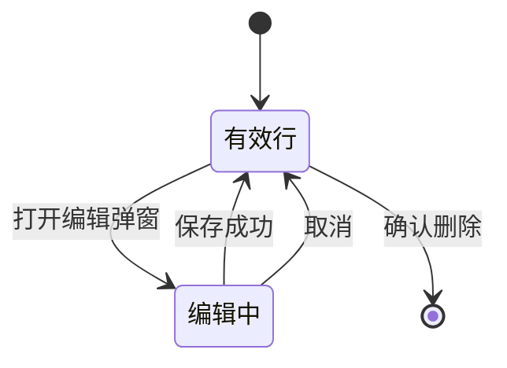
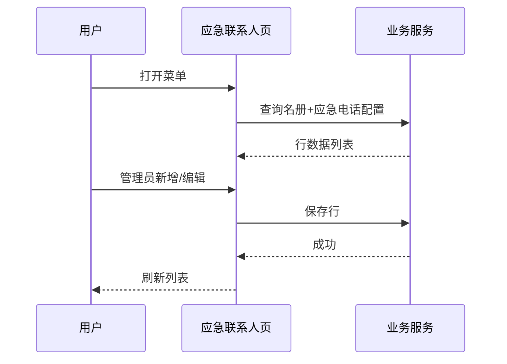
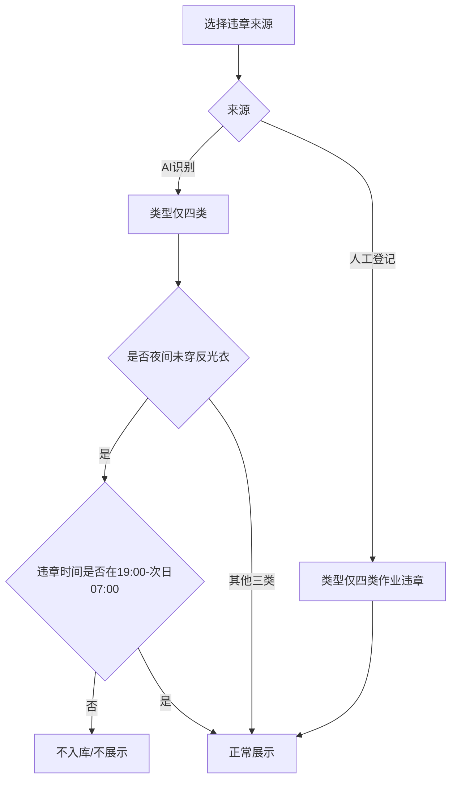
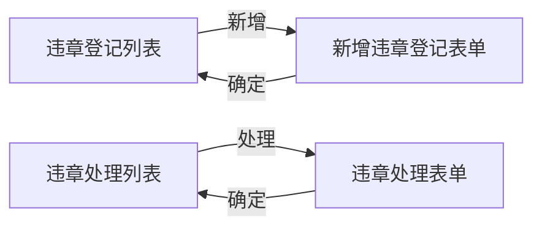

# SES 安环监测原型 PRD（v1.1.0）

<style>
  .prd-toc {
    position: fixed; left: 12px; top: 80px; width: 220px; max-height: calc(100vh - 100px);
    overflow-y: auto; z-index: 100; background: rgba(255,255,255,0.96);
    border: 1px solid #e5e7eb; border-radius: 8px; padding: 12px 14px; font-size: 13px;
    line-height: 1.5; box-shadow: 0 4px 12px rgba(0,0,0,0.05);
  }
  .prd-toc strong { display:block; margin-bottom:8px; color:#111827; font-size:13px; }
  .prd-toc a { display:block; color:#374151; text-decoration:none; margin:4px 0; padding:2px 0; }
  .prd-toc a:hover { color:#2563eb; }
  .prd-toc .l2 { padding-left:10px; color:#6b7280; font-size:12px; }
  .prd-toc .l3 { padding-left:18px; color:#9ca3af; font-size:12px; }
  @media (max-width: 1100px) { .prd-toc { display:none; } }
  .prd-body { max-width: 960px; margin: 0 auto; }
</style>

<nav class="prd-toc" aria-label="文档目录">
  <strong>目录</strong>
  <a href="#sec-version">版本信息</a>
  <a href="#sec-1">1. 产品概述</a>
  <a href="#sec-2">2. PC端</a>
  <a class="l2" href="#sec-2-1">2.1 使用监督统计</a>
  <a class="l3" href="#sec-2-2">2.2 业务流程</a>
  <a class="l3" href="#sec-2-3">2.3 统计口径</a>
  <a class="l3" href="#sec-2-4">2.4 功能说明</a>
  <a class="l2" href="#sec-2-5">2.5 安环门户·重要通知</a>
  <a class="l2" href="#sec-2-6">2.6 应急管理·应急联系人</a>
  <a class="l2" href="#sec-2-7">2.7 违章管理·违章登记</a>
  <a href="#sec-3">3. 企微H5端</a>
  <a class="l2" href="#sec-3-1">3.1 违章管理补强</a>
  <a class="l3" href="#sec-3-2">3.2 违章登记</a>
  <a class="l3" href="#sec-3-3">3.3 违章处理</a>
  <a href="#sec-4">4. 页面清单</a>
  <a href="#sec-5">5. 范围与权限</a>
  <a href="#sec-6">6. 非功能性需求</a>
  <a href="#sec-7">7. 系统功能清单</a>
  <a href="#sec-8">8. 风险项</a>
  <a href="#sec-9">9. 与 v1.0.0 关系</a>
  <a href="#sec-10">10. 验收要点</a>
  <a href="#sec-pending">待确认</a>
</nav>

<div class="prd-body">

---

## <span id="sec-version">版本信息</span>

| 项 | 内容 |
|----|------|
| **版本号** | v1.1.0 |
| **更新日期** | 2026-07-22 |
| **迭代说明** | ① **PC端**：使用监督统计；重要通知+公告后台；应急联系人；**违章管理→违章登记**列表（照片列、筛选、来源-类型级联、AI 口径）。② **企微H5端**：违章登记/处理表单；**违章登记列表与 PC 同步补强**；公告不在企微端做页面。③ 按终端分章编写。 |

---

## <span id="sec-1">1. 产品概述</span>

### 1.1 版本定位

本版本在 v1.0.0 安环业务能力之上，按终端增量交付：

| 终端 | 本版增量 |
|------|----------|
| **PC端** | ① 使用监督统计；② 重要通知+公告后台；③ 应急联系人；④ **违章管理→违章登记**列表维护 |
| **企微H5端** | 违章登记/处理；**违章登记列表与 PC 同步**（照片、筛选、级联口径）；**不提供**门户公告页 |
| **独立 App** | 本版不新增统计页、不新增违章/公告页面 |

安环无法单独统计登录；PC 统计以 **功能模块有效操作 + 业务闭环 + 用户使用排行** 作为监督依据。

### 1.2 产品目标

| 目标 | 终端 | 说明 | 优先级 |
|------|------|------|--------|
| 监督汇报 | PC | 日/周/月可导出使用数据 | P0 |
| 模块/用户可见 | PC | 树表 + 用户使用表 + 使用明细 | P0 |
| 闭环可见 | PC | 检查整改 / 违章 / 危险作业完成量 | P0 |
| **重要事项强提醒** | PC | 安环门户 Banner 滚动重要通知，强化首屏曝光 | P0 |
| **公告可运营** | PC | 后台可发布/下架/置顶，默认全员可见 | P0 |
| **应急联系人可维护** | PC | 应急组织名册可查看；安环管理员可增删改 | P0 |
| 违章可填报闭环 | 企微H5 | 登记、处理表单字段完备可走通 | P0 |
| **违章登记可筛查** | PC + 企微H5 | 列表含违章照片、类型/来源/时间筛选；来源-类型级联；AI 识别口径明确 | P0 |

### 1.3 用户角色

| 角色 | 终端 | 职责（业务侧） |
|------|------|----------------|
| 安环负责人 / 管理者 | PC | 查看使用监督统计、导出；发布/管理重要通知；维护应急联系人；**违章登记筛查与发起审核入口** |
| 系统管理员 | PC | 查看全量统计；可管理公告、应急联系人与违章登记 |
| 门户浏览人 / 全员 | PC | 查看重要通知；只读查看应急联系人名册（不可增删改） |
| 检查人 / 登记人 | PC / 企微H5 | PC 或企微新增/编辑违章登记；可收到企微推送后打开链接查看公告（落地见【待确认】） |
| 违章处理责任人 | 企微H5 | 填写违章处理并提交 |
| 普通业务用户 | PC/采集端 | 产生有效操作与单据；默认不使用统计菜单 |

> 审批**办理页**、平台消息中心列表页、角色权限配置页由平台统一支撑，本 PRD **不设计**。违章列表可保留「发起审核」**入口按钮**（调用平台）。企微推送由企微+平台触达，业务侧仅约定触发时机与文案要素。

### 1.4 版本边界

| 纳入 | 不纳入 |
|------|--------|
| PC 使用监督统计及 PC 原型 | 独立登录次数/人数 |
| PC 安环门户 Banner 重要通知 + 公告列表/详情 + 公告后台 | 企微端公告首页/列表页（本版不做） |
| PC 应急管理→应急联系人（列表维护） | 门户首页挂应急联系入口；Excel 导入；企微端应急名册页 |
| **PC 违章管理→违章登记列表**（照片列、筛选、级联、AI 口径） | 自研审批办理/节点配置页 |
| 发布成功后触发企微消息推送的**业务约定** | 消息中心 UI、订阅管理、已读回执后台（平台能力） |
| 企微 H5 违章登记/处理列表+表单；**登记列表与 PC 同步** | 按部门/角色过滤公告可见性（本版明确不做） |
| 违章表单来源-类型级联与 AI 时段校验 | 系统设置-基础配置使用统计 |
| Excel 导出（统计） | 权限配置 UI |

### 1.5 平台公共能力边界

| 能力 | 本产品约定 |
|------|------------|
| 审批办理 / 权限配置 | **不设计页面**；违章「发起审核」仅作平台入口 |
| **消息中心列表** | 不设计页面 |
| **企微消息推送** | 公告发布后由平台调用企微能力推送；本产品只约定触发条件与文案字段，**不画推送配置后台** |

---

## <span id="sec-2">2. PC端</span>

### <span id="sec-2-1">2.1 一级模块：使用监督统计【P0】</span>

独立一级菜单「使用监督统计」，按日/周/月展示总览、功能模块树表、用户使用表、业务闭环，支持导出与明细下钻。

| 维度 | 说明 |
|------|------|
| **前置条件** | 已登录一体化系统，具备本菜单数据范围约定（按钮显隐由平台控制） |
| **数据权限** | 安环负责人/系统管理员查看安环域全量；部门维为 P1 |
| **页面跳转** | 菜单 → `pc_使用监督统计_主页面.html`；明细抽屉 / `pc_使用监督统计_用户明细.html`；导出 Excel |

```mermaid
flowchart TD
  A[用户进入安环功能模块或菜单] --> B{同用户同功能10分钟内是否已记有效操作}
  B -->|是| C[忽略重复计入]
  B -->|否| D[记1次有效操作]
  E[整改通知变为已复核] --> F[记检查整改闭环完成]
  G[违章处理审核通过] --> H[记违章闭环完成]
  I[危险作业申请审核通过] --> J[记危险作业闭环完成]
  D --> K{是否系统管理员或admin}
  F --> K
  H --> K
  J --> K
  K -->|是| L[不计入统计]
  K -->|否| M[写入日汇总]
  M --> N[按日/周/月聚合]
  N --> O[PC使用监督统计页展示]
  O --> P[导出Excel]
```

### <span id="sec-2-2">2.2 业务流程</span>



**文字解读：**

- **正常**：有效操作与闭环 → 排除管理员 → 日汇总 → 日/周/月查看 → 导出。  
- **边界**：闭环计入**完成状态发生**的周期；有操作无办单则闭环为 0。  
- **异常兜底**：未埋点标「未接入」禁止显示为 0；汇总失败提示数据延迟（P1）。

管理者路径：

```text
安环域 → 使用监督统计 → 选日/周/月与端 → 总览 → 模块树展开 → 用户使用表/使用明细 → 闭环 → 导出
```

### <span id="sec-2-3">2.3 统计口径（已锁定）【P0】</span>

| 维度 | 规则 |
|------|------|
| 日/周/月 | 自然日；自然周周一至周日；自然月 |
| 排除账号 | 系统管理员角色、账号 `admin`（及同等身份）；全指标排除 |
| **有效操作** | 进入/操作纳管功能后，同一用户+同一功能 **10 分钟内仅计 1 次** |
| **有效用户数** | 周期内产生过有效操作的去重用户数 |
| PC 纳管 | 含门户，不含系统设置-基础配置 |
| App 采集范围 | 安环检查、违章管理、危险作业相关菜单（仅作数据采集，本版无 App 统计页） |
| 功能模块树 | 一级默认收起；展开为功能菜单 |
| 使用明细 | **仅一级功能模块**，不含菜单层拆分 |

**业务闭环完成计入：**

| 链路 | 完成条件 |
|------|----------|
| 检查 → 整改 → 已复核 | 状态变为已复核且时间落在统计期 |
| 违章登记 → 处理 → 审核通过 | 处理审核通过（平台回写）且时间落在统计期 |
| 危险作业 → 审核通过 | 申请审核通过；不以作业票导出为准 |

**明确不做：** 登录统计、消息推送、基础配置统计、留存漏斗、使用明细下级菜单拆分。

### <span id="sec-2-4">2.4 功能说明【P0】</span>

#### 2.4.1 筛选区

| 筛选项 | 优先级 |
|--------|--------|
| 日/周/月、周期、端（全部/PC/App） | P0 |
| 部门 | P1 |

#### 2.4.2 总览卡片

有效操作合计、有效用户数、检查整改已复核数、违章处理审核通过数、危险作业审核通过数、冷模块数（本期有效操作=0 的一级模块，不含未接入）。

#### 2.4.3 功能模块使用表

列：功能模块（树）、类型、端、有效操作、有效用户数、状态、用户明细。默认全部收起；支持全部展开/收起。

#### 2.4.4 用户使用表

按有效操作降序；列含排名、账号/姓名/部门、有效操作、触达一级模块数、最近使用时间、**使用明细**。

#### 2.4.5 使用明细 / 模块用户明细

- 使用明细：仅一级功能模块分布（可含占个人总操作比）。  
- 模块用户明细：可抽屉或打开 `pc_使用监督统计_用户明细.html`。

#### 2.4.6 业务闭环看板与导出

闭环与 §2.3 一致。导出 Excel 多 Sheet：功能模块使用、用户使用、用户使用明细（一级模块）、模块用户明细、业务闭环。文件名建议：`安环使用监督统计_{粒度}_{周期}.xlsx`。

### <span id="sec-2-5">2.5 一级模块：安环门户 · 重要通知（消息公告）【P0】</span>

#### 2.5.1 模块定位

| 维度 | 说明 |
|------|------|
| **场景** | 仅 **PC 安环门户首页** 强化重要事项提醒；**不**在企微 H5 做公告版面 |
| **布局方案** | 采用方案 **C**：在门户顶部主题 Banner **下方（或 Banner 内底部）** 增加 **重要通知滚动通告条**，强化首屏提醒 |
| **与违章公告** | 「违章公告」看板保留不变；重要通知走 Banner 通告条，职责分离 |
| **可见范围** | **默认全员可见**，本版本**不区分**部门/角色数据权限 |
| **企微侧** | 公告发布（及重要/紧急）后，由平台触发 **企微消息推送** 提醒用户查看；落地页建议 PC 公告详情或平台统一 H5 详情【待确认】；**本产品不画企微消息列表、不画推送配置页** |

#### 2.5.2 业务流程



**文字解读：**

- **正常**：列表弹窗新建/编辑 → 发布 → 门户通告条展示；若选择全部/部分推送则由平台发企微消息 → 用户点通告条或列表弹窗看详情。  
- **边界**：无生效通知 → **整条「重要通知」通告条模块隐藏**；仅草稿 → 门户不展示；部分推送未选人不可发布；推送范围不影响门户全员可见。  
- **异常兜底**：推送失败不影响门户展示，后台可提示「已发布，企微推送失败可重试」（重试入口由平台或后台按钮【待确认】）；详情无数据 → 弹窗内友好提示或关闭后回列表。

#### 2.5.2A PC 固定业务菜单【P0】

跨页侧栏外观与结构保持一致，预览切换时菜单骨架不变，仅高亮当前项。

| 层级 | 菜单文案 | 跳转 | 说明 |
|------|----------|------|------|
| 一级 | 安环门户 | 安环门户首页 | — |
| 一级 | 使用监督 | 使用监督统计主页面 | 菜单名简化，功能同「使用监督统计」 |
| 一级 | 公告信息 | 仅展开/收起 | 默认展开 |
| 二级 | 重要通知 | 重要通知管理后台列表 | 新建/编辑/发布/下架 |
| 一级 | 应急管理 | 仅展开/收起 | 默认展开 |
| 二级 | 应急联系人 | 应急联系人名册列表 | 全员只读；安环管理员可维护 |
| 一级 | 违章管理 | 仅展开/收起 | 默认展开 |
| 二级 | 违章登记 | PC 违章登记列表 | 新增/批量删除/查看/编辑/删除/发起审核 |

> 用户明细、详情兜底页等子页可不挂侧栏；门户「更多」进入的只读列表仍挂同一固定侧栏。不在安环门户首页另挂应急联系入口。

#### 2.5.3 门户端 · Banner 重要通知通告条【P0】

| 项 | 说明 | 优先级 |
|----|------|--------|
| **位置** | 安环门户首页，主题 Banner 下方通栏（或叠在 Banner 底部一条半透明条） | P0 |
| **样式** | 左侧「重要通知」标签（可用警示色）；中部横向滚动标题；右侧「更多」 | P0 |
| **条数** | 同时参与滚动的已发布未过期公告，建议最多 **10** 条；展示优先级：紧急 > 重要 > 一般，同级按发布时间倒序 | P0 |
| **交互** | 点击单条 → **弹窗**展示详情；点击「更多」→ 重要通知只读列表 | P0 |
| **强化提醒** | 紧急级可角标「紧急」；可轻微动效/高对比底色（避免刺眼闪烁） | P0 |
| **空态** | **无生效数据时：整模块隐藏**（不展示弱提示条、不占位） | P0 |

##### 通告条 · UI 场景说明（原型未必全切，以本表为准）【P0】

| 场景 | UI 表现 | 优先级 |
|------|---------|--------|
| 有 ≥1 条生效通知 | 展示通告条；滚动标题；右侧「更多」可见 | P0 |
| 0 条生效通知 | **整模块隐藏**；Banner 直接衔接下方看板，无空白占位 | P0 |
| 仅草稿 / 已下架 / 已过期 | 同 0 条，不进入通告条与只读列表 | P0 |
| 仅 1 条通知 | 通告条仍展示；可滚动或静止均可，不强制双列复制滚动 | P1 |
| 紧急级混排 | 「紧急」角标高对比；排序优先 | P0 |
| 标题超长 | 通告条单行省略或横向滚出；弹窗内完整展示 | P0 |
| 弹窗打开时 | 蒙层 + 居中弹窗；Esc/知道了/点击蒙层关闭 | P0 |

> 不新增替换「违章公告」看板；看板区布局可保持 v1.0.0 既有 2×2。

#### 2.5.4 门户端 · 重要通知列表 / 详情弹窗【P0】

| 形态 | 说明 |
|------|------|
| 只读列表 | 由通告条「更多」进入；列：级别、标题、发布时间、发布单位；支持按级别筛选（P1） |
| 详情 | **统一为弹窗**，不作为独立业务页主路径；展示标题、级别、发布时间、发布单位、正文、附件（如有） |
| 列表空态 | 列表区展示「暂无重要通知」（与门户通告条「整模块隐藏」区分：列表页用户主动进入，需明示空态） |

#### 2.5.5 后台 · 重要通知管理【P0】

本版**同步交付后台**（PC），菜单路径：**公告信息 → 重要通知**。

| 能力 | 说明 | 优先级 |
|------|------|--------|
| 公告列表 | 全部/草稿/已发布/已下架；搜索标题 | P0 |
| 新建/编辑 | **列表页中央标准弹窗（灯箱蒙层）**，不跳转独立编辑页 | P0 |
| 发布 | 草稿→已发布；触发门户展示；按配置触发企微推送 | P0 |
| 下架 | 已发布→已下架；门户立即消失 | P0 |
| 删除 | 仅草稿可删，或已下架二次确认删除【待确认】 | P1 |
| 置顶 | 提升通告条排序权重 | P0 |

**后台表单字段（弹窗内）：**

| 字段 | 说明 | 必填 | 优先级 |
|------|------|------|--------|
| 标题 | ≤30 字建议 | 是 | P0 |
| 重要级别 | 一般 / 重要 / 紧急 | 是 | P0 |
| 是否置顶 | 是/否 | 否 | P0 |
| 正文 | 富文本或纯文本 | 是 | P0 |
| 附件 | 可选多个 | 否 | P1 |
| 生效时间 | 默认=发布时间 | 是 | P0 |
| 失效时间 | 到期自动不在门户展示 | 是 | P0 |
| 发布单位 | 可默认当前部门 | 否 | P1 |
| 发起企微消息 | **不推送 / 全部推送 / 部分推送** 三选一；**不强制推送**（含紧急） | 是（默认「不推送」） | P0 |
| 部分推送·接收人 | 调用**平台组织架构**选人（可一人或多名）；**本产品不自研选人页/组织树原型** | 部分推送时必填 ≥1 人 | P0 |

#### 2.5.6 企微推送约定（不画选人页）【P0】

| 项 | 约定 |
|----|------|
| **触发** | 公告状态变为「已发布」且推送方式≠「不推送」；**不因紧急级别强制推送** |
| **全部推送** | 对安环应用可见范围内全员发企微消息（由平台/企微通讯录决定） |
| **部分推送** | 对已选接收人（一人或多名）推送；选人统一复用**平台组织架构组件**，业务侧只存人员 ID 列表 |
| **不推送** | 仅门户通告条/列表可见，不发企微消息 |
| **门户 vs 推送** | 门户重要通知仍**全员可见**；推送范围只影响企微消息接收对象 |
| **本产品不设计** | 企微消息列表、催办、已读统计配置页、自研组织树/选人界面 |

##### 发布弹窗 · 企微推送 UI 场景【P0】

| 场景 | UI 表现 |
|------|---------|
| 默认打开新建 | 「发起企微消息」默认 **不推送** |
| 选「全部推送」 | 不展示选人入口 |
| 选「部分推送」 | 展示「选择接收人」入口；点击调起平台组织架构；回写已选人数（原型示意） |
| 部分推送未选人即发布 | 拦截并提示至少选择 1 人 |
| 紧急级别 | 与一般/重要相同，**不强制**勾选推送 |

---

### <span id="sec-2-6">2.6 一级模块：应急管理 · 应急联系人【P0】</span>

#### 2.6.1 模块定位

| 维度 | 说明 |
|------|------|
| **场景** | PC 侧维护「公司应急组织及人员联系方式」名册，对齐业务表 **Y6.1-1** |
| **菜单位置** | 一级 **应急管理** → 二级 **应急联系人** |
| **交付边界** | **仅维护名单入口**；不在安环门户首页展示；不做企微端名册页；**不支持 Excel 导入**（本版纯手动） |
| **数据形态** | **一机构多行**：同一机构可对应多条人员行；列表**每行完整展示机构名称**（不合并省略） |

#### 2.6.2 四维说明【P0】

| 维度 | 内容 |
|------|------|
| **功能介绍** | 集中维护应急指挥体系各机构成员的职责、职务、姓名与电话，便于查询与日常更新 |
| **前置条件** | 用户已登录 PC 安环域；具备「应急联系人」菜单可见权限（平台配置） |
| **数据权限** | **全员只读查看**；**仅安环负责人/管理者及系统管理员可新增、编辑、删除**（方案 A，已确认） |
| **页面跳转** | 菜单 → 列表页；管理员点击「新增/编辑」→ 同页灯箱弹窗；删除 → 二次确认后刷新列表 |

#### 2.6.3 业务流程







**文字解读：**

- **正常**：打开列表查看；管理员弹窗录入保存；顶部展示统一「应急电话」。  
- **边界**：姓名可空（业务表常见待补录）；电话可空；同一机构多行人行独立维护；列表空态提示「暂无应急联系人」。  
- **异常兜底**：保存失败保留表单内容并提示重试；删除失败不移除行；无维护权限时隐藏「新增/编辑/删除」按钮（只读）。

#### 2.6.4 列表页【P0】

| 项 | 说明 | 优先级 |
|----|------|--------|
| **页头** | 标题「应急联系人」；副文案对齐表 Y6.1-1；展示 **应急电话**（全局配置，可编辑入口仅管理员） | P0 |
| **操作** | 全员：**查看**；管理员另含：新增、编辑、删除 | P0 |
| **筛选** | 按机构名称筛选；关键词搜索（姓名/电话/职务）（P1） | P0 机构筛选 / P1 搜索 |
| **表格列** | 序号、机构名称、内部职责、公司内职务、人员姓名、联系电话、操作 | P0 |
| **展示** | **每一行完整展示机构名称**（不合并省略）；仍为一机构多行存储 | P0 |
| **排序** | 默认按机构排序号 + 行内顺序；支持拖拽排序【待确认，一期可手工改序号】 | P1 |

#### 2.6.5 新增/编辑弹窗字段【P0】

纯手动录入，中央灯箱弹窗（与重要通知后台交互一致）。

| 字段 | 说明 | 必填 | 优先级 |
|------|------|------|--------|
| 机构名称 | 下拉可选已有机构或手工输入新机构；演示机构见基线数据 | 是 | P0 |
| 内部职责 | 如总指挥、副总指挥、应急办负责人、联络员、组长、组员 | 是 | P0 |
| 公司内职务 | 如副总经理、安监部部长等；可空 | 否 | P0 |
| 人员姓名 | 可空，支持后续补录 | 否 | P0 |
| 联系电话 | 可空；支持手机号/短号；不做强校验阻断保存（弱提示） | 否 | P0 |
| 行排序 | 同机构内展示顺序，默认追加到末尾 | 否 | P1 |

**全局配置（列表页头或弹窗旁）：**

| 字段 | 说明 | 必填 | 优先级 |
|------|------|------|--------|
| 应急电话 | 名册页统一展示，对应表脚「应急电话」；演示默认 `186270336` | 是 | P0 |

#### 2.6.6 基线演示数据约定【P0】

| 约定 | 说明 |
|------|------|
| 机构与职责 | 对齐业务表 Y6.1-1；缺序号 **5**，按 1–4、6–8 保留，**不补**占位机构（应急指挥部、应急指挥办公室、通讯联络组、警戒疏散组、抢险救援组、后勤保障组、医疗救护组） |
| 姓名 / 电话 | **正式规则允许为空**（待补录）；原型演示数据可补全姓名与 11 位电话便于评审，**不以演示数据替代正式通讯录** |
| 机构名称展示 | 每一行完整显示机构名称 |
| 应急电话 | 页头全局配置；演示可用完整号码 |

##### UI 场景说明【P0】

| 场景 | UI 表现 |
|------|---------|
| 全员只读 | 无新增按钮；无行内编辑/删除；可浏览 |
| 管理员 | 可见新增、编辑、删除；可改应急电话 |
| 列表为空 | 空态文案 + 管理员可见「新增」 |
| 姓名/电话为空 | 单元格展示「—」，允许保存 |
| 删除 | 二次确认：「确认删除该联系人？」 |

---

### <span id="sec-2-7">2.7 一级模块：违章管理 · 违章登记（PC）【P0】</span>

#### 2.7.1 模块定位

| 维度 | 说明 |
|------|------|
| **场景** | PC 后台维护违章登记名册，与企微 H5 违章登记列表**同一业务口径**同步交付 |
| **菜单位置** | 一级 **违章管理** → 二级 **违章登记** |
| **能力** | 列表查询、筛选、新增、批量删除、查看、编辑、删除、**发起审核**（触发平台审批，**不设计审批办理页**） |
| **与企微** | 列表字段、筛选、来源-类型级联、AI 识别口径 **PC 与企微保持一致** |

#### 2.7.2 四维说明【P0】

| 维度 | 内容 |
|------|------|
| **功能介绍** | 集中查看与维护违章登记单据，支持按类型/来源/时间筛查，并展示违章照片 |
| **前置条件** | 已登录 PC；具备违章登记菜单权限（平台配置） |
| **数据权限** | 按组织/项目范围查看（如项目部下拉）；具体行权由平台配置，本版不画权限页 |
| **页面跳转** | 菜单 → 列表；新增 → 表单/弹窗；查看/编辑 → 详情或编辑；发起审核 → 调用平台审批（无自研审批页） |

#### 2.7.3 列表页【P0】

**工具栏：**

| 项 | 说明 | 优先级 |
|----|------|--------|
| 项目/组织切换 | 如「武穴项目部」下拉 | P0 |
| **新增** | 保留 | P0 |
| **批量删除** | 保留；需勾选 ≥1 行；二次确认 | P0 |
| 关键词搜索 | 编号/地点/人员等 | P1 |

**筛选区（本版新增/明确）：**

| 筛选项 | 说明 | 优先级 |
|--------|------|--------|
| 违章来源 | 下拉：全部 / AI识别 / 人工登记 | P0 |
| 违章类型 | 与来源**级联**（见 2.7.4）；先选来源再选类型，来源=全部时类型可选「全部」或禁用至选定来源 | P0 |
| 违章时间 | **起止时间**（开始日期时间 ~ 结束日期时间） | P0 |

**表格列（相对截图增量）：**

| 列序 | 字段 | 说明 | 优先级 |
|------|------|------|--------|
| 1 | 复选框 | 批量选择 | P0 |
| 2 | 序号 | — | P0 |
| 3 | 违章编号 | — | P0 |
| 4 | 违章类型 | — | P0 |
| 5 | **违章照片** | **新增**，紧挨违章类型之后；缩略图展示；**点击放大**（灯箱） | P0 |
| 6 | 来源 | AI识别 / 人工登记 等 | P0 |
| 7 | 违章人员 | 可空 | P0 |
| 8 | 违章处理责任人 | 可空 | P0 |
| 9 | 违章地点 | — | P0 |
| 10 | 违章时间 | — | P0 |
| 11 | 登记人 | 可空 | P0 |
| 12 | 登记部门 | 可空 | P0 |
| 13 | 操作 | 查看 / 编辑 / 删除 / **发起审核** | P0 |

**操作约定：**

| 操作 | 说明 | 优先级 |
|------|------|--------|
| 查看 | 打开详情（含大图） | P0 |
| 编辑 | 进入编辑 | P0 |
| 删除 | 单行删除，二次确认 | P0 |
| 发起审核 | **保留**；点击后调用**平台审批能力**；本产品**不设计**审批节点/办理页/审批记录页 | P0 |

##### UI 场景【P0】

| 场景 | 表现 |
|------|------|
| 无照片 | 缩略图位展示「暂无照片」占位，不可放大 |
| 有照片 | 缩略图；点击灯箱放大，可关闭 |
| 未勾选点批量删除 | 提示先选择记录 |
| 筛无结果 | 空态「暂无符合条件的违章记录」 |

#### 2.7.4 来源 · 类型级联与 AI 识别口径【P0】

**级联规则（列表筛选、新增/编辑表单共用）：**

| 违章来源 | 违章类型可选值 |
|----------|----------------|
| **AI识别** | **仅**：车辆超速、夜间未穿反光衣、未带安全帽、吸烟 |
| **人工登记** | **仅**：人员作业违章、设备作业违章、环境作业违章、制度执行违章 |
| 全部（仅筛选） | 不限定类型，或类型先选来源后再选 |

**AI 识别范围（写入业务规则，P0）：**

| 规则项 | 约定 |
|--------|------|
| 纳入类型 | AI 识别**仅仅包括**：① 车辆超速；② 夜间未穿反光衣；③ 未带安全帽；④ 吸烟 |
| 夜间未穿反光衣时段 | **仅截取当日 19:00（含）至次日 07:00（不含）** 的识别结果入库/展示 |
| 其他时段 | **19:00 前至 07:00 后** 的「未穿反光衣」识别结果 **不需要**（不入库、不展示） |
| 非上述四类 | AI 侧其他识别类目本产品不承接 |



**文字解读：**

- **正常**：来源决定类型选项；AI 四类可展示；夜间反光衣仅夜间时段有效。  
- **边界**：切换来源时清空已选类型；筛选来源=AI 时类型下拉只出四类。  
- **异常兜底**：历史脏数据若来源/类型不匹配，列表仍可展示但编辑时强制按级联重选。

---

## <span id="sec-3">3. 企微H5端</span>

### <span id="sec-3-1">3.1 一级模块：违章管理补强【P0】</span>

| 维度 | 说明 |
|------|------|
| **形态** | 企业微信内嵌 H5；无独立 App 外壳、无自定义底部 Tab |
| **范围** | 违章登记列表/新增表单；违章处理列表/处理表单 |
| **与 PC** | **违章登记列表**与 PC §2.7 **同步**：违章照片列、类型/来源/时间筛选、来源-类型级联、AI 口径 |
| **边界** | **保留「发起审核」入口**（调用平台审批）；**不设计**审批办理页、审批节点配置页 |
| **相对 v1.0.0** | 本版交付完整表单字段与企微样式页；列表按本版规则迭代 |



**文字解读：**

- **正常**：登记提交进入可处理；处理责任人打开待处理填写并确定归档（状态回写依赖平台）。  
- **边界**：必填未填不可提交；字数 500 上限；列表筛无结果空态。  
- **异常兜底**：上传失败可重试（原型 toast）；提交失败保留已填内容。

### <span id="sec-3-2">3.2 违章登记【P0】</span>

| 维度 | 说明 |
|------|------|
| **功能介绍** | 登记违章信息；列表支持筛查与照片预览；底部「新增违章登记」进入表单 |
| **页面** | `违章管理_违章登记_list.html` → `wecom_违章管理_违章登记_form.html` |
| **列表同步 PC** | 见 §2.7.3～2.7.4（照片在类型后、筛选、级联、AI 时段规则） |
| **底部操作** | 取消（回列表）/ 确定（校验后回列表） |

**列表增量（企微）：**

| 项 | 说明 | 优先级 |
|----|------|--------|
| 违章照片 | 卡片/列表展示缩略图，类型信息旁或下方；**点击放大** | P0 |
| 筛选 | 违章类型、违章来源、违章时间（起止） | P0 |
| 级联 | 来源 AI → 仅四类；来源人工 → 四类作业违章 | P0 |
| 操作 | 查看 / 编辑 / **发起审核**（平台入口） | P0 |

**新增表单字段分组：**

| 分组 | 字段 | 交互 | 优先级 |
|------|------|------|--------|
| 安全日志 | 违章编号 | 只读，系统自动生成 | P0 |
| 安全日志 | 违章来源 | 必填：AI识别 / 人工登记 | P0 |
| 安全日志 | 违章类型 | 必填；**以来源级联**（§2.7.4） | P0 |
| 违章信息 | 违章时间 | 必填，日期时间；AI「夜间未穿反光衣」须落在 19:00–次日 07:00 | P0 |
| 违章信息 | 违章地点 | 必填输入 | P0 |
| 违章信息 | 违章人员 | 必填输入 | P0 |
| 违章信息 | 违章处理责任人 | 必填选择 | P0 |
| 违章信息 | 违章记录 | 多行，0/500 | P0 |
| 违章信息 | 违章照片 | 上传示意 | P0 |
| 其他信息 | 登记人 | 只读自动填充 | P0 |
| 其他信息 | 登记部门 | 只读自动填充 | P0 |
| 其他信息 | 登记时间 | 只读自动填充 | P0 |

### <span id="sec-3-3">3.3 违章处理【P0】</span>

| 维度 | 说明 |
|------|------|
| **功能介绍** | 对待处理违章填写处罚信息并提交；列表「处理」进入表单 |
| **页面** | `违章管理_违章处理_list.html` → `wecom_违章管理_违章处理_form.html` |
| **说明** | 本版表单**不附加**顶部关联违章只读区，严格按业务处理弹窗字段 |

**处理表单字段：**

| 字段 | 交互 | 优先级 |
|------|------|--------|
| 处理编号 | 只读已生成 | P0 |
| 违章类目 | 必填下拉 | P0 |
| 违章内容 | 必填下拉 | P0 |
| 考核（元） | 只读带出 | P0 |
| 扣除金额 | 可编辑（必填） | P0 |
| 违章处罚单位 | 只读自动带出 | P0 |
| 违章处罚人员 | 只读自动带出 | P0 |
| 处理说明 | 多行，0/500 | P0 |
| 处理文件 | 上传示意 | P0 |
| 处理照片 | 上传示意 | P0 |
| 取消 / 确定 | 回列表 / 校验后保存回列表 | P0 |

---

## <span id="sec-4">4. 页面清单与跳转关系</span>

### 4.1 PC端

| 序号 | 页面文件名 | 页面名称 | 上游 | 下游 | 状态 |
|------|-----------|----------|------|------|------|
| 1 | `pc_使用监督统计_主页面.html` | 使用监督主页面 | 固定菜单「使用监督」 | 抽屉、子页、导出 | 已交付 |
| 2 | `pc_使用监督统计_用户明细.html` | 模块用户明细子页 | 主页面 | 返回主页面 | 已交付 |
| 3 | `pc_安环门户_home.html` | 安环门户首页（通告条；空则隐藏；点击弹窗） | 固定菜单「安环门户」 | 只读列表 / 详情弹窗 | **已交付** |
| 4 | `pc_消息公告_list.html` | 重要通知只读列表 | 通告条「更多」 | 详情弹窗 | **已交付** |
| 5 | `pc_消息公告_detail.html` | 详情兜底（兼容旧链，弹窗后回列表） | 旧链接 | 列表 | **已交付（非主路径）** |
| 6 | `pc_消息公告_管理_list.html` | 重要通知管理（含新建/编辑灯箱弹窗） | 菜单「公告信息→重要通知」 | 弹窗发布/预览 | **已交付** |
| 7 | `pc_消息公告_管理_form.html` | 旧独立表单（已改为跳转列表弹窗） | 旧链兜底 | 管理列表弹窗 | **已降级为跳转页** |
| 8 | `pc_应急联系人_list.html` | 应急联系人名册（只读/维护；灯箱录入） | 菜单「应急管理→应急联系人」 | 新增/编辑弹窗 | **已交付** |
| 8b | `pc_违章管理_违章登记_list.html` | PC 违章登记列表（照片/筛选/级联） | 菜单「违章管理→违章登记」 | 新增/查看/编辑/审核入口 | **已交付** |

### 4.2 企微H5端

| 序号 | 页面文件名 | 页面名称 | 上游 | 下游 | 状态 |
|------|-----------|----------|------|------|------|
| 9 | `违章管理_违章登记_list.html` | 企微违章登记列表（与 PC 同步补强） | 版本入口 | 新增表单 | **已交付** |
| 10 | `wecom_违章管理_违章登记_form.html` | 新增违章登记（来源-类型级联 + AI 时段校验） | 列表 | 回列表 | **已交付** |
| 11 | `违章管理_违章处理_list.html` | 违章处理列表 | 版本入口 | 处理表单 | 已交付（迁入） |
| 12 | `wecom_违章管理_违章处理_form.html` | 违章处理 | 列表 | 回列表 | 已交付（迁入） |
| 13 | `prototype/versions/v1.1.0/index.html` | 本版本原型入口 | 全局总入口 | 上述全部 | 已交付 |

> 企微端**不**新增消息公告页面；推送查看依赖企微消息能力。

---

## <span id="sec-5">5. 范围与权限说明</span>

| 能力 | 普通用户/全员 | 安环负责人 | 系统管理员 | 登记人/处理人 |
|------|---------------|------------|------------|---------------|
| 使用监督统计 | 否 | 是（全量） | 是（全量） | 否 |
| 门户重要通知 / 详情弹窗 | **是（全员可见）** | 是 | 是 | 是 |
| 重要通知后台发布/下架 | 否 | 是 | 是 | 否 |
| **应急联系人查看** | **是（全员只读）** | 是 | 是 | 是 |
| **应急联系人增删改 / 改应急电话** | 否 | **是** | **是** | 否 |
| 违章登记列表查看/筛选 | 按项目权限 | 是 | 是 | 是（本人相关约定范围） |
| 违章登记新增/编辑/删除/批量删除 | 按权限 | 是 | 是 | 登记人可操作本人单据【待确认】 |
| 违章「发起审核」入口 | 按权限 | 是 | 是 | 是（调用平台，无自研审批页） |
| 违章处理业务页 | — | 可查看约定范围 | 可查看 | 操作本人相关单据 |

- 消息公告本版**不做**按部门/角色过滤。  
- 一期统计默认仅「安环负责人 + 系统管理员」可见菜单。【待确认】  
- 权限配置由平台支撑，原型不绘制权限页；**不绘制**平台消息中心页。

---

## <span id="sec-6">6. 非功能性需求</span>

| 类别 | 要求 | 优先级 |
|------|------|--------|
| 性能 | 单周期汇总 3 秒内；导出 1 万行内可完成；通告条接口轻量快速 | P0 |
| 准确 | 排重、排除账号、闭环一致；过期公告不展示；AI 反光衣时段过滤正确 | P0 |
| 提醒 | 紧急通知通告条视觉强于一般，但不使用刺眼闪烁 | P0 |
| 企微兼容 | 违章 H5：viewport 固定；字号≥12px；`-webkit-` 前缀 | P0 |
| 兼容性 | PC Chrome/Edge；可 GitHub Pages 访问 | P1 |

---

## <span id="sec-7">7. 系统功能清单</span>

| 终端 | 一级功能 | 二级功能 | 优先级 | 本版包含 |
|------|----------|----------|--------|----------|
| PC | 使用监督 | 菜单/日周月/有效操作与用户/树表/用户表/明细/闭环/导出/排除 admin | P0 | 是 |
| PC | 使用监督 | 部门筛选/环比/闭环单据清单 | P1 | 否 |
| PC | 安环门户·重要通知 | Banner 滚动通告条（无数据整模块隐藏） | P0 | 是 |
| PC | 重要通知 | 只读列表 + 详情弹窗 | P0 | 是 |
| PC | 公告信息→重要通知（后台） | 列表内灯箱弹窗新建/编辑/发布/下架/置顶 | P0 | 是 |
| PC | 重要通知 | 企微：不推送 / 全部 / 部分（平台组织架构选人） | P0 | 是（不画选人页） |
| PC | 应急管理→应急联系人 | 一机构多行名册；全员只读；管理员手动增删改 | P0 | 是 |
| PC | 应急联系人 | 门户挂载 / Excel 导入 / 企微名册 | — | **否** |
| PC | 违章管理→违章登记 | 列表照片列、筛选、来源-类型级联、发起审核入口 | P0 | 是 |
| 企微H5 | 违章管理 | 违章登记列表/表单、处理列表/表单；登记列表与 PC 同步 | P0 | 是 |
| 企微H5 | 消息公告页 | 门户式公告版面 | — | **否** |
| 企微H5 | 统计 | 使用监督统计页 | — | **否** |
| 独立 App | 违章/统计/公告 | — | — | **否（本版）** |

---

## <span id="sec-8">8. 风险项</span>

| 风险 | 说明 | 应对 | 优先级 |
|------|------|------|--------|
| 无登录指标被质疑 | 领导习惯看登录 | 口径统一为有效操作+闭环 | P0 |
| 管理员误伤 | 业务管理员被当 admin | 排除限定系统管理员角色或账号=`admin` | P0 |
| 通告条淹没主视觉 | Banner 过吵 | 单行通栏+限条数；紧急才强样式 | P0 |
| 与平台消息中心混淆 | 用户找待办 | 文案用「重要通知/消息公告」；不开放消息中心 UI | P0 |
| 企微推送失败 | 门户有、推送无 | 门户仍展示；失败可重试（平台/后台） | P0 |
| 姓名长期空白 | 联系人不落地 | 列表空姓名展示「—」；运营补录 | P1 |
| 电话残缺/短号 | 外呼失败 | 允许短号与空值；不做强阻断 | P1 |
| AI 反光衣时段漏检/误拦 | 白天反光衣进库 | 入库与展示双重校验 19:00～次日 07:00 | P0 |
| 来源-类型级联不一致 | PC/企微选项漂移 | 两端共用字典与规则说明 | P0 |
| 违章与 v1.0.0 分版 | 入口找错版本 | 全局总入口明确 v1.1.0 | P0 |
| 闭环状态码不一致 | 命名差异 | 状态映射表评审 | P0 |

---

## <span id="sec-9">9. 与 v1.0.0 关系</span>

| 项 | 说明 |
|----|------|
| 继承 | 安环检查、危险作业、门户主体（隐患公示等）以 v1.0.0 为准 |
| 本版 PC 增量 | 使用监督；重要通知+公告后台；应急联系人；**违章登记列表** |
| 本版企微增量 | 违章登记/处理；**登记列表与 PC 同步**（照片/筛选/AI 口径）；公告仅推送触达 |
| v1.0.0 原型 | 门户无重要通知条；违章页已迁出 |

---

## <span id="sec-10">10. 验收要点（P0）</span>

**PC · 使用监督统计：**  
1. 独立菜单可进入，日/周/月正确。  
2. 10 分钟同用户同功能只计 1 次有效操作。  
3. admin/系统管理员不出现在汇总与明细。  
4. 功能模块表默认收起可展开；使用明细仅一级模块。  
5. 导出与页面一致；无审批/消息中心/权限配置页。

**PC · 重要通知 / 公告后台：**  
6. 固定侧栏含「安环门户 / 使用监督 / 公告信息→重要通知 / 应急管理→应急联系人 / 违章管理→违章登记」，跨页样式一致。  
7. 有生效通知时门户展示通告条；**无生效通知时整模块隐藏**。  
8. 点击通告条单条 → 详情弹窗；「更多」→ 只读列表，列表再弹窗详情。  
9. 后台「重要通知」：新建/编辑为**中央灯箱弹窗**；可发布、下架、置顶；门户全员可见。  
10. 企微推送支持 **不推送 / 全部推送 / 部分推送**；部分推送调平台组织架构选人（原型不画选人树）；**不强制推送**。  
11. 产品内无消息中心页面。

**PC · 应急联系人：**  
12. 菜单「应急管理 → 应急联系人」可进入；一机构多行列表；页头展示应急电话。  
13. 全员可查看（含行内「查看」弹窗）；管理员可手动新增/编辑/删除（灯箱）；无导入、无门户挂载。  
14. 演示数据姓名与电话已补全便于预览；业务表缺序号 5 仍保留。

**企微H5 · 违章：**  
15. 违章登记/处理表单与列表可用；登记列表含照片、筛选与级联。  
16. 「发起审核」为平台入口保留；无自研审批办理页。  
17. 企微侧无独立公告首页、无应急联系人名册（本版）。

**PC · 违章登记：**  
18. 菜单可进入；违章类型后有照片列，点击可放大。  
19. 可按违章类型、来源、起止时间筛选；来源-类型级联正确。  
20. AI 仅四类；夜间未穿反光衣仅 19:00–次日 07:00；新增/批量删除/发起审核保留。

---

## <span id="sec-pending">【待确认】</span>

| 项 | 说明 | 建议默认 |
|----|------|----------|
| 一期是否开放部门管理员统计范围 | 影响统计菜单 | 一期仅安环负责人+系统管理员 |
| 《纳管模块字典》最终表 | PC 模块/菜单清单 | 按飞书《功能记录》去掉基础配置 |
| 违章内容下拉与类目联动 | 字典依赖 | 一期静态选项 |
| 通告条空态 | 隐藏 vs 弱提示「暂无重要通知」 | **已确认：隐藏整模块** |
| 发布时企微推送默认 | 不推送 / 全员 / 部分 | **已确认：默认不推送；可选全部或部分；不强制** |
| 部分推送选人 | 自研选人 vs 平台 | **已确认：统一调用平台组织架构，不画选人原型** |
| 企微消息点击落地 | PC 详情需登录 / 独立 H5 详情 | 一期引导登录 PC 门户，详情以弹窗查看 |
| 公告删除规则 | 草稿删 / 下架后删 | 草稿可删；已发布仅下架 |
| 后台菜单挂载位置 | 安环域菜单结构 | **已确认：含应急联系人、违章管理→违章登记** |
| 应急联系人权限 | 全员只读 vs 仅管理员 | **已确认：方案 A——全员只读，安环管理员可改** |
| 应急联系人录入方式 | 手工 / 导入 | **已确认：纯手动，无 Excel 导入** |
| 应急机构缺序号 5 | 是否补「5」占位机构 | **不补**；按业务表 1–4、6–8 保留 |
| 同机构行排序方式 | 手工序号 / 拖拽 | 一期手工序号即可 |
| 违章登记 PC/企微同步 | 列表与级联口径 | **已确认：两端列表同步；表单级联与 AI 口径一并适用** |
| AI 反光衣时段边界 | 19:00/07:00 含否 | **已确认：19:00 含～次日 07:00 不含** |
| 发起审核 | 保留 vs 去掉 | **已确认：保留入口，审批页走平台** |

</div>
