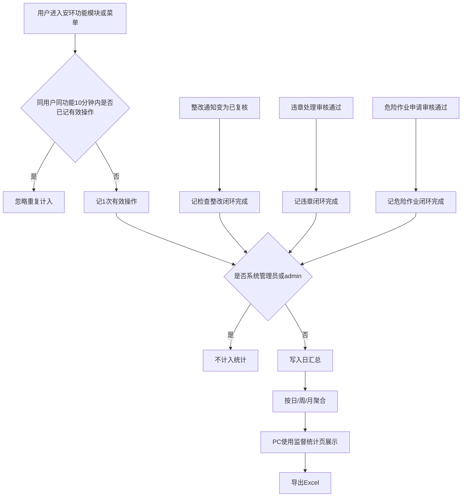
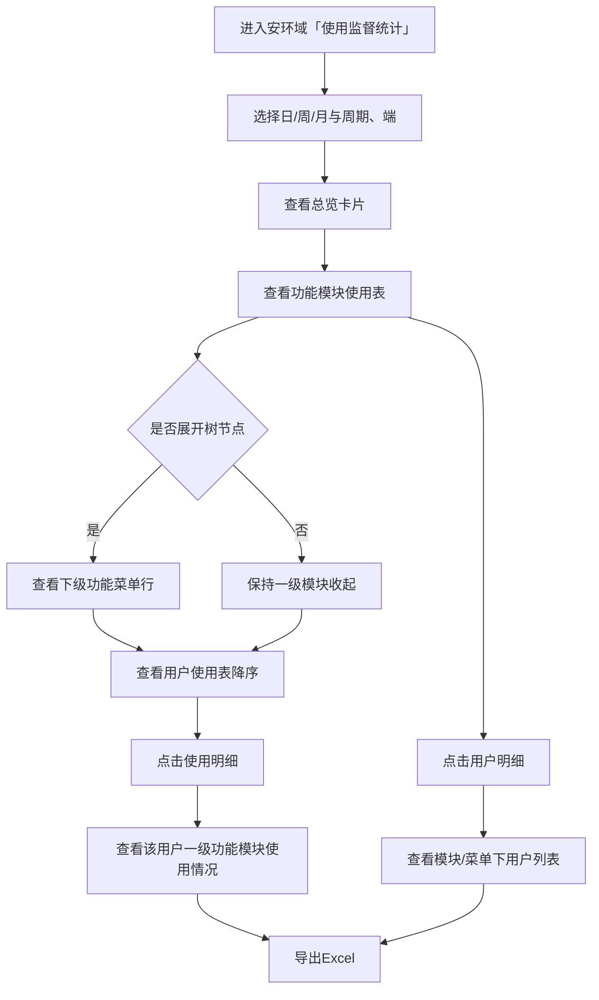
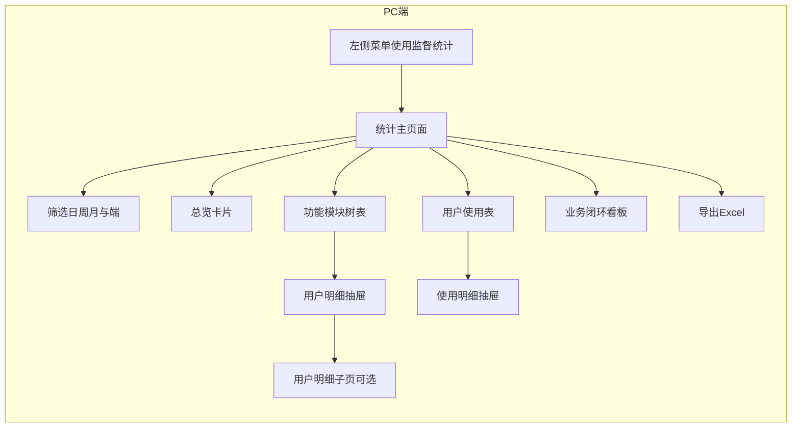
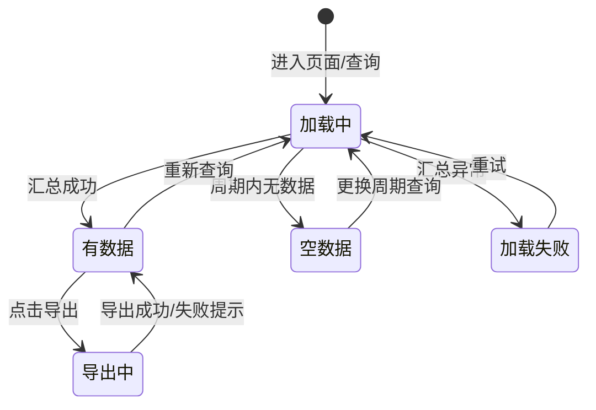
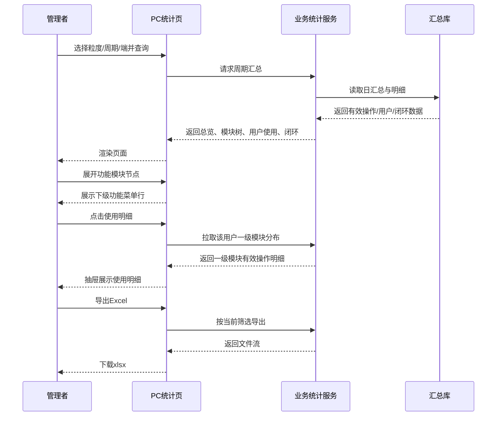

# SES 安环监测原型 PRD（v1.1.0 · 使用监督统计）

<style>
  .prd-toc {
    position: fixed; left: 12px; top: 80px; width: 220px; max-height: calc(100vh - 100px);
    overflow-y: auto; z-index: 100; background: rgba(255,255,255,0.96);
    border: 1px solid #e5e7eb; border-radius: 8px; padding: 12px 14px; font-size: 13px;
    line-height: 1.5; box-shadow: 0 4px 12px rgba(0,0,0,0.05);
  }
  .prd-toc strong { display:block; margin-bottom:8px; color:#111827; font-size:13px; }
  .prd-toc a { display:block; color:#374151; text-decoration:none; margin:4px 0; padding:2px 0; }
  .prd-toc a:hover { color:#2563eb; }
  .prd-toc .l2 { padding-left:10px; color:#6b7280; font-size:12px; }
  @media (max-width: 1100px) { .prd-toc { display:none; } }
  .prd-body { max-width: 920px; margin: 0 auto; }
</style>

<nav class="prd-toc" aria-label="文档目录">
  <strong>目录</strong>
  <a href="#sec-version">版本信息</a>
  <a href="#sec-1">1. 产品概述</a>
  <a class="l2" href="#sec-1-1">1.1 版本定位</a>
  <a class="l2" href="#sec-1-2">1.2 产品目标</a>
  <a class="l2" href="#sec-1-3">1.3 用户角色</a>
  <a class="l2" href="#sec-1-4">1.4 版本边界</a>
  <a href="#sec-2">2. 业务流程</a>
  <a href="#sec-3">3. 统计口径</a>
  <a href="#sec-4">4. 功能模块总览</a>
  <a href="#sec-5">5. 用户交互路径</a>
  <a href="#sec-6">6. 页面清单与跳转</a>
  <a href="#sec-7">7. 范围与权限说明</a>
  <a href="#sec-8">8. 非功能性需求</a>
  <a href="#sec-9">9. 系统功能清单</a>
  <a href="#sec-10">10. 风险项</a>
  <a href="#sec-11">11. 与 v1.0.0 关系</a>
  <a href="#sec-12">12. 验收要点</a>
  <a href="#sec-pending">待确认</a>
</nav>

<div class="prd-body">

---

## <span id="sec-version">版本信息</span>

| 项 | 内容 |
|----|------|
| **版本号** | v1.1.0 |
| **更新日期** | 2026-07-15 |
| **迭代说明** | PC 端新增独立菜单「使用监督统计」：日/周/月统计；指标统一为**有效操作**、**有效用户数**；功能模块树形展开（默认收起）；新增**用户使用表**及「使用明细」（仅一级功能模块）；支持导出。用于向领导反向监督汇报。已交付 PC 原型。 |

---

## <span id="sec-1">1. 产品概述</span>

### <span id="sec-1-1">1.1 版本定位</span>

本版本在既有安环业务能力（见 v1.0.0）之上，新增 **使用监督统计** 能力。

安环系统作为一体化大系统中的功能域，**无法单独统计登录**。本版本以 **功能模块有效操作** + **业务闭环完成量** + **用户使用排行** 作为监督依据，回答：

1. 各功能模块 / 功能菜单有没有人用、谁在用  
2. 检查整改、违章、危险作业三条闭环有没有真正跑完  
3. 使用活跃用户在各一级功能模块上的分布如何  

### <span id="sec-1-2">1.2 产品目标</span>

| 目标 | 说明 | 优先级 |
|------|------|--------|
| **监督汇报** | 为领导提供可导出的日/周/月使用数据，支撑反向督办 | P0 |
| **模块可见** | 功能模块（可展开至功能菜单）：有效操作、有效用户数、用户明细 | P0 |
| **用户可见** | 用户使用表按有效操作降序；支持查看一级功能模块使用明细 | P0 |
| **闭环可见** | 三条核心业务链完成量可量化 | P0 |
| **可扩展** | 独立菜单承载，后续可扩展更多分析子页 | P1 |

### <span id="sec-1-3">1.3 用户角色</span>

| 角色 | 终端 | 职责范围（业务侧） |
|------|------|-------------------|
| **安环负责人 / 管理者** | PC | 查看使用监督统计、用户使用明细、导出汇报材料 |
| **系统管理员** | PC | 查看全量统计；排除账号规则维护为平台/配置能力（P1，本产品不设计配置页） |
| **普通业务用户** | PC / App | 产生有效操作与业务单据；默认不使用本菜单 |
| **测试/管理员账号** | — | **不计入**任何统计（见 §3.2） |

> 消息中心、流程审批办理、角色权限配置由平台统一支撑，本 PRD 不设计对应页面与按钮。

### <span id="sec-1-4">1.4 版本边界</span>

| 纳入（本版包含） | 不纳入 |
|------------------|--------|
| 日 / 周 / 月统计与筛选 | 独立登录次数、登录人数 |
| PC 安环域纳管功能模块使用（含门户） | 系统设置 · **基础配置** |
| App 当前业务范围内的有效操作与闭环相关数据 | 消息推送 / 自动订阅 |
| 功能模块树形展开至功能菜单 | 审批办理 UI、权限配置 UI |
| 用户使用表 + 一级模块使用明细 | 新增用户、留存等增长类指标 |
| 三条业务闭环完成量 | — |
| Excel 导出 | — |
| **PC 原型页面**（主页面 + 用户明细子页） | 独立 App / 企微 H5 统计页 |

---

## <span id="sec-2">2. 业务流程</span>

### 2.1 完整业务主流程



**文字解读：**

- **正常流程**：记录有效操作与闭环完成 → 排除管理员账号 → 按日汇总 → 独立菜单按日/周/月查看（含模块树、用户使用表）→ 导出。  
- **边界情况**：跨周期完成的闭环，计入**完成状态发生**的那一日/周/月；仅有操作未办单则有效操作有数、闭环为 0。  
- **异常兜底**：模块未埋点标注「未接入」，禁止显示为 0；汇总失败时提示数据延迟（P1）。

### 2.2 子流程 · 管理者监督检查汇报



### 2.3 用户交互流程



### 2.4 页面状态机



### 2.5 系统数据流转时序图



---

## <span id="sec-3">3. 统计口径（已锁定）</span>

### 3.1 时间粒度【P0】

| 粒度 | 规则 |
|------|------|
| **日** | 自然日 00:00:00～23:59:59 |
| **周** | 自然周，周一至周日 |
| **月** | 自然月，1 日至月末最后一秒 |
| 切换 | 页面支持日/周/月切换；导出范围与当前筛选一致 |

### 3.2 账号排除【P0】

| 规则 | 说明 |
|------|------|
| 排除对象 | **系统管理员角色**、账号为 **`admin`**（及同等系统管理员身份账号） |
| 生效范围 | 有效操作、有效用户数、用户使用表、使用明细、模块用户明细、业务闭环量均排除 |
| 维护 | 一期按角色/账号规则固定；名单扩展配置为 P1（不在本产品设计配置页） |

### 3.3 有效操作与有效用户数【P0】

| 项 | 口径 |
|----|------|
| **有效操作** | 进入/操作安环纳管功能（功能模块着陆或功能菜单）后，经 10 分钟排重计入的有效次数 |
| **排重规则** | **同一用户 + 同一功能（模块或菜单），10 分钟内仅计 1 次有效操作** |
| **有效用户数** | 统计期内产生过有效操作的去重用户数 |
| 模块表指标 | ① 有效操作 ② 有效用户数 ③ 用户明细 |
| 用户使用表指标 | ① 有效操作（全站合计） ② 触达功能模块数（**仅一级**） ③ 使用明细 |

> 对外文案统一使用「有效操作 / 有效用户数」，不再使用「有效点击次数 / 点击用户数」。

### 3.4 功能模块纳管与层级【P0】

| 端 | 范围 |
|----|------|
| **PC** | 以飞书《功能记录》为准，**包含门户**；**不包含**系统设置-基础配置 |
| **App** | 仅当前业务范围内：安环检查、违章管理、危险作业管理相关菜单 |

| 层级 | 说明 | 展示规则 |
|------|------|----------|
| **功能模块（一级）** | 如安环门户、安环检查、违章管理、危险作业管理等 | 功能模块使用表默认展示；可树形展开 |
| **功能菜单（二级）** | 如检查记录、整改通知、违章登记等 | 父级展开后显示；类型标识为「功能菜单」 |

未接入埋点的节点展示为「未接入」，不得展示为有效操作 0。

### 3.5 业务闭环【P0】

| 闭环链路 | 完成计入条件 | 同屏建议过程量 |
|----------|--------------|----------------|
| 检查记录 → 整改通知 → **已复核** | 整改通知状态变为已复核，且完成时间落在统计期 | 检查记录提交数、整改通知生成数、待整改/待复核存量 |
| 违章登记 → 违章处理 → **审核通过** | 违章处理审核通过，且完成时间落在统计期 | 违章登记数、处理提交数、待审数 |
| 危险作业申请 → **审核通过** | 危险作业申请审核通过，且完成时间落在统计期；**不以作业票导出/打印为准** | 申请提交数、待审数、驳回数 |

> 闭环完成时间 = 状态首次变为上述完成态的时间戳所属日/周/月。审核办理由平台支撑，本产品只消费状态结果。

### 3.6 明确不做

| 不做项 | 原因 |
|--------|------|
| 登录次数 / 登录人数 | 安环非独立系统，无法单独统计登录 |
| 消息推送 / 订阅 | 业务明确不需要；仅需导出 |
| 基础配置使用统计 | 业务明确排除 |
| 新增用户、留存漏斗等 | 内部生产系统无管理价值 |
| 使用明细中的下级菜单拆分 | 使用明细**仅统计一级功能模块** |

---

## <span id="sec-4">4. 功能模块总览</span>

### 4.1 使用监督统计（PC · 独立菜单）【P0】

| 维度 | 说明 |
|------|------|
| **功能介绍** | 独立一级菜单「使用监督统计」，按日/周/月展示总览、功能模块树表、用户使用表、业务闭环，支持导出与明细下钻 |
| **前置条件** | 用户已登录一体化系统，且具备查看本菜单的数据范围约定（具体按钮显隐由平台控制） |
| **数据权限** | 安环负责人/系统管理员查看安环域全量；部门维为 P1；普通用户默认不可见本菜单 |
| **页面跳转** | 左侧菜单「使用监督统计」→ `pc_使用监督统计_主页面.html`；「用户明细/使用明细」→ 抽屉；可选「打开子页」→ `pc_使用监督统计_用户明细.html`；导出 → 下载 Excel |

#### 4.1.1 筛选区【P0】

| 筛选项 | 说明 | 优先级 |
|--------|------|--------|
| 统计粒度 | 日 / 周 / 月 | P0 |
| 日期 / 周期 | 随粒度切换 | P0 |
| 端 | 全部 / PC / App | P0 |
| 部门 | 可选部门过滤 | P1 |

#### 4.1.2 总览卡片【P0】

| 卡片 | 定义 |
|------|------|
| **有效操作合计** | 当前筛选下纳管功能模块有效操作之和 |
| **有效用户数** | 当前筛选下去重用户数 |
| 检查整改已复核数 | 闭环完成量 |
| 违章处理审核通过数 | 闭环完成量 |
| 危险作业审核通过数 | 闭环完成量 |
| 冷模块数 | 应纳管且本期有效操作 = 0 的一级功能模块数（不含「未接入」） |

#### 4.1.3 功能模块使用表【P0】

| 列 | 说明 |
|----|------|
| **功能模块** | 树形展示；一级为功能模块，展开后为功能菜单 |
| 类型 | 功能模块 / 功能菜单 |
| 端 | PC / App / 全部（按筛选） |
| **有效操作** | 含 10 分钟排重 |
| **有效用户数** | 去重 |
| 状态 | 正常 / 冷模块 / 未接入 |
| 操作 | 用户明细（未接入不可下钻） |

**树形交互【P0】：**

| 规则 | 说明 |
|------|------|
| 默认 | **全部收起**，仅展示一级功能模块 |
| 展开 | 点击模块前箭头逐层展开下级功能菜单 |
| 收起 | 再次点击箭头收起 |
| 快捷 | 支持「全部展开 / 全部收起」 |

#### 4.1.4 用户使用表【P0】

按当前统计时间范围，对有效用户按**有效操作降序**展示。

| 列 | 说明 |
|----|------|
| 排名 | 按有效操作降序序号 |
| 用户账号 / 姓名 / 部门 | — |
| **有效操作** | 该用户在周期内合计 |
| **触达功能模块数** | 产生过有效操作的**一级功能模块**个数 |
| 最近使用时间 | — |
| 操作 | **使用明细** |

#### 4.1.5 使用明细（用户维度）【P0】

从用户使用表点击「使用明细」打开抽屉：

| 字段 | 说明 |
|------|------|
| 功能模块 | **仅一级功能模块**，不含下级菜单拆分 |
| 有效操作 | 该用户在该一级模块的有效操作 |
| 占个人总操作比 | 该模块有效操作 / 个人合计 |
| 最近使用时间 | — |

明细按有效操作降序；不出现已排除账号。

#### 4.1.6 模块/菜单用户明细【P0】

从功能模块使用表点击「用户明细」：

| 字段 | 说明 |
|------|------|
| 用户账号 / 姓名 / 部门 | — |
| 有效操作 | 当前周期该模块或菜单 |
| 最近操作时间 | — |

可选打开独立子页 `pc_使用监督统计_用户明细.html`。

#### 4.1.7 业务闭环看板【P0】

展示三条链路完成量及过程量（见 §3.5），与上方筛选条件一致。

#### 4.1.8 导出【P0】

| Sheet | 内容 |
|-------|------|
| 功能模块使用汇总 | 粒度、周期、端、模块/菜单、有效操作、有效用户数 |
| 用户使用汇总 | 用户、部门、有效操作、触达功能模块数、最近使用时间 |
| 用户使用明细 | 用户 + **一级功能模块**有效操作分布 |
| 模块用户明细 | 模块/菜单、用户、有效操作、最近操作时间 |
| 业务闭环汇总 | 三条链路完成量及过程量 |

- 格式：Excel（`.xlsx`）  
- 文件名建议：`安环使用监督统计_{粒度}_{周期}.xlsx`  
- 无消息推送能力  

#### 4.1.9 菜单与扩展【P0/P1】

| 项 | 说明 |
|----|------|
| 菜单 | **单独开一级菜单**「使用监督统计」 |
| 本版页面 | 主统计页 + 用户明细抽屉/子页 |
| 扩展 | 后续可增加趋势、岗位督办等子页（P1） |

---

## <span id="sec-5">5. 完整用户交互路径</span>

### 5.1 管理者查看并导出周报

```text
一体化系统 → 安环域 → 使用监督统计（主页面）
  → 粒度选「周」→ 选择周期 / 端 → 查询
  → 查看总览卡片（有效操作合计、有效用户数、闭环、冷模块）
  → 功能模块使用表：默认收起 → 点击箭头展开功能菜单 → 「用户明细」
  → 用户使用表：按有效操作降序 → 「使用明细」（仅一级模块）
  → 业务闭环看板
  → 「导出」下载 Excel
```

### 5.2 场景拆分

| 类型 | 说明 |
|------|------|
| **正常** | 筛选后数据完整；树展开/收起正确；使用明细仅一级模块且与合计一致；导出成功 |
| **边界** | 零业务周：闭环为 0、冷模块高亮；未接入行不可点用户明细；用户无一级模块记录时抽屉空态 |
| **异常** | 导出失败提示重试；汇总失败提示；无访问范围时不进入菜单（由平台控制） |

---

## <span id="sec-6">6. 页面清单与跳转关系</span>

| 序号 | 页面文件名 | 页面名称 | 上游 | 下游 | 优先级 | 原型状态 |
|------|-----------|----------|------|------|--------|----------|
| 1 | `pc_使用监督统计_主页面.html` | 使用监督统计主页面 | 左侧菜单 / 版本入口 | 用户明细抽屉、使用明细抽屉、导出、用户明细子页 | P0 | **已交付** |
| 2 | `pc_使用监督统计_用户明细.html` | 模块用户明细子页 | 主页面「打开子页」 | 返回主页面 | P0 | **已交付** |
| 3 | `prototype/versions/v1.1.0/index.html` | 本版本原型入口 | 全局总入口 | 上述页面 | P0 | **已交付** |

> App / 企微 H5 本版本不新增统计页面；App 仅作为有效操作与业务数据的采集端。

---

## <span id="sec-7">7. 范围与权限说明</span>

### 7.1 业务数据可见范围（约定）

| 能力 | 普通用户 | 部门安环管理员 | 安环负责人 | 系统管理员 |
|------|----------|----------------|------------|------------|
| 查看使用监督统计 | 否 | 是（本部门，P1） | 是（全量） | 是（全量） |
| 查看用户明细 / 使用明细 | 否 | 是（本部门，P1） | 是 | 是 |
| 导出 | 否 | 是（本部门，P1） | 是 | 是 |

一期建议默认仅开放「安环负责人 + 系统管理员」全量能力。【待确认】  
权限配置本身由平台支撑，原型不绘制权限配置页。

---

## <span id="sec-8">8. 非功能性需求</span>

| 类别 | 要求 | 优先级 |
|------|------|--------|
| 性能 | 单周期汇总查询常规数据量下 3 秒内出数；导出 1 万行明细内可完成 | P0 |
| 准确 | 排重、排除账号、闭环状态与业务库一致；使用明细仅一级模块且可对账 | P0 |
| 安全 / 合规 | 导出仅授权范围可下载；明细含姓名按可见范围控制 | P0 |
| 可用性 | 空数据、未接入、导出失败文案明确；禁止把「未接入」显示为 0 | P0 |
| 兼容性 | PC Chrome / Edge 主流版本；可 GitHub Pages 静态访问原型 | P1 |
| 可拓展 | 独立菜单下可继续挂分析子页 | P1 |

---

## <span id="sec-9">9. 系统功能清单</span>

| 一级功能 | 二级功能 | 功能概述 | 优先级 | 本版包含 |
|----------|----------|----------|--------|----------|
| 使用监督统计 | 独立菜单入口 | 安环域单独菜单 | P0 | 是 |
| 使用监督统计 | 日/周/月统计 | 切换粒度与周期 | P0 | 是 |
| 使用监督统计 | 有效操作 / 有效用户数 | 10 分钟同用户同功能排重 | P0 | 是 |
| 使用监督统计 | 功能模块树表 | 默认收起，逐层展开功能菜单 | P0 | 是 |
| 使用监督统计 | 模块用户明细 | 按模块/菜单查看用户 | P0 | 是 |
| 使用监督统计 | 用户使用表 | 按有效操作降序 | P0 | 是 |
| 使用监督统计 | 使用明细 | 用户 × **一级功能模块**分布 | P0 | 是 |
| 使用监督统计 | 门户纳入 | 门户作为功能模块统计 | P0 | 是 |
| 使用监督统计 | 业务闭环 | 检查已复核；违章处理审过；危险作业审过 | P0 | 是 |
| 使用监督统计 | 导出 Excel | 模块/用户/使用明细/闭环多 Sheet | P0 | 是 |
| 使用监督统计 | 排除管理员/admin | 全指标排除 | P0 | 是 |
| 使用监督统计 | 端筛选 PC/App | App 限业务采集范围 | P0 | 是 |
| 使用监督统计 | 部门筛选 / 环比 | 增强督办 | P1 | 否 |
| 使用监督统计 | 闭环单据清单导出 | 可追溯到单号 | P1 | 否 |

---

## <span id="sec-10">10. 风险项</span>

| 风险 | 说明 | 应对 | 优先级 |
|------|------|------|--------|
| 无登录指标被质疑 | 领导习惯看登录 | 统一口径为「有效操作 + 业务闭环」 | P0 |
| 管理员误伤 | 业务管理员被当成系统 admin | 排除限定：系统管理员角色或账号=`admin` | P0 |
| 10 分钟排重偏低 | 数字低于直觉 | 材料中明确「有效操作」定义 | P1 |
| 模块字典偏差 | 与《功能记录》不一致 | 上线前锁定纳管字典 | P0 |
| 使用明细误含菜单层 | 统计过细难汇报 | 明确仅一级功能模块 | P0 |
| 闭环状态码不一致 | 已复核/审核通过命名差异 | 状态映射表评审确认 | P0 |

---

## <span id="sec-11">11. 与 v1.0.0 关系</span>

| 项 | 说明 |
|----|------|
| 业务功能 | 检查/整改/违章/危险作业等主流程以 v1.0.0 为准，本版本不修改 |
| 本版本增量 | 仅新增「使用监督统计」采集、展示、导出与 PC 原型 |
| 原型交付 | 主页面 + 用户明细子页 + 版本入口；全局总入口已挂 PC 预览链接 |

---

## <span id="sec-12">12. 验收要点（P0）</span>

1. 独立菜单可进入，日/周/月切换正确。  
2. 同用户同功能 10 分钟内重复进入只计 1 次有效操作。  
3. admin / 系统管理员账号不出现在任何明细与汇总中。  
4. 基础配置不出现在功能模块列表。  
5. 门户作为功能模块有统计。  
6. 功能模块表默认全部收起，点击箭头可展开功能菜单。  
7. 用户使用表按有效操作降序；「使用明细」仅展示一级功能模块。  
8. 三条闭环完成口径与 §3.5 一致。  
9. 导出 Excel 数据与页面一致（含用户使用相关 Sheet）。  
10. 无登录类指标、无推送能力入口；无审批/消息/权限配置页面。  

---

## <span id="sec-pending">【待确认】</span>

| 项 | 说明 | 建议默认 |
|----|------|----------|
| 一期是否开放部门管理员范围 | 影响数据可见范围 | 一期仅安环负责人+系统管理员全量 |
| 《纳管模块字典》最终表 | PC 功能模块/菜单清单签字版 | 按飞书《功能记录》去掉基础配置 |
| 菜单中文名 | 「使用监督统计」是否定名 | 使用监督统计 |
| 使用明细占比字段 | 是否必须展示「占个人总操作比」 | 建议保留，便于汇报 |

</div>
