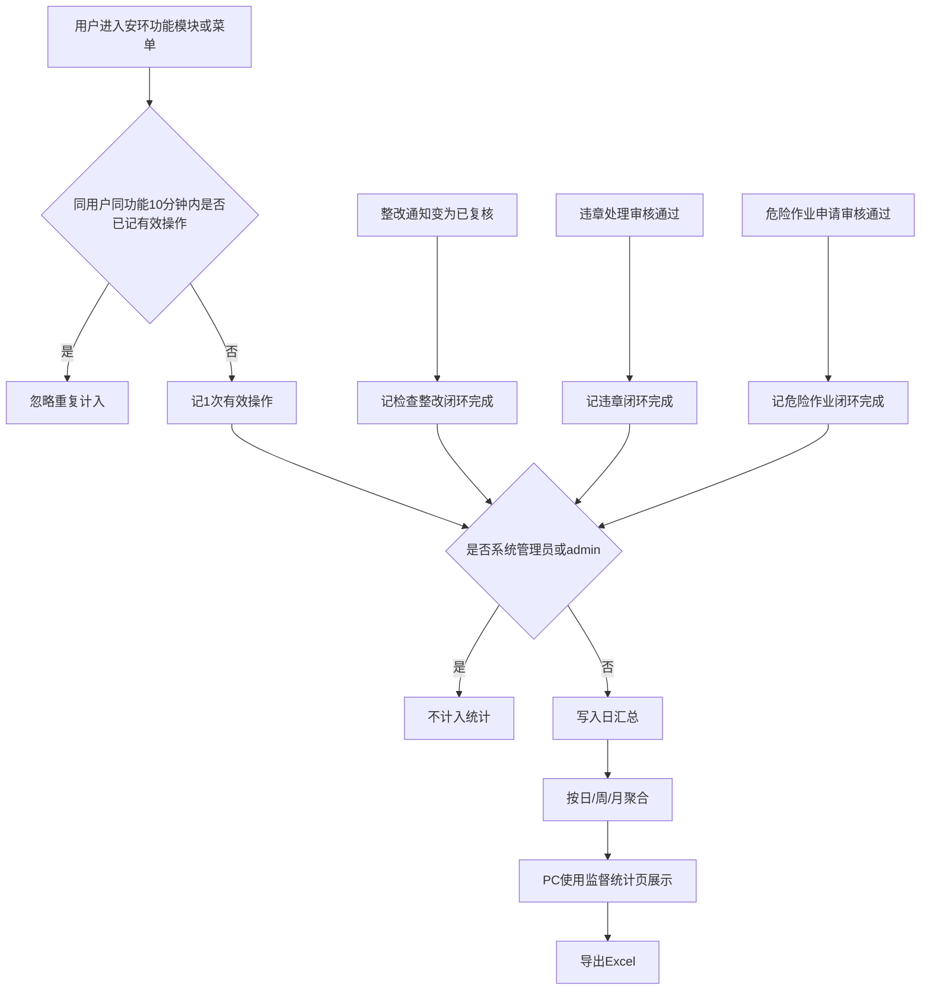
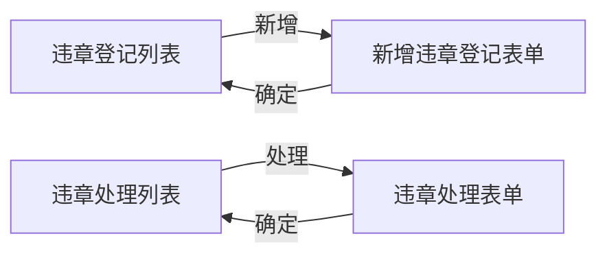

# SES 安环监测原型 PRD（v1.1.0）

<style>
  .prd-toc {
    position: fixed; left: 12px; top: 80px; width: 220px; max-height: calc(100vh - 100px);
    overflow-y: auto; z-index: 100; background: rgba(255,255,255,0.96);
    border: 1px solid #e5e7eb; border-radius: 8px; padding: 12px 14px; font-size: 13px;
    line-height: 1.5; box-shadow: 0 4px 12px rgba(0,0,0,0.05);
  }
  .prd-toc strong { display:block; margin-bottom:8px; color:#111827; font-size:13px; }
  .prd-toc a { display:block; color:#374151; text-decoration:none; margin:4px 0; padding:2px 0; }
  .prd-toc a:hover { color:#2563eb; }
  .prd-toc .l2 { padding-left:10px; color:#6b7280; font-size:12px; }
  .prd-toc .l3 { padding-left:18px; color:#9ca3af; font-size:12px; }
  @media (max-width: 1100px) { .prd-toc { display:none; } }
  .prd-body { max-width: 960px; margin: 0 auto; }
</style>

<nav class="prd-toc" aria-label="文档目录">
  <strong>目录</strong>
  <a href="#sec-version">版本信息</a>
  <a href="#sec-1">1. 产品概述</a>
  <a href="#sec-2">2. PC端</a>
  <a class="l2" href="#sec-2-1">2.1 使用监督统计</a>
  <a class="l3" href="#sec-2-2">2.2 业务流程</a>
  <a class="l3" href="#sec-2-3">2.3 统计口径</a>
  <a class="l3" href="#sec-2-4">2.4 功能说明</a>
  <a href="#sec-3">3. 企微H5端</a>
  <a class="l2" href="#sec-3-1">3.1 违章管理补强</a>
  <a class="l3" href="#sec-3-2">3.2 违章登记</a>
  <a class="l3" href="#sec-3-3">3.3 违章处理</a>
  <a href="#sec-4">4. 页面清单</a>
  <a href="#sec-5">5. 范围与权限</a>
  <a href="#sec-6">6. 非功能性需求</a>
  <a href="#sec-7">7. 系统功能清单</a>
  <a href="#sec-8">8. 风险项</a>
  <a href="#sec-9">9. 与 v1.0.0 关系</a>
  <a href="#sec-10">10. 验收要点</a>
  <a href="#sec-pending">待确认</a>
</nav>

<div class="prd-body">

---

## <span id="sec-version">版本信息</span>

| 项 | 内容 |
|----|------|
| **版本号** | v1.1.0 |
| **更新日期** | 2026-07-15 |
| **迭代说明** | ① **PC端**：独立菜单「使用监督统计」（日/周/月、有效操作/有效用户数、功能模块树、用户使用表与使用明细、业务闭环、Excel 导出）。② **企微H5端**：违章登记/违章处理列表与表单字段补强（对齐业务表单），原型从本版本交付（自 v1.0.0 迁入）。PRD 按**终端**分一级模块编写。 |

---

## <span id="sec-1">1. 产品概述</span>

### 1.1 版本定位

本版本在 v1.0.0 安环业务能力之上，按终端增量交付：

| 终端 | 本版增量 |
|------|----------|
| **PC端** | 使用监督统计（督导汇报） |
| **企微H5端** | 违章登记、违章处理页面与字段补强 |
| **独立 App** | 本版不新增统计页、不新增违章页面（违章以企微 H5 为准） |

安环无法单独统计登录；PC 统计以 **功能模块有效操作 + 业务闭环 + 用户使用排行** 作为监督依据。

### 1.2 产品目标

| 目标 | 终端 | 说明 | 优先级 |
|------|------|------|--------|
| 监督汇报 | PC | 日/周/月可导出使用数据 | P0 |
| 模块/用户可见 | PC | 树表 + 用户使用表 + 使用明细 | P0 |
| 闭环可见 | PC | 检查整改 / 违章 / 危险作业完成量 | P0 |
| 违章可填报闭环 | 企微H5 | 登记、处理表单字段完备可走通 | P0 |

### 1.3 用户角色

| 角色 | 终端 | 职责（业务侧） |
|------|------|----------------|
| 安环负责人 / 管理者 | PC | 查看使用监督统计、导出 |
| 系统管理员 | PC | 查看全量统计（统计口径排除 admin，见 §2.3） |
| 检查人 / 登记人 | 企微H5 | 新增违章登记 |
| 违章处理责任人 | 企微H5 | 填写违章处理并提交 |
| 普通业务用户 | PC/采集端 | 产生有效操作与单据；默认不使用统计菜单 |

> 消息中心、流程审批办理、角色权限配置由平台统一支撑，本 PRD 不设计对应页面与按钮。

### 1.4 版本边界

| 纳入 | 不纳入 |
|------|--------|
| PC 使用监督统计及 PC 原型 | 独立登录次数/人数 |
| 企微 H5 违章登记/处理列表+表单及原型 | 企微/App 统计页 |
| 违章表单字段对齐业务系统 | 系统设置-基础配置使用统计 |
| Excel 导出（统计） | 消息推送；审批/权限配置 UI |

### 1.5 平台公共能力边界

审批发起/办理页、消息中心、权限配置页：**不设计、不画原型**。业务侧保留表单填写、状态展示与自动建单等自有逻辑。

---

## <span id="sec-2">2. PC端</span>

### <span id="sec-2-1">2.1 一级模块：使用监督统计【P0】</span>

独立一级菜单「使用监督统计」，按日/周/月展示总览、功能模块树表、用户使用表、业务闭环，支持导出与明细下钻。

| 维度 | 说明 |
|------|------|
| **前置条件** | 已登录一体化系统，具备本菜单数据范围约定（按钮显隐由平台控制） |
| **数据权限** | 安环负责人/系统管理员查看安环域全量；部门维为 P1 |
| **页面跳转** | 菜单 → `pc_使用监督统计_主页面.html`；明细抽屉 / `pc_使用监督统计_用户明细.html`；导出 Excel |

### <span id="sec-2-2">2.2 业务流程</span>



**文字解读：**

- **正常**：有效操作与闭环 → 排除管理员 → 日汇总 → 日/周/月查看 → 导出。  
- **边界**：闭环计入**完成状态发生**的周期；有操作无办单则闭环为 0。  
- **异常兜底**：未埋点标「未接入」禁止显示为 0；汇总失败提示数据延迟（P1）。

管理者路径：

```text
安环域 → 使用监督统计 → 选日/周/月与端 → 总览 → 模块树展开 → 用户使用表/使用明细 → 闭环 → 导出
```

### <span id="sec-2-3">2.3 统计口径（已锁定）【P0】</span>

| 维度 | 规则 |
|------|------|
| 日/周/月 | 自然日；自然周周一至周日；自然月 |
| 排除账号 | 系统管理员角色、账号 `admin`（及同等身份）；全指标排除 |
| **有效操作** | 进入/操作纳管功能后，同一用户+同一功能 **10 分钟内仅计 1 次** |
| **有效用户数** | 周期内产生过有效操作的去重用户数 |
| PC 纳管 | 含门户，不含系统设置-基础配置 |
| App 采集范围 | 安环检查、违章管理、危险作业相关菜单（仅作数据采集，本版无 App 统计页） |
| 功能模块树 | 一级默认收起；展开为功能菜单 |
| 使用明细 | **仅一级功能模块**，不含菜单层拆分 |

**业务闭环完成计入：**

| 链路 | 完成条件 |
|------|----------|
| 检查 → 整改 → 已复核 | 状态变为已复核且时间落在统计期 |
| 违章登记 → 处理 → 审核通过 | 处理审核通过（平台回写）且时间落在统计期 |
| 危险作业 → 审核通过 | 申请审核通过；不以作业票导出为准 |

**明确不做：** 登录统计、消息推送、基础配置统计、留存漏斗、使用明细下级菜单拆分。

### <span id="sec-2-4">2.4 功能说明【P0】</span>

#### 2.4.1 筛选区

| 筛选项 | 优先级 |
|--------|--------|
| 日/周/月、周期、端（全部/PC/App） | P0 |
| 部门 | P1 |

#### 2.4.2 总览卡片

有效操作合计、有效用户数、检查整改已复核数、违章处理审核通过数、危险作业审核通过数、冷模块数（本期有效操作=0 的一级模块，不含未接入）。

#### 2.4.3 功能模块使用表

列：功能模块（树）、类型、端、有效操作、有效用户数、状态、用户明细。默认全部收起；支持全部展开/收起。

#### 2.4.4 用户使用表

按有效操作降序；列含排名、账号/姓名/部门、有效操作、触达一级模块数、最近使用时间、**使用明细**。

#### 2.4.5 使用明细 / 模块用户明细

- 使用明细：仅一级功能模块分布（可含占个人总操作比）。  
- 模块用户明细：可抽屉或打开 `pc_使用监督统计_用户明细.html`。

#### 2.4.6 业务闭环看板与导出

闭环与 §2.3 一致。导出 Excel 多 Sheet：功能模块使用、用户使用、用户使用明细（一级模块）、模块用户明细、业务闭环。文件名建议：`安环使用监督统计_{粒度}_{周期}.xlsx`。

---

## <span id="sec-3">3. 企微H5端</span>

### <span id="sec-3-1">3.1 一级模块：违章管理补强【P0】</span>

| 维度 | 说明 |
|------|------|
| **形态** | 企业微信内嵌 H5；无独立 App 外壳、无自定义底部 Tab |
| **范围** | 违章登记列表/新增表单；违章处理列表/处理表单 |
| **边界** | 不设计审批办理页、「发起审核」按钮；流转由平台支撑 |
| **相对 v1.0.0** | 本版交付完整表单字段与企微样式页；对应原型自 v1.0.0 **迁入**本版本目录 |



**文字解读：**

- **正常**：登记提交进入可处理；处理责任人打开待处理填写并确定归档（状态回写依赖平台）。  
- **边界**：必填未填不可提交；字数 500 上限。  
- **异常兜底**：上传失败可重试（原型 toast）；提交失败保留已填内容。

### <span id="sec-3-2">3.2 违章登记【P0】</span>

| 维度 | 说明 |
|------|------|
| **功能介绍** | 登记违章信息；列表可查看/编辑示意；底部「新增违章登记」进入表单 |
| **页面** | `违章管理_违章登记_list.html` → `wecom_违章管理_违章登记_form.html` |
| **底部操作** | 取消（回列表）/ 确定（校验后回列表） |

**新增表单字段分组：**

| 分组 | 字段 | 交互 | 优先级 |
|------|------|------|--------|
| 安全日志 | 违章编号 | 只读，系统自动生成 | P0 |
| 安全日志 | 违章类型 | 必填下拉 | P0 |
| 违章信息 | 违章时间 | 必填，日期时间 | P0 |
| 违章信息 | 违章地点 | 必填输入 | P0 |
| 违章信息 | 违章人员 | 必填输入 | P0 |
| 违章信息 | 违章处理责任人 | 必填选择 | P0 |
| 违章信息 | 违章记录 | 多行，0/500 | P0 |
| 违章信息 | 违章照片 | 上传示意 | P0 |
| 其他信息 | 登记人 | 只读自动填充 | P0 |
| 其他信息 | 登记部门 | 只读自动填充 | P0 |
| 其他信息 | 登记时间 | 只读自动填充 | P0 |

### <span id="sec-3-3">3.3 违章处理【P0】</span>

| 维度 | 说明 |
|------|------|
| **功能介绍** | 对待处理违章填写处罚信息并提交；列表「处理」进入表单 |
| **页面** | `违章管理_违章处理_list.html` → `wecom_违章管理_违章处理_form.html` |
| **说明** | 本版表单**不附加**顶部关联违章只读区，严格按业务处理弹窗字段 |

**处理表单字段：**

| 字段 | 交互 | 优先级 |
|------|------|--------|
| 处理编号 | 只读已生成 | P0 |
| 违章类目 | 必填下拉 | P0 |
| 违章内容 | 必填下拉 | P0 |
| 考核（元） | 只读带出 | P0 |
| 扣除金额 | 可编辑（必填） | P0 |
| 违章处罚单位 | 只读自动带出 | P0 |
| 违章处罚人员 | 只读自动带出 | P0 |
| 处理说明 | 多行，0/500 | P0 |
| 处理文件 | 上传示意 | P0 |
| 处理照片 | 上传示意 | P0 |
| 取消 / 确定 | 回列表 / 校验后保存回列表 | P0 |

---

## <span id="sec-4">4. 页面清单与跳转关系</span>

### 4.1 PC端

| 序号 | 页面文件名 | 页面名称 | 上游 | 下游 | 状态 |
|------|-----------|----------|------|------|------|
| 1 | `pc_使用监督统计_主页面.html` | 使用监督统计主页面 | 菜单/版本入口 | 抽屉、子页、导出 | 已交付 |
| 2 | `pc_使用监督统计_用户明细.html` | 模块用户明细子页 | 主页面 | 返回主页面 | 已交付 |

### 4.2 企微H5端

| 序号 | 页面文件名 | 页面名称 | 上游 | 下游 | 状态 |
|------|-----------|----------|------|------|------|
| 3 | `违章管理_违章登记_list.html` | 违章登记列表 | 版本入口 | 新增表单 | 已交付（迁入） |
| 4 | `wecom_违章管理_违章登记_form.html` | 新增违章登记 | 列表 | 回列表 | 已交付（迁入） |
| 5 | `违章管理_违章处理_list.html` | 违章处理列表 | 版本入口 | 处理表单 | 已交付（迁入） |
| 6 | `wecom_违章管理_违章处理_form.html` | 违章处理 | 列表 | 回列表 | 已交付（迁入） |
| 7 | `prototype/versions/v1.1.0/index.html` | 本版本原型入口 | 全局总入口 | 上述全部 | 已交付 |

---

## <span id="sec-5">5. 范围与权限说明</span>

| 能力 | 普通用户 | 安环负责人 | 系统管理员 | 登记人/处理人 |
|------|----------|------------|------------|---------------|
| 使用监督统计 | 否 | 是（全量） | 是（全量） | 否 |
| 违章登记/处理业务页 | — | 可查看约定范围 | 可查看 | 操作本人相关单据 |

一期统计默认仅「安环负责人 + 系统管理员」。【待确认】  
权限配置由平台支撑，原型不绘制权限页。

---

## <span id="sec-6">6. 非功能性需求</span>

| 类别 | 要求 | 优先级 |
|------|------|--------|
| 性能 | 单周期汇总 3 秒内；导出 1 万行内可完成 | P0 |
| 准确 | 排重、排除账号、闭环与业务库一致 | P0 |
| 企微兼容 | viewport 固定；字号≥12px；`-webkit-` 前缀；底栏避让软键盘 | P0 |
| 兼容性 | PC Chrome/Edge；可 GitHub Pages 访问 | P1 |

---

## <span id="sec-7">7. 系统功能清单</span>

| 终端 | 一级功能 | 二级功能 | 优先级 | 本版包含 |
|------|----------|----------|--------|----------|
| PC | 使用监督统计 | 菜单/日周月/有效操作与用户/树表/用户表/明细/闭环/导出/排除 admin | P0 | 是 |
| PC | 使用监督统计 | 部门筛选/环比/闭环单据清单 | P1 | 否 |
| 企微H5 | 违章管理 | 违章登记列表 | P0 | 是 |
| 企微H5 | 违章管理 | 新增违章登记表单（字段分组） | P0 | 是 |
| 企微H5 | 违章管理 | 违章处理列表 | P0 | 是 |
| 企微H5 | 违章管理 | 违章处理表单 | P0 | 是 |
| 企微H5 | 统计 | 使用监督统计页 | — | **否** |
| 独立 App | 违章/统计 | — | — | **否（本版）** |

---

## <span id="sec-8">8. 风险项</span>

| 风险 | 说明 | 应对 | 优先级 |
|------|------|------|--------|
| 无登录指标被质疑 | 领导习惯看登录 | 口径统一为有效操作+闭环 | P0 |
| 管理员误伤 | 业务管理员被当 admin | 排除限定系统管理员角色或账号=`admin` | P0 |
| 模块字典偏差 | 与《功能记录》不一致 | 上线前锁定纳管字典 | P0 |
| 违章与 v1.0.0 分版 | 入口找错版本 | 全局总入口明确 v1.1.0 企微列；v1.0.0 移除违章原型链接 | P0 |
| 闭环状态码不一致 | 命名差异 | 状态映射表评审 | P0 |

---

## <span id="sec-9">9. 与 v1.0.0 关系</span>

| 项 | 说明 |
|----|------|
| 继承 | 安环检查、危险作业、门户等主流程仍以 v1.0.0 为准 |
| 本版 PC 增量 | 使用监督统计 |
| 本版企微增量 | 违章登记/处理完整表单与列表原型（**自 v1.0.0 目录迁入 v1.1.0**） |
| v1.0.0 原型 | 不再保留违章登记/处理页面文件；相关入口改为指向本版本或移除 |

---

## <span id="sec-10">10. 验收要点（P0）</span>

**PC端：**  
1. 独立菜单可进入，日/周/月正确。  
2. 10 分钟同用户同功能只计 1 次有效操作。  
3. admin/系统管理员不出现在汇总与明细。  
4. 功能模块表默认收起可展开；使用明细仅一级模块。  
5. 导出与页面一致；无审批/消息/权限配置页。

**企微H5端：**  
6. 违章登记表单字段分组与必填校验可用；登记人/部门/时间只读填充。  
7. 违章处理表单只读/可编字段与截图约定一致；列表「处理」可进入。  
8. 无「发起审核」类按钮；取消/确定回列表。

---

## <span id="sec-pending">【待确认】</span>

| 项 | 说明 | 建议默认 |
|----|------|----------|
| 一期是否开放部门管理员统计范围 | 影响可见范围 | 一期仅安环负责人+系统管理员 |
| 《纳管模块字典》最终表 | PC 模块/菜单清单 | 按飞书《功能记录》去掉基础配置 |
| 违章内容下拉与类目联动规则 | 字典依赖 | 一期静态选项，联调再绑字典 |
| 考核金额只读规则 | 是否一律由类目/内容带出 | 是，带出后仅允许改扣除金额 |

</div>
