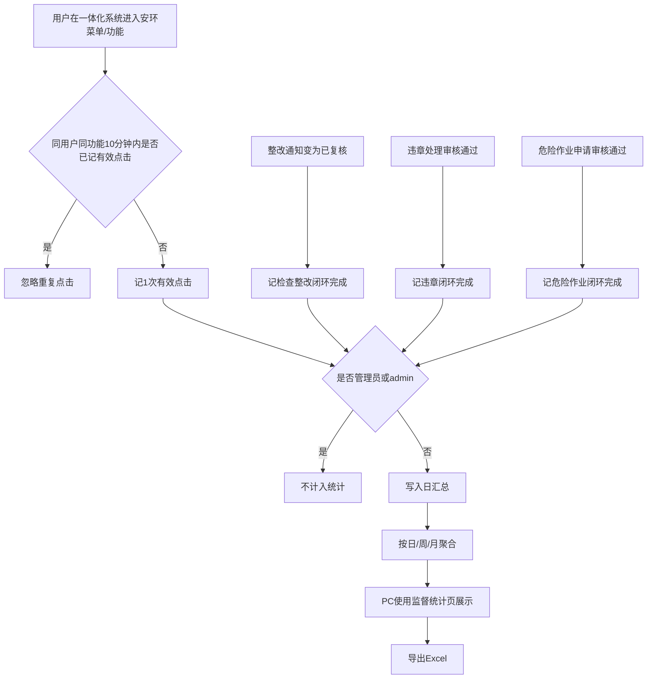

# SES 安环监测原型 PRD（v1.1.0 · 使用监督统计）

<div id="toc"></div>

> **版本信息**：v1.1.0 | **更新日期**：2026-07-14 | **迭代说明**：新增 PC 端「使用监督统计」独立菜单，支持按日/周/月统计模块有效点击、用户明细与三条业务闭环，支持导出；用于向领导反向监督汇报使用情况

---

## 1. 产品概述

### 1.1 版本定位

本版本在既有安环业务能力（见 v1.0.0）之上，新增 **使用监督统计** 能力。

安环系统作为一体化大系统中的功能域，**无法单独统计登录**。本版本以 **模块有效点击** + **业务闭环完成量** 作为监督依据，回答：

1. 各安环大功能有没有人点、谁在点  
2. 检查整改、违章、危险作业三条闭环有没有真正跑完  

### 1.2 产品目标

| 目标 | 说明 | 优先级 |
|------|------|--------|
| **监督汇报** | 为领导提供可导出的日/周/月使用数据，支撑反向督办 | P0 |
| **模块可见** | 各一级功能模块：点击次数、点击用户数、用户明细 | P0 |
| **闭环可见** | 三条核心业务链完成量可量化 | P0 |
| **可扩展** | 独立菜单承载，后续可扩展更多分析子页 | P1 |

### 1.3 用户角色

| 角色 | 终端 | 职责范围 |
|------|------|----------|
| **安环负责人 / 管理者** | PC | 查看使用监督统计、导出汇报材料 |
| **系统管理员** | PC | 维护排除账号规则（如有配置页，P1）；查看全量统计 |
| **普通业务用户** | PC / App | 产生点击与业务单据；默认不使用本菜单 |
| **测试/管理员账号** | — | **不计入**任何统计（见 §3.2） |

### 1.4 版本边界

| 纳入 | 不纳入 |
|------|--------|
| 日 / 周 / 月统计与筛选 | 独立登录次数、登录人数 |
| PC 安环域纳管模块使用（含门户） | 系统设置 · **基础配置** |
| App 当前原型功能范围内的点击与闭环相关数据 | 消息推送 / 自动订阅 |
| 三条业务闭环完成量 | 新增用户、留存等增长类指标 |
| Excel 导出 | 本版本不做原型页（仅 PRD） |

---

## 2. 业务流程

### 2.1 数据采集与展示总流程



**文字解读：**
- **正常流程**：记录有效点击与闭环完成 → 排除管理员账号 → 按日汇总 → 在独立菜单按日/周/月查看 → 导出。  
- **边界情况**：跨周期完成的闭环，计入**完成状态发生**的那一日/周/月；仅点击未办单则点击有数、闭环为 0。  
- **异常兜底**：模块未埋点标注「未接入」，禁止显示为 0 冒充无人使用；汇总任务失败时页面提示数据延迟并支持重算（P1）。

### 2.2 监督检查汇报路径（管理者）


---

## 3. 统计口径（已锁定）

### 3.1 时间粒度【P0】

| 粒度 | 规则 |
|------|------|
| **日** | 自然日 00:00:00～23:59:59 |
| **周** | 自然周，周一至周日 |
| **月** | 自然月，1 日至月末最后一秒 |
| 切换 | 页面支持日/周/月切换；导出范围与当前筛选一致 |

### 3.2 账号排除【P0】

| 规则 | 说明 |
|------|------|
| 排除对象 | **管理员账号**、账号为 **`admin`**（及同等系统管理员身份账号） |
| 生效范围 | 模块点击、点击用户数、用户明细、业务闭环量均排除 |
| 维护 | 一期按角色/账号规则固定；名单扩展配置为 P1 |

### 3.3 模块点击（有效点击）【P0】

| 项 | 口径 |
|----|------|
| 计数对象 | 进入/点击安环纳管功能（菜单、入口、一级模块着陆） |
| 排重规则 | **同一用户 + 同一功能，10 分钟内仅计 1 次有效点击** |
| 指标 | ① 模块点击次数 ② 点击用户数（去重） ③ 点击用户明细 |
| 用户明细字段 | 用户账号、姓名、部门、有效点击次数、最近点击时间 |

### 3.4 模块纳管范围【P0】

| 端 | 范围 |
|----|------|
| **PC** | 以飞书《功能记录》一级功能模块为准，**包含门户（门户记录）**；**不包含**系统设置-基础配置 |
| **App** | 仅当前已有原型功能：安环检查（检查记录/整改通知）、违章管理（登记/处理）、危险作业管理（申请/作业票相关） |

未接入埋点的模块在列表中展示为「未接入」，不得展示为点击 0。

### 3.5 业务闭环【P0】

| 闭环链路 | 完成计入条件 | 同屏建议过程量 |
|----------|--------------|----------------|
| 检查记录 → 整改通知 → **已复核** | 整改通知状态变为 **已复核**，且完成时间落在统计期 | 检查记录提交数、整改通知生成数、待整改/待复核存量 |
| 违章登记 → 违章处理 → **审核通过** | 违章处理流程 **审核通过**，且完成时间落在统计期 | 违章登记数、处理提交数、待审数 |
| 危险作业申请 → **审核通过** | 危险作业申请 **审核通过**，且完成时间落在统计期；**不以作业票导出/打印为准** | 申请提交数、待审数、驳回数 |

> 闭环完成时间 = 状态首次变为上述完成态的时间戳所属日/周/月。

### 3.6 明确不做

| 不做项 | 原因 |
|--------|------|
| 登录次数 / 登录人数 | 安环非独立系统，无法单独统计登录 |
| 消息推送 / 订阅 | 业务明确不需要；仅需导出 |
| 基础配置使用统计 | 业务明确排除 |
| 新增用户、留存漏斗等 | 内部生产系统无管理价值 |

---

## 4. 功能模块

### 4.1 使用监督统计（PC · 独立菜单）【P0】

| 维度 | 说明 |
|------|------|
| **功能介绍** | 独立一级菜单「使用监督统计」，按日/周/月展示模块有效点击、用户明细与三条业务闭环，支持导出，用于向上监督汇报 |
| **前置条件** | 用户已登录一体化系统且具备安环「使用监督统计」查看权限 |
| **数据权限** | 安环负责人/系统管理员查看安环域全量；部门管理员查看本部门（P1）；普通用户默认无菜单 |
| **页面跳转** | 安环域左侧/顶部菜单「使用监督统计」→ 统计主页面；模块行操作「用户明细」→ 明细抽屉/子页；「导出」→ 下载 Excel |

#### 4.1.1 筛选区

| 筛选项 | 说明 | 优先级 |
|--------|------|--------|
| 统计粒度 | 日 / 周 / 月 | P0 |
| 日期 / 周期 | 随粒度切换日期选择器或周/月选择 | P0 |
| 端 | 全部 / PC / App | P0 |
| 部门 | 可选部门过滤 | P1 |

#### 4.1.2 总览卡片【P0】

| 卡片 | 定义 |
|------|------|
| 模块有效点击总次数 | 当前筛选下全部纳管模块有效点击之和 |
| 点击用户数 | 当前筛选下去重用户数 |
| 检查整改已复核数 | 闭环完成量 |
| 违章处理审核通过数 | 闭环完成量 |
| 危险作业审核通过数 | 闭环完成量 |
| 冷模块数 | 应纳管且本期有效点击 = 0 的一级模块数（不含「未接入」） |

#### 4.1.3 模块使用表【P0】

| 列 | 说明 |
|----|------|
| 一级模块 | 如安环门户、安环检查、违章管理、危险作业管理等 |
| 端 | PC / App / 合计（按筛选） |
| 有效点击次数 | 含 10 分钟排重后的次数 |
| 点击用户数 | 去重 |
| 操作 | 用户明细 |

#### 4.1.4 业务闭环看板【P0】

展示三条链路的完成量及建议过程量（见 §3.5），支持与模块使用表同一筛选条件。

#### 4.1.5 用户明细【P0】

按选定模块下钻：

| 字段 | 说明 |
|------|------|
| 用户账号 | — |
| 姓名 | — |
| 部门 | — |
| 有效点击次数 | 当前周期该模块 |
| 最近点击时间 | — |

明细中不出现已排除的管理员 / admin。

#### 4.1.6 导出【P0】

| Sheet | 内容 |
|-------|------|
| 模块使用汇总 | 粒度、周期、端、模块、有效点击次数、点击用户数 |
| 模块用户明细 | 模块、用户、部门、有效点击次数、最近点击时间 |
| 业务闭环汇总 | 三条链路完成量及过程量 |

- 格式：Excel（`.xlsx`）  
- 文件名建议：`安环使用监督统计_{粒度}_{周期}.xlsx`  
- 本版本不需要消息推送

#### 4.1.7 菜单与扩展【P0/P1】

| 项 | 说明 |
|----|------|
| 菜单 | **单独开一级菜单**「使用监督统计」，不挂在门户或基础配置下 |
| 扩展 | 后续可在此菜单下增加子页面（趋势、岗位督办等），本版本仅主统计页 |

---

## 5. 完整用户交互路径

### 5.1 管理者查看并导出周报

```text
一体化系统 → 安环域 → 使用监督统计
  → 粒度选「周」→ 选择上一自然周
  → 查看总览卡片 / 模块使用表 / 闭环看板
  → 点击某模块「用户明细」查看具体用户
  → 点击「导出」下载 Excel 用于汇报
```

### 5.2 场景拆分

| 类型 | 说明 |
|------|------|
| **正常** | 筛选周期后数据完整；导出成功；下钻用户与汇总一致 |
| **边界** | 本周期未结束：展示已发生数据并标注「统计期未结束」（P1）；零业务周：闭环为 0、冷模块高亮 |
| **异常** | 导出失败提示重试；无权限提示无访问；未埋点模块显示「未接入」 |

---

## 6. 页面清单（本版本）

| 序号 | 页面 | 端 | 说明 | 优先级 | 原型状态 |
|------|------|----|------|--------|----------|
| 1 | 使用监督统计（主页面） | PC | 筛选、总览、模块表、闭环、导出入口 | P0 | 本版本仅 PRD，原型后续版本补充 |
| 2 | 模块用户明细（抽屉/子页） | PC | 下钻用户列表 | P0 | 同上 |

> App 端本版本不新增统计页面；App 仅作为点击与业务数据的采集端。

---

## 7. 权限矩阵

| 能力 | 普通用户 | 部门安环管理员 | 安环负责人 | 系统管理员 |
|------|----------|----------------|------------|------------|
| 查看使用监督统计菜单 | 否 | 是（本部门，P1） | 是（全量） | 是（全量） |
| 查看用户明细 | 否 | 是（本部门，P1） | 是 | 是 |
| 导出 | 否 | 是（本部门，P1） | 是 | 是 |
| 维护排除账号规则 | 否 | 否 | 否 | 是（P1） |

一期可仅开放「安环负责人 + 系统管理员」全量能力。【待确认是否一期上部门维】

---

## 8. 非功能性需求

| 类别 | 要求 | 优先级 |
|------|------|--------|
| 性能 | 单周期汇总查询：常规数据量下 3 秒内出数；导出 1 万行明细内可完成 | P0 |
| 准确 | 排重、排除账号、闭环状态与业务库一致；支持对账抽检 | P0 |
| 合规 | 导出文件仅权限内可下载；明细含姓名等需按权限控制 | P0 |
| 可用性 | 空数据、未接入、无权限状态文案明确，禁止误导为「0 使用」 | P0 |

---

## 9. 系统功能清单

| 一级功能 | 二级功能 | 功能概述 | 优先级 |
|----------|----------|----------|--------|
| 使用监督统计 | 独立菜单入口 | 安环域单独菜单，便于后续扩展 | P0 |
| 使用监督统计 | 日/周/月统计 | 切换粒度与周期查看 | P0 |
| 使用监督统计 | 模块有效点击 | 次数、用户数；10 分钟同用户同功能排重 | P0 |
| 使用监督统计 | 模块用户明细 | 下钻查看具体用户 | P0 |
| 使用监督统计 | 门户记录 | 门户作为一级模块纳入点击统计 | P0 |
| 使用监督统计 | 业务闭环 | 检查→整改已复核；违章处理审过；危险作业审过 | P0 |
| 使用监督统计 | 导出 Excel | 汇总 + 用户明细 + 闭环汇总 | P0 |
| 使用监督统计 | 排除管理员/admin | 全指标排除 | P0 |
| 使用监督统计 | 端筛选 PC/App | App 限原型功能采集 | P0 |
| 使用监督统计 | 部门筛选 / 环比 | 增强督办 | P1 |
| 使用监督统计 | 闭环单据清单导出 | 可追溯到单号 | P1 |

---

## 10. 风险项

| 风险 | 说明 | 应对 |
|------|------|------|
| 无登录指标被质疑 | 领导习惯看登录 | 汇报口径统一为「有效进入 + 业务闭环」；PRD/材料明确无法单独统计登录 |
| 管理员误伤 | 业务侧管理员被当成系统 admin 排除 | 排除规则限定：系统管理员角色 或 账号=`admin` |
| 10 分钟排重偏低 | 点击量低于直觉 | 材料中标注为「有效进入次数」 |
| PC 模块与《功能记录》偏差 | 菜单改名/增减 | 上线前锁定《纳管模块字典》 |
| 闭环状态码不一致 | 「已复核」「审核通过」落地名不同 | 与现网状态机映射表评审确认 |

---

## 11. 与 v1.0.0 关系

| 项 | 说明 |
|----|------|
| 业务功能 | 检查/整改/违章/危险作业等业务规则以 v1.0.0 为准，本版本不修改其主流程 |
| 本版本增量 | 仅新增「使用监督统计」采集、展示、导出 |
| 原型 | 本版本交付 **PRD**；统计页 HTML 原型不在本版本范围，待后续确认后再制作 |

---

## 12. 【待确认】

| 项 | 说明 | 建议默认 |
|----|------|----------|
| 一期是否开放部门管理员范围 | 影响权限矩阵 | 一期仅安环负责人+系统管理员全量 |
| 《纳管模块字典》最终表 | PC 一级模块清单签字版 | 按飞书《功能记录》去掉基础配置 |
| 菜单中文名 | 「使用监督统计」是否定名 | 使用监督统计 |

---

## 13. 验收要点（P0）

1. 独立菜单可进入，日/周/月切换正确。  
2. 同用户同功能 10 分钟内重复进入只计 1 次。  
3. admin / 系统管理员账号不出现在用户明细与汇总中。  
4. 基础配置不出现在模块列表。  
5. 门户有点击统计。  
6. 三条闭环完成口径与 §3.5 一致（整改=已复核；违章处理=审核通过；危险作业=审核通过）。  
7. 导出 Excel 含三个 Sheet，数据与页面一致。  
8. 无登录类指标、无推送能力入口。  
